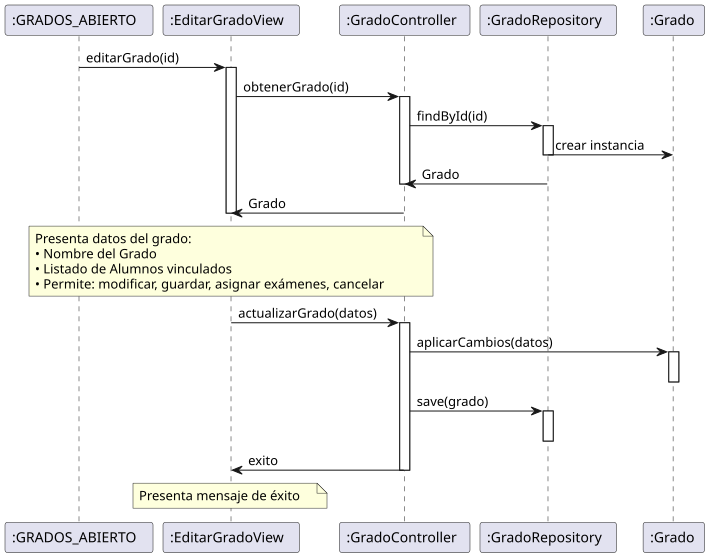

# Jorgestor > editarGrado > Análisis

> |[🏠️](/README.md)|[ 📊](../../../archivosEsenciales/casos-de-uso/diagramasDeContexto/diagramaDeContextoDocente/diagramaContexto.svg)|[Detalle](../../../archivosEsenciales/casos-de-uso/detalladoCasosDeUso/README.md#editar-grado-docente)|**Análisis**|Diseño|Desarrollo|Pruebas|
> |-|-|-|-|-|-|-|

## información del artefacto

- **Proyecto**: Jorgestor - Sistema de Gestión de Exámenes
- **Fase RUP**: Elaboración
- **Disciplina**: Análisis y Diseño
- **Versión**: 1.0
- **Fecha**: 2026-05-23
- **Autor**: Gemini CLI

## propósito

Análisis de colaboración del caso de uso `editarGrado()` mediante el patrón MVC, identificando las clases de análisis, sus responsabilidades y colaboraciones necesarias para implementar la gestión integral de grados, incluyendo la vinculación de alumnos y acceso a la asignación de exámenes.

## diagramas de análisis

### diagrama de colaboración

||
|-|
|Código fuente: [colaboracion.puml](colaboracion.puml)|

### diagrama de secuencia

||
|-|
|Código fuente: [secuencia.puml](secuencia.puml)|

## clases de análisis identificadas

### clases de vista (boundary)

#### EditarGradoView
**Estereotipo**: Vista (Boundary)  
**Responsabilidades**:
- Recibir la solicitud de edición de grado.
- Interactuar con el controlador para obtener datos del grado.
- Presentar datos completos de edición (Nombre, Alumnos).
- Permitir solicitar modificación de campos y vinculaciones.
- Permitir acceso a la asignación de exámenes.
- Permitir solicitar guardar cambios, eliminar o cancelar edición.

**Colaboraciones**:
- **Entrada**: Recibe `editarGrado(id)` desde `:GRADOS_ABIERTO`, `:GRADO_ABIERTO` o desde `:Collaboration CrearGrado`.
- **Control**: Se comunica con `GradoController`.
- **Salida**: **<<include>>** `:Collaboration AbrirGrados` o `:Collaboration AsignarExamenes`.

### clases de control

#### GradoController
**Estereotipo**: Control  
**Responsabilidades**:
- Coordinar la carga de datos del grado.
- Validar la integridad de los datos y relaciones antes de actualizar.
- Procesar la persistencia de cambios en el grado y sus vínculos.
- Gestionar la transición al módulo de asignación de exámenes.

**Colaboraciones**:
- **Vista**: Responde a `EditarGradoView`.
- **Repositorio**: Delega en `GradoRepository`.

### clases de entidad (entity)

#### GradoRepository
**Estereotipo**: Entidad  
**Responsabilidades**:
- Abstraer el acceso a datos de grados.
- Proporcionar métodos para obtener, actualizar y eliminar registros.
- Gestionar la persistencia de relaciones con Alumnos.

**Colaboraciones**:
- **Control**: Responde a `GradoController`.
- **Entidad**: Gestiona instancias de `Grado`.

#### Grado
**Estereotipo**: Entidad  
**Responsabilidades**:
- Representar la información del grado.
- Encapsular atributos: nombre.
- Mantener relaciones con Alumnos.

## flujo de colaboración principal

### secuencia: editar grado

1. **Inicio**: Solicitud desde lista, detalle o tras creación.
2. **Carga**: `EditarGradoView` → `GradoController.cargarGradoParaEdición(id)`.
3. **Obtención**: `GradoController` → `GradoRepository.obtenerPorId(id) : Grado`.
4. **Presentación**: `EditarGradoView` presenta los datos al Docente.
5. **Modificación**: Docente modifica campos o vinculaciones y solicita guardar.
6. **Actualización**: `GradoController` aplica cambios y solicita actualización al repositorio.
7. **Finalización**: Navegación a lista de grados o asignación de exámenes.

## patrón de edición completa (El Gordo)

Sigue el patrón de "El Gordo" permitiendo la gestión completa de todos los aspectos de un grado desde un único punto centralizado de edición.
