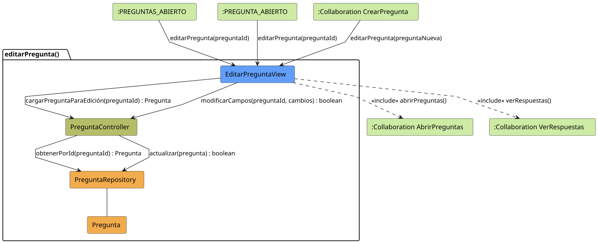
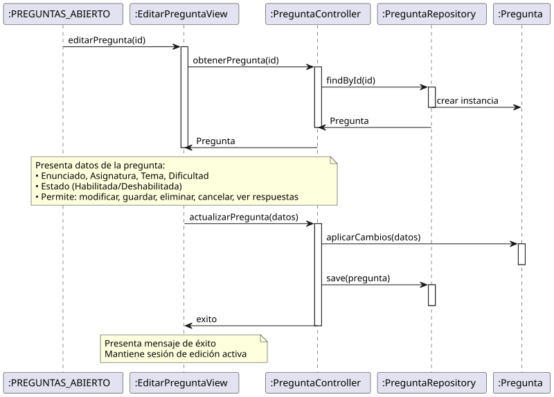

# Jorgestor > editarPregunta > Análisis

> |[🏠️](/README.md)|[ 📊](../../../archivosEsenciales/casos-de-uso/diagramasDeContexto/diagramaDeContextoDocente/diagramaContexto.svg)|[Detalle](../../../archivosEsenciales/casos-de-uso/detalladoCasosDeUso/README.md#editar-pregunta-docente)|**Análisis**|Diseño|Desarrollo|Pruebas|
> |-|-|-|-|-|-|-|

## información del artefacto

- **Proyecto**: Jorgestor - Sistema de Gestión de Exámenes
- **Fase RUP**: Elaboración
- **Disciplina**: Análisis y Diseño
- **Versión**: 1.0
- **Fecha**: 2026-05-23
- **Autor**: Gemini CLI

## propósito

Análisis de colaboración del caso de uso `editarPregunta()` mediante el patrón MVC, identificando las clases de análisis, sus responsabilidades y colaboraciones necesarias para implementar la edición integral de preguntas.

## diagramas de análisis

### diagrama de colaboración

||
|-|
|Código fuente: [colaboracion.puml](colaboracion.puml)|

### diagrama de secuencia

||
|-|
|Código fuente: [secuencia.puml](secuencia.puml)|

## clases de análisis identificadas

### clases de vista (boundary)

#### EditarPreguntaView
**Estereotipo**: Vista (Boundary)  
**Responsabilidades**:
- Recibir la solicitud de edición de pregunta.
- Interactuar con el controlador para obtener datos de la pregunta.
- Presentar datos completos de edición (Enunciado, Tema, Dificultad, Asignatura).
- Permitir solicitar modificación de campos.
- Permitir acceso a la gestión de respuestas asociadas.
- Permitir solicitar guardar cambios, eliminar o cancelar edición.

**Colaboraciones**:
- **Entrada**: Recibe `editarPregunta(id)` desde `:PREGUNTAS_ABIERTO`, `:PREGUNTA_ABIERTO` o desde `:Collaboration CrearPregunta`.
- **Control**: Se comunica con `PreguntaController`.
- **Salida**: **<<include>>** `:Collaboration AbrirPreguntas` o `:Collaboration VerRespuestas`.

### clases de control

#### PreguntaController
**Estereotipo**: Control  
**Responsabilidades**:
- Coordinar la carga de datos de la pregunta.
- Validar la integridad de los datos de la pregunta antes de actualizar.
- Procesar la persistencia de cambios.
- Gestionar la transición a la vista de respuestas.

**Colaboraciones**:
- **Vista**: Responde a `EditarPreguntaView`.
- **Repositorio**: Delega en `PreguntaRepository`.

### clases de entidad (entity)

#### PreguntaRepository
**Estereotipo**: Entidad  
**Responsabilidades**:
- Abstraer el acceso a datos de preguntas.
- Proporcionar métodos para obtener, actualizar y eliminar preguntas.

**Colaboraciones**:
- **Control**: Responde a `PreguntaController`.
- **Entidad**: Gestiona instancias de `Pregunta`.

#### Pregunta
**Estereotipo**: Entidad  
**Responsabilidades**:
- Representar la información de la pregunta.
- Encapsular atributos: enunciado, tema, dificultad, habilitada.
- Mantener relación con asignatura.

## flujo de colaboración principal

### secuencia: editar pregunta

1. **Inicio**: Solicitud desde lista, detalle o tras creación.
2. **Carga**: `EditarPreguntaView` → `PreguntaController.cargarPreguntaParaEdición(id)`.
3. **Obtención**: `PreguntaController` → `PreguntaRepository.obtenerPorId(id) : Pregunta`.
4. **Presentación**: `EditarPreguntaView` presenta los datos al Docente.
5. **Modificación**: Docente modifica campos y solicita guardar.
6. **Actualización**: `PreguntaController` aplica cambios a la entidad y solicita actualización al repositorio.
7. **Finalización**: Navegación a la lista de preguntas o gestión de respuestas.

## patrón de edición completa (El Gordo)

Este caso de uso sigue el patrón de "El Gordo" permitiendo una edición exhaustiva de todos los atributos de la pregunta una vez ha sido creada con los datos mínimos.
