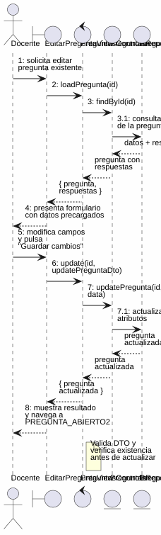
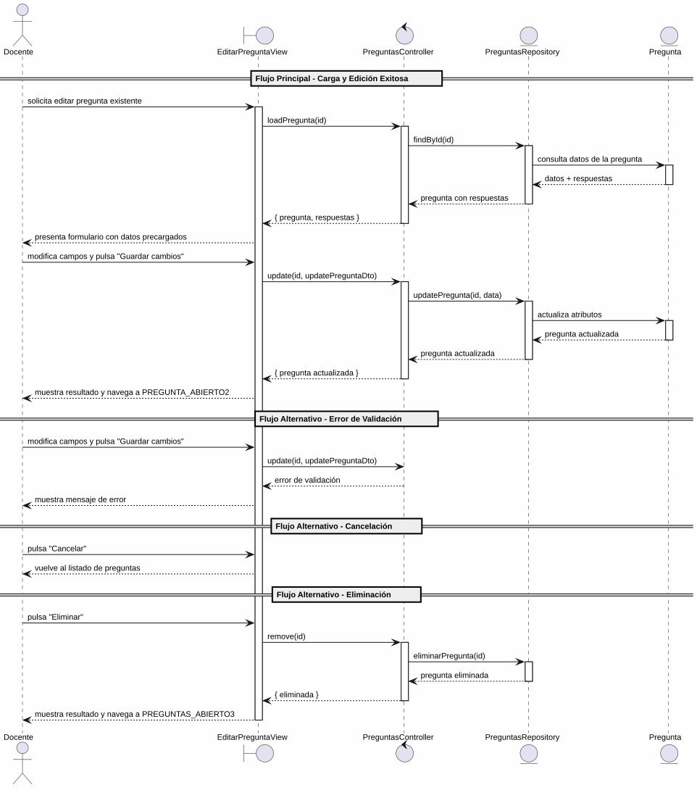

# 25-26-idsw2-sdVC > editarPregunta > Análisis

## información del artefacto

- **Proyecto**: Sistema de Gestión de Exámenes Universitarios
- **Fase RUP**: Elaboration (Elaboración)
- **Disciplina**: Análisis y Diseño
- **Versión**: 1.0
- **Fecha**: 2026-05-29
- **Autor**: Marcos Gutierrez

## propósito

Análisis de colaboración del caso de uso `editarPregunta()` mediante el patrón MVC, identificando las clases de análisis, sus responsabilidades y colaboraciones necesarias para cumplir con los requisitos especificados.

## diagrama de colaboración

||
|-|
|Código fuente: [colaboracion.puml](../../../modelosUML/analisis/editarPregunta/colaboracion.puml)|

## clases de análisis identificadas

### clases de vista (boundary)

#### EditarPreguntaView
**Estereotipo**: Vista (Boundary)
**Responsabilidades**:
- Recibir la solicitud de edición desde múltiples orígenes (RESPUESTAS_ABIERTO, RESPUESTAS_CONTEXTUALES_ABIERTO, PREGUNTAS_ABIERTO, PREGUNTAS_CONTEXTUALES_ABIERTO, PREGUNTA_ABIERTO, PREGUNTA_CONTEXTUAL_ABIERTO)
- Solicitar la carga de datos existentes de la pregunta
- Presentar formulario con datos precargados: Asignatura, Enunciado, Tema, Dificultad (radio), Respuestas, Habilitada/Deshabilitada
- Permitir modificar campos, guardar cambios, cancelar, eliminar la pregunta y navegar a ver respuestas
- Validar visualmente los campos obligatorios antes de enviar
- Visualizar el resultado final (éxito, error)

**Colaboraciones**:
- **Entrada**: Recibe `editarPregunta(id)` desde 6 orígenes (listados de preguntas/respuestas global y contextual, o vista de pregunta)
- **Control**: Se comunica con `PreguntasController`
- **Salida**: Navega a `PREGUNTA_ABIERTO2` / `PREGUNTA_CONTEXTUAL_ABIERTO2` (guardar), `PREGUNTAS_ABIERTO2` / `PREGUNTAS_CONTEXTUALES_ABIERTO2` (cancelar), `PREGUNTAS_ABIERTO3` / `PREGUNTAS_CONTEXTUALES_ABIERTO3` (eliminar) o `RESPUESTAS_ABIERTO2` / `RESPUESTAS_CONTEXTUALES_ABIERTO2` (ver respuestas)

### clases de control

#### PreguntasController
**Estereotipo**: Control
**Responsabilidades**:
- Coordinar la carga de datos existentes de la pregunta a editar
- Coordinar la lógica de actualización de una pregunta existente
- Validar los datos de entrada del DTO de actualización
- Verificar que la pregunta existe antes de cualquier operación
- Gestionar la eliminación de la pregunta cuando se solicita
- Gestionar la respuesta de éxito o error

**Colaboraciones**:
- **Vista**: Responde a solicitudes de `EditarPreguntaView`
- **Repositorio**: Delega operaciones de persistencia a `PreguntasRepository`

### clases de entidad (entity)

#### PreguntasRepository
**Estereotipo**: Entidad
**Responsabilidades**:
- Abstraer el acceso a datos de preguntas, respuestas y baterías
- Proporcionar método para obtener una pregunta por ID con sus relaciones
- Proporcionar método para actualizar una pregunta existente
- Proporcionar método para eliminar una pregunta
- Validar la existencia de la pregunta antes de cada operación
- Mantener la consistencia de los datos durante la actualización

**Colaboraciones**:
- **Control**: Responde a `PreguntasController`
- **Entidad**: Gestiona instancias de `Pregunta`, `BateriaDePreguntas` y `Respuesta`

#### Pregunta
**Estereotipo**: Entidad
**Responsabilidades**:
- Representar una pregunta del banco de preguntas
- Encapsular atributos: id, enunciado, tema, dificultad, estado, bateriaId
- Permitir la actualización de sus atributos
- Relacionarse con la batería de preguntas y sus respuestas

**Atributos relevantes**:
| Campo | Tipo | Descripción |
|-------|------|-------------|
| `id` | Int (PK) | Identificador único de la pregunta |
| `enunciado` | String | Texto de la pregunta |
| `tema` | String | Tema al que pertenece |
| `dificultad` | Dificultad (enum) | BAJA \| MEDIA \| ALTA |
| `estado` | EstadoPregunta (enum) | EN_CONSTRUCCION \| HABILITADA \| INHABILITADA |
| `bateriaId` | Int (FK) | Referencia a la batería de preguntas |

**Colaboraciones**:
- **PreguntasRepository**: Es gestionada por el repositorio
- **BateriaDePreguntas**: Relación de pertenencia a la batería
- **Respuesta**: Contiene respuestas asociadas

#### BateriaDePreguntas
**Estereotipo**: Entidad
**Responsabilidades**:
- Representar el banco de preguntas asociado a una asignatura
- Proporcionar la asignatura asociada para la visualización en el formulario

**Atributos relevantes**:
| Campo | Tipo | Descripción |
|-------|------|-------------|
| `id` | Int (PK) | Identificador único de la batería |
| `asignaturaId` | Int (FK, unique) | Referencia a la asignatura |

**Colaboraciones**:
- **PreguntasRepository**: Es consultada para obtener la asignatura

#### Respuesta
**Estereotipo**: Entidad
**Responsabilidades**:
- Representar una opción de respuesta asociada a una pregunta
- Encapsular atributos: id, opcion, esCorrecta, preguntaId

**Atributos relevantes**:
| Campo | Tipo | Descripción |
|-------|------|-------------|
| `id` | Int (PK) | Identificador único de la respuesta |
| `opcion` | String | Texto de la opción |
| `esCorrecta` | Boolean | Indica si es la respuesta correcta |
| `preguntaId` | Int (FK) | Referencia a la pregunta |

**Colaboraciones**:
- **Pregunta**: Pertenece a la pregunta editada

## diagrama de secuencia

||
|-|
|Código fuente: [secuencia.puml](../../../modelosUML/analisis/editarPregunta/secuencia.puml)|

## flujo de colaboración

### secuencia de operaciones (flujo principal — edición exitosa)

1. **Inicio**: Desde cualquiera de los 6 orígenes → `EditarPreguntaView.editarPregunta(id)`
2. **Carga de datos**: `EditarPreguntaView` → `PreguntasController.loadPregunta(id)`
3. **Verificación**: `PreguntasController` → `PreguntasRepository.findById(id)`
4. **Consulta de entidad**: `PreguntasRepository` → `Pregunta` → consulta datos + respuestas + batería
5. **Devolución**: `PreguntasRepository` → `PreguntasController` → `EditarPreguntaView`: pregunta con datos completos
6. **Presentación**: `EditarPreguntaView` muestra formulario con datos precargados
7. **Modificación**: Docente modifica campos (enunciado, tema, dificultad, estado)
8. **Guardado**: Docente pulsa "Guardar cambios" → `EditarPreguntaView` → `PreguntasController.update(id, updatePreguntaDto)`
9. **Validación**: `PreguntasController` valida los datos de entrada
10. **Persistencia**: `PreguntasController` → `PreguntasRepository.updatePregunta(id, data)`
11. **Actualización**: `PreguntasRepository` → `Pregunta` → actualiza atributos
12. **Resultado**: `PreguntasRepository` → `PreguntasController` → `EditarPreguntaView` → Docente: pregunta actualizada + navegación a `PREGUNTA_ABIERTO2`

### flujo alternativo — error de validación

- Paso 9 falla por datos inválidos (validación del controlador)
- `PreguntasController` retorna error a `EditarPreguntaView`
- `EditarPreguntaView` muestra mensaje de error al Docente
- El sistema regresa al estado `GuardandoDatos`

### flujo alternativo — cancelación

- Docente pulsa "Cancelar" en el formulario
- `EditarPreguntaView` regresa al listado de preguntas (`PREGUNTAS_ABIERTO2` / `PREGUNTAS_CONTEXTUALES_ABIERTO2`)
- No se ejecuta ninguna actualización ni persistencia

### flujo alternativo — eliminación

- Docente pulsa "Eliminar" en el formulario
- `EditarPreguntaView` → `PreguntasController.remove(id)`
- `PreguntasController` → `PreguntasRepository.eliminarPregunta(id)`
- `PreguntasRepository` verifica existencia y elimina
- `EditarPreguntaView` navega a `PREGUNTAS_ABIERTO3` / `PREGUNTAS_CONTEXTUALES_ABIERTO3`

### flujo alternativo — ver respuestas

- Docente pulsa "Ver respuestas" en el formulario
- `EditarPreguntaView` navega a `RESPUESTAS_ABIERTO2` / `RESPUESTAS_CONTEXTUALES_ABIERTO2`
- No se ejecuta ninguna actualización ni persistencia

### opciones de navegación disponibles

| Acción | Destino | Descripción |
|--------|---------|-------------|
| `Guardar cambios` | `PREGUNTA_ABIERTO2` / `PREGUNTA_CONTEXTUAL_ABIERTO2` | Guarda los cambios y permanece en la vista de la pregunta |
| `Cancelar` | `PREGUNTAS_ABIERTO2` / `PREGUNTAS_CONTEXTUALES_ABIERTO2` | Vuelve al listado sin guardar |
| `Eliminar` | `PREGUNTAS_ABIERTO3` / `PREGUNTAS_CONTEXTUALES_ABIERTO3` | Elimina la pregunta y vuelve al listado |
| `Ver respuestas` | `RESPUESTAS_ABIERTO2` / `RESPUESTAS_CONTEXTUALES_ABIERTO2` | Navega a la gestión de respuestas |

## estados de análisis

Los estados se corresponden con el diagrama de estados detallado en `contexto/casos-de-uso/detalladoCasosDeUso/editarPregunta/editarPregunta.puml`:

| Estado | Descripción |
|--------|-------------|
| `EditandoDatos` | El docente solicita editar una pregunta existente; el sistema inicia la carga de datos |
| `GuardandoDatos` | El sistema presenta el formulario con datos precargados; el docente modifica campos, guarda cambios, cancela, elimina la pregunta o navega a ver respuestas |

**Transiciones clave:**
- `EditandoDatos` → `GuardandoDatos`: Sistema carga y presenta datos de la pregunta con campos editables
- `GuardandoDatos` → `EditandoDatos`: Docente solicita modificar campos
- `GuardandoDatos` → `[*]`: Docente guarda cambios (salida a `PREGUNTA_ABIERTO2` / `PREGUNTA_CONTEXTUAL_ABIERTO2`)
- `GuardandoDatos` → `PREGUNTAS_ABIERTO2` / `PREGUNTAS_CONTEXTUALES_ABIERTO2`: Cancelación
- `GuardandoDatos` → `PREGUNTAS_ABIERTO3` / `PREGUNTAS_CONTEXTUALES_ABIERTO3`: Eliminación
- `GuardandoDatos` → `RESPUESTAS_ABIERTO2` / `RESPUESTAS_CONTEXTUALES_ABIERTO2`: Ver respuestas

## correspondencia con requisitos

### mapeado con especificación detallada

| Requisito del caso de uso | Clase responsable | Método/Colaboración |
|--------------------------|-------------------|---------------------|
| Recibir solicitud de edición desde 6 orígenes | `EditarPreguntaView` | Entrada dual + contextual (preguntas, respuestas, vista de pregunta) |
| Cargar datos existentes de la pregunta | `PreguntasController` | `loadPregunta(id)` → `PreguntasRepository.findById(id)` |
| Mostrar formulario con datos precargados | `EditarPreguntaView` | Asignatura, Enunciado, Tema, Dificultad, Respuestas, Habilitada/Deshabilitada |
| Validar campos obligatorios | `EditarPreguntaView` | Validación visual antes de enviar |
| Actualizar pregunta con datos modificados | `PreguntasController` | `update(id, updatePreguntaDto)` |
| Validar integridad de datos de entrada | `PreguntasController` | Validación de DTO |
| Verificar existencia de la pregunta | `PreguntasRepository` | `findById(id)` lanza excepción si no existe |
| Persistir actualización | `PreguntasRepository` | `updatePregunta(id, data)` |
| Eliminar pregunta | `PreguntasController` | `remove(id)` → `PreguntasRepository.eliminarPregunta(id)` |
| Transicionar a guardado exitoso | `EditarPreguntaView` | Navegación a `PREGUNTA_ABIERTO2` |
| Cancelar edición | `EditarPreguntaView` | Navegación a `PREGUNTAS_ABIERTO2` |
| Navegar a ver respuestas | `EditarPreguntaView` | Navegación a `RESPUESTAS_ABIERTO2` |

### patrón de colaboración establecido

Este análisis sigue el **patrón metodológico universal** establecido para el proyecto:
- **Entrada múltiple**: Desde 6 orígenes (listados de preguntas, vista de pregunta y listados de respuestas)
- **Análisis MVC completo**: Vista, Control y Entidad claramente separados
- **Salida cuádruple**: Guardar, Cancelar, Eliminar y Ver respuestas con destinos diferenciados
- **Flujo con carga previa**: Primero carga datos existentes, luego permite modificar y guardar

### consideraciones de filtros

`editarPregunta()` **no requiere filtros de búsqueda**. Es un caso de uso transaccional donde el docente selecciona una pregunta existente y edita sus datos. La carga inicial usa el ID de la pregunta seleccionada.

## características del análisis

### separación de responsabilidades MVC

- **Vista**: Solo presentación del formulario con datos precargados, captura de modificaciones e interacción con el docente
- **Control**: Solo coordinación de carga de datos, validación, actualización y eliminación
- **Entidad**: Solo datos, reglas de negocio de persistencia y verificación de existencia

### agnóstico tecnológicamente

- No especifica tecnología de interfaz de usuario
- No asume implementación específica de base de datos
- Mantiene independencia de frameworks

### trazabilidad completa

- **Origen**: Caso de uso detallado `editarPregunta()` y prototipo asociado
- **Destino**: Base para diseño arquitectónico e implementación
- **Conexión**: Diagrama de contexto → Análisis de colaboración → Implementación real

## trazabilidad con la implementación

| Capa | Artefacto real |
|------|----------------|
| Controlador | `src/apps/backend/src/preguntas/preguntas.controller.ts` (`PATCH /preguntas/:id`, `DELETE /preguntas/:id`) |
| Servicio | `src/apps/backend/src/preguntas/preguntas.service.ts` (`update()`, `remove()`, `findOne()`) |
| DTO | `src/apps/backend/src/preguntas/dto/update-pregunta.dto.ts` (`UpdatePreguntaDto`) |
| Vista | `src/apps/frontend/src/views/PreguntasView.vue` (diálogo de edición) |
| Modelo (BD) | `src/apps/backend/prisma/schema.prisma` (Pregunta, BateriaDePreguntas, Respuesta) |

> **Nota:** Este caso de uso está priorizado como #11 y ya tiene implementación completa en el backend (`PreguntasService.update()`, `PreguntasService.remove()`). El análisis se ha realizado a partir de los artefactos de requisitos (diagrama de estados detallado y prototipo de interfaz) y validado contra la implementación real.

## patrones aplicados

### repository pattern
`PreguntasRepository` abstrae el acceso a datos de preguntas, respuestas y baterías, encapsulando operaciones de carga, actualización y eliminación con verificación de existencia.

### mvc pattern
Separación clara entre presentación (`EditarPreguntaView`), lógica de aplicación (`PreguntasController`) y datos (`Pregunta`, `BateriaDePreguntas`, `Respuesta`, `PreguntasRepository`).

### navigation pattern
Las opciones de "Guardar cambios", "Cancelar", "Eliminar" y "Ver respuestas" permiten al docente controlar el flujo, con salida diferenciada según la acción. Los 6 orígenes de entrada convergen en un único flujo de edición.
