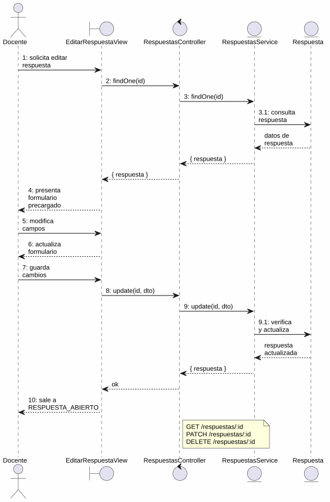
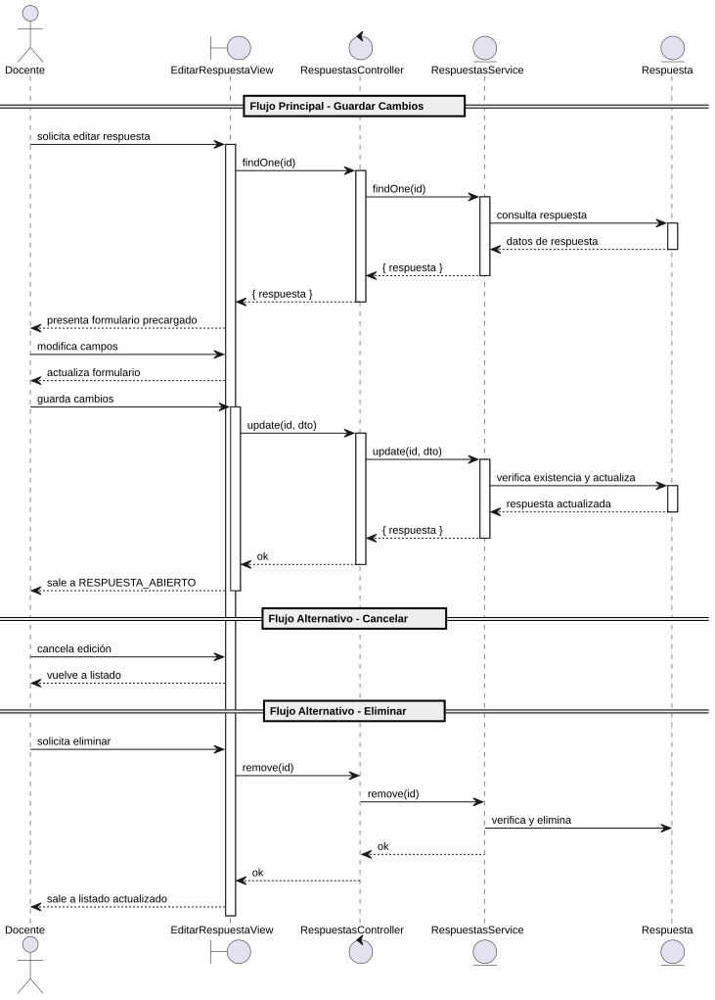

# 25-26-idsw2-sdVC > editarRespuesta > Análisis

## propósito

Análisis de colaboración del caso de uso `editarRespuesta()` mediante el patrón MVC.

## diagrama de colaboración

||
|-|
|Código fuente: [colaboracion.puml](../../../modelosUML/analisis/editarRespuesta/colaboracion.puml)|

## clases de análisis identificadas

### EditarRespuestaView (Boundary)
- Recibir solicitud desde 4 orígenes (RESPUESTAS_ABIERTO, RESPUESTA_ABIERTO, RESPUESTAS_CONTEXTUALES_ABIERTO, RESPUESTA_CONTEXTUAL_ABIERTO)
- Presentar formulario de edición precargado (contenido, correcta)
- Guardar, modificar campos, cancelar o eliminar

### RespuestasController (Control)
- Coordinar carga previa, actualización y eliminación
- `findOne(id)`, `update(id, dto)`, `remove(id)` → `RespuestasService`

### RespuestasService (Entity)
- Abstraer acceso a datos de respuestas
- `findOne(id)`, `update(id, dto)`, `remove(id)` con verificación de existencia

### Respuesta (Entity)
- Atributos: id, contenido, correcta, preguntaId

## diagrama de secuencia

||
|-|
|Código fuente: [secuencia.puml](../../../modelosUML/analisis/editarRespuesta/secuencia.puml)|

## estados de análisis

| Estado | Descripción |
|--------|-------------|
| `EditandoDatos` | Muestra formulario precargado; permite modificar, guardar, cancelar o eliminar |
| `GuardandoDatos` | Persiste cambios y retorna a EditandoDatos (loop) o sale |

**Entradas:** RESPUESTAS_ABIERTO, RESPUESTA_ABIERTO, RESPUESTAS_CONTEXTUALES_ABIERTO, RESPUESTA_CONTEXTUAL_ABIERTO
**Salidas:** RESPUESTA_ABIERTO2/RESPUESTA_CONTEXTUAL_ABIERTO2 (guardar), RESPUESTAS_ABIERTO2/RESPUESTAS_CONTEXTUALES_ABIERTO2 (cancelar), RESPUESTAS_ABIERTO3/RESPUESTAS_CONTEXTUAL_ABIERTO3 (eliminar)

## trazabilidad con la implementación

| Capa | Artefacto |
|------|-----------|
| Controlador | `src/apps/backend/src/respuestas/respuestas.controller.ts` (`GET /respuestas/:id`, `PATCH /respuestas/:id`, `DELETE /respuestas/:id`) |
| Servicio | `src/apps/backend/src/respuestas/respuestas.service.ts` (`findOne()`, `update()`, `remove()`) |
| Vista | `src/apps/frontend/src/views/RespuestasView.vue` |
| Modelo (BD) | `src/apps/backend/prisma/schema.prisma` (modelo `Respuesta`) |
