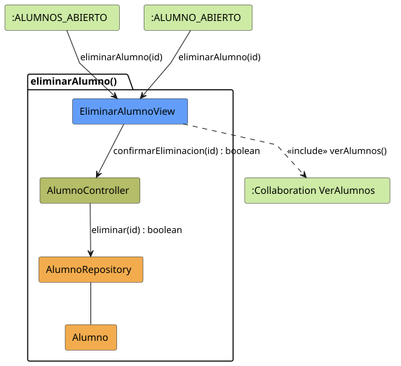

# Jorgestor > eliminarAlumno > Análisis

> |[🏠️](/README.md)|[ 📊](../../../archivosEsenciales/casos-de-uso/diagramasDeContexto/diagramaDeContextoDocente/diagramaContexto.svg)|[Detalle](../../../archivosEsenciales/casos-de-uso/detalladoCasosDeUso/README.md#eliminar-alumno-docente)|**Análisis**|Diseño|Desarrollo|Pruebas|
> |-|-|-|-|-|-|-|

## información del artefacto

- **Proyecto**: Jorgestor - Sistema de Gestión de Exámenes
- **Fase RUP**: Elaboración
- **Disciplina**: Análisis y Diseño
- **Versión**: 1.0
- **Fecha**: 2026-05-26
- **Autor**: Gemini CLI

## propósito

Análisis de colaboración del caso de uso `eliminarAlumno()` mediante el patrón MVC, identificando las clases de análisis, sus responsabilidades y colaboraciones necesarias para gestionar la baja definitiva de alumnos y su información académica.

## diagramas de análisis

### diagrama de colaboración

||
|-|
|Código fuente: [colaboracion.puml](colaboracion.puml)|

## clases de análisis identificadas

### clases de vista (boundary)

#### EliminarAlumnoView
**Estereotipo**: Vista (Boundary)  
**Responsabilidades**:
- Mostrar los datos identificativos del alumno (DNI, Nombre, Apellidos).
- Advertir sobre la eliminación permanente del registro académico.
- Recoger la confirmación o cancelación de la acción por parte del docente.

**Colaboraciones**:
- **Entrada**: Recibe `eliminarAlumno(id)` desde `:ALUMNOS_ABIERTO` o `:ALUMNO_ABIERTO`.
- **Control**: Se comunica con `AlumnoController`.
- **Salida**: **<<include>>** `:Collaboration VerAlumnos`.

### clases de control

#### AlumnoController
**Estereotipo**: Control  
**Responsabilidades**:
- Gestionar el proceso de eliminación de la entidad Alumno.
- Asegurar que la operación se refleje correctamente en el sistema.

**Colaboraciones**:
- **Vista**: Responde a `EliminarAlumnoView`.
- **Repositorio**: Delega en `AlumnoRepository`.

### clases de entidad (entity)

#### AlumnoRepository
**Estereotipo**: Entidad  
**Responsabilidades**:
- Proveer los mecanismos de persistencia para eliminar registros de alumnos.
- Garantizar la integridad de los datos almacenados.

**Colaboraciones**:
- **Control**: Responde a `AlumnoController`.
- **Entidad**: Maneja instancias de `Alumno`.

#### Alumno
**Estereotipo**: Entidad  
**Responsabilidades**:
- Contener la información del alumno: DNI, nombre, apellidos y curso.

## flujo de colaboración principal

### secuencia: eliminar alumno

1. **Inicio**: El docente selecciona eliminar a un alumno desde el listado general o su ficha individual.
2. **Presentación**: `EliminarAlumnoView` presenta el resumen del alumno y el aviso legal/técnico de borrado.
3. **Confirmación**: El docente pulsa sobre la opción de confirmar eliminación.
4. **Ejecución**: `AlumnoController` invoca al repositorio para eliminar el registro por ID.
5. **Finalización**: Redirección a la vista de gestión de alumnos (`VerAlumnos`).

## política de borrado de datos personales

Este proceso asegura la eliminación física de los datos del alumno conforme a las necesidades del sistema y las advertencias presentadas en el wireframe de prototipado.
