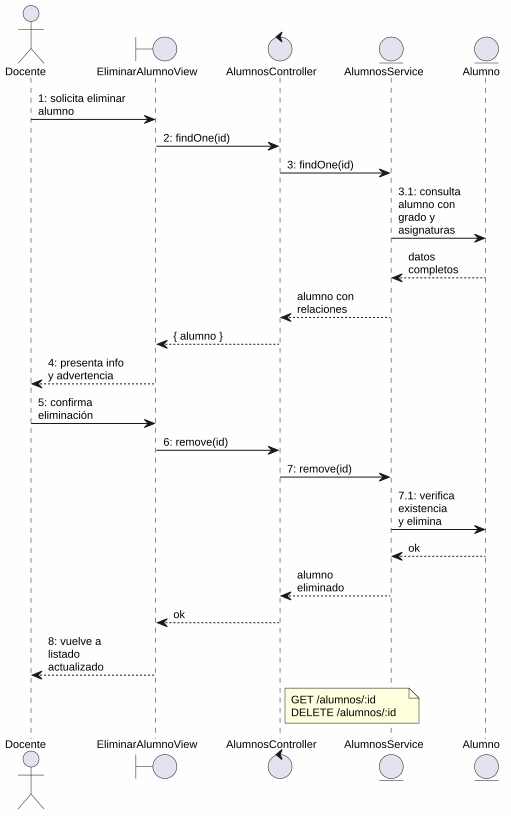
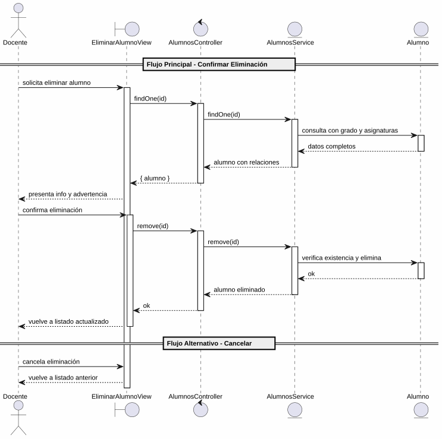

# 25-26-idsw2-sdVC > eliminarAlumno > Análisis

## propósito

Análisis de colaboración del caso de uso `eliminarAlumno()` mediante el patrón MVC.

## diagrama de colaboración

||
|-|
|Código fuente: [colaboracion.puml](../../../modelosUML/analisis/eliminarAlumno/colaboracion.puml)|

## clases de análisis identificadas

### EliminarAlumnoView (Boundary)
- Recibir solicitud desde 2 orígenes (ALUMNOS_ABIERTO, ALUMNO_ABIERTO)
- Presentar información del alumno (nombre, apellidos, DNI) con advertencia de irreversibilidad
- Confirmar o cancelar eliminación

### AlumnosController (Control)
- Coordinar carga previa y eliminación
- `findOne(id)` → `AlumnosService`
- `remove(id)` → `AlumnosService`

### AlumnosService (Entity)
- Abstraer acceso a datos de alumnos
- `findOne(id)` con `include: { grado, asignaturas }`
- `remove(id)` con verificación previa de existencia

### Alumno (Entity)
- Atributos: id, nombre, apellidos, dni, email, gradoId

## diagrama de secuencia

||
|-|
|Código fuente: [secuencia.puml](../../../modelosUML/analisis/eliminarAlumno/secuencia.puml)|

## estados de análisis

| Estado | Descripción |
|--------|-------------|
| `ConfirmandoEliminacion` | Presenta info del alumno + advertencia; espera confirmación o cancelación |
| `EliminandoAlumno` | Ejecuta borrado y retorna al listado actualizado |

**Entradas:** ALUMNOS_ABIERTO, ALUMNO_ABIERTO
**Salidas:** ALUMNOS_ABIERTO2 (confirmado), ALUMNOS_ABIERTO3/4 (cancelación)

## trazabilidad con la implementación

| Capa | Artefacto |
|------|-----------|
| Controlador | `src/apps/backend/src/alumnos/alumnos.controller.ts` (`GET /alumnos/:id`, `DELETE /alumnos/:id`) |
| Servicio | `src/apps/backend/src/alumnos/alumnos.service.ts` (`findOne()`, `remove()`) |
| Vista | `src/apps/frontend/src/views/AlumnosView.vue` |
| Modelo (BD) | `src/apps/backend/prisma/schema.prisma` (modelo `Alumno`) |
