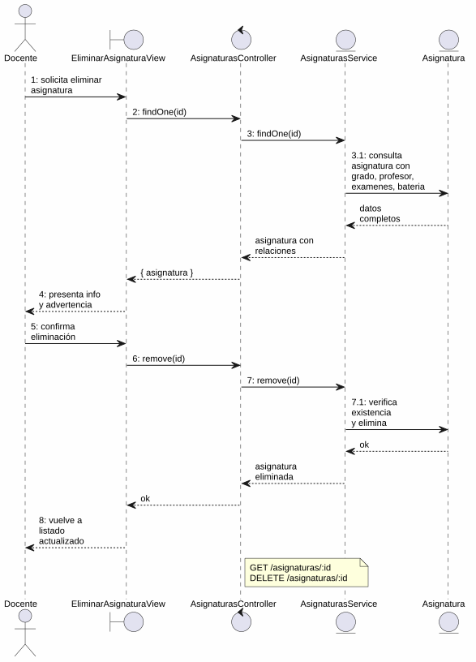
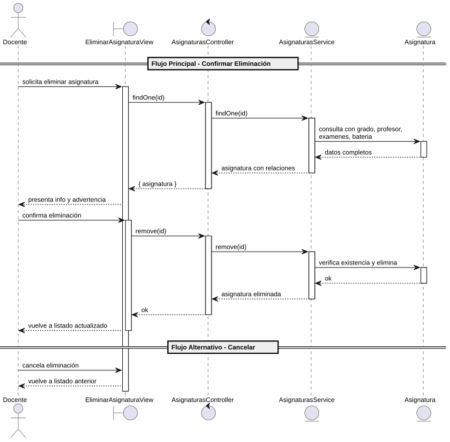

# 25-26-idsw2-sdVC > eliminarAsignatura > Análisis

## propósito

Análisis de colaboración del caso de uso `eliminarAsignatura()` mediante el patrón MVC.

## diagrama de colaboración

||
|-|
|Código fuente: [colaboracion.puml](../../../modelosUML/analisis/eliminarAsignatura/colaboracion.puml)|

## clases de análisis identificadas

### EliminarAsignaturaView (Boundary)
- Recibir solicitud desde 2 orígenes (ASIGNATURAS_ABIERTO, ASIGNATURA_ABIERTO)
- Presentar información completa de la asignatura (código, nombre, curso, batería de preguntas) con advertencia de irreversibilidad
- Confirmar o cancelar eliminación

### AsignaturasController (Control)
- Coordinar carga previa y eliminación
- `findOne(id)` → `AsignaturasService`
- `remove(id)` → `AsignaturasService`

### AsignaturasService (Entity)
- Abstraer acceso a datos de asignaturas
- `findOne(id)` con `include: { grado, profesor, examenes, bateria }`
- `remove(id)` con verificación previa de existencia

### Asignatura (Entity)
- Atributos: id, nombre, codigo, cursoAcademico, gradoId, profesorId
- Relaciones: grado, profesor, examenes, bateria

## diagrama de secuencia

||
|-|
|Código fuente: [secuencia.puml](../../../modelosUML/analisis/eliminarAsignatura/secuencia.puml)|

## estados de análisis

| Estado | Descripción |
|--------|-------------|
| `ConfirmandoEliminacion` | Presenta info de la asignatura + advertencia; espera confirmación o cancelación |
| `EliminandoAsignatura` | Ejecuta borrado y retorna al listado actualizado |

**Entradas:** ASIGNATURAS_ABIERTO, ASIGNATURA_ABIERTO
**Salidas:** ASIGNATURAS_ABIERTO2 (confirmado), ASIGNATURAS_ABIERTO3 (cancel desde lista), ASIGNATURAS_ABIERTO4 (cancel desde vista)

## trazabilidad con la implementación

| Capa | Artefacto |
|------|-----------|
| Controlador | `src/apps/backend/src/asignaturas/asignaturas.controller.ts` (`GET /asignaturas/:id`, `DELETE /asignaturas/:id`) |
| Servicio | `src/apps/backend/src/asignaturas/asignaturas.service.ts` (`findOne()`, `remove()`) |
| Vista | `src/apps/frontend/src/views/AsignaturasView.vue` |
| Modelo (BD) | `src/apps/backend/prisma/schema.prisma` (modelo `Asignatura`) |
