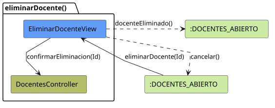
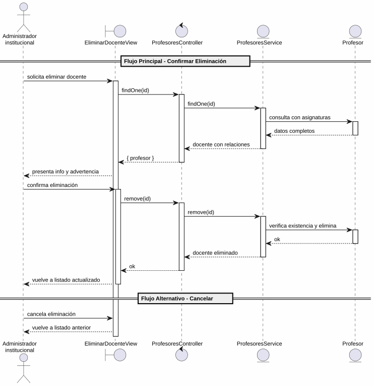

# 25-26-idsw2-sdVC > eliminarDocente > Análisis

## propósito

Análisis de colaboración del caso de uso `eliminarDocente()` mediante el patrón MVC.

## diagrama de colaboración

||
|-|
|Código fuente: [colaboracion.puml](../../../modelosUML/analisis/eliminarDocente/colaboracion.puml)|

## clases de análisis identificadas

### EliminarDocenteView (Boundary)
- Recibir solicitud desde 2 orígenes (DOCENTES_ABIERTO, DOCENTE_ABIERTO)
- Presentar información del docente (nombre, apellidos, DNI, usuario, email, password) con advertencia de irreversibilidad
- Confirmar o cancelar eliminación

### ProfesoresController (Control)
- Coordinar carga previa y eliminación
- `findOne(id)` → `ProfesoresService`
- `remove(id)` → `ProfesoresService`

### ProfesoresService (Entity)
- Abstraer acceso a datos de docentes
- `findOne(id)` con `include: { asignaturas }`, `omit: { password }`
- `remove(id)` con verificación previa de existencia

### Profesor (Entity)
- Atributos: id, nombre, apellidos, dni, email, usuario, password, rol

## diagrama de secuencia

||
|-|
|Código fuente: [secuencia.puml](../../../modelosUML/analisis/eliminarDocente/secuencia.puml)|

## estados de análisis

| Estado | Descripción |
|--------|-------------|
| `ConfirmandoEliminacion` | Presenta info del docente + advertencia; espera confirmación o cancelación |
| `EliminandoDocente` | Ejecuta borrado y retorna al listado actualizado |

**Entradas:** DOCENTES_ABIERTO, DOCENTE_ABIERTO
**Salidas:** DOCENTES_ABIERTO2 (confirmado), DOCENTES_ABIERTO3/4 (cancelación)

## trazabilidad con la implementación

| Capa | Artefacto |
|------|-----------|
| Controlador | `src/apps/backend/src/profesores/profesores.controller.ts` (`GET /profesores/:id`, `DELETE /profesores/:id`) |
| Servicio | `src/apps/backend/src/profesores/profesores.service.ts` (`findOne()`, `remove()`) |
| Vista | `src/apps/frontend/src/views/ProfesoresView.vue` |
| Modelo (BD) | `src/apps/backend/prisma/schema.prisma` (modelo `Profesor`) |
