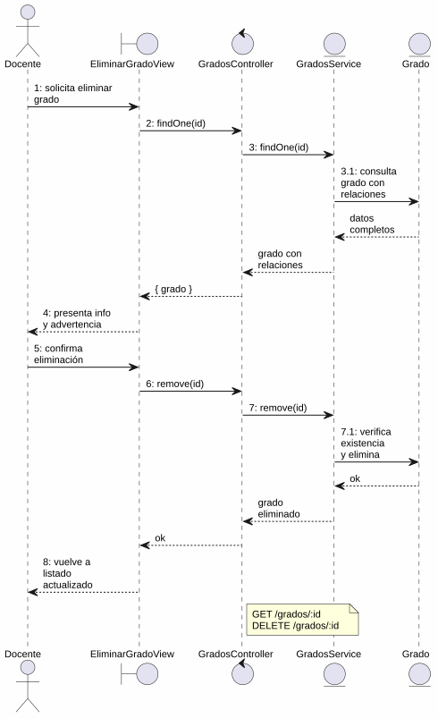
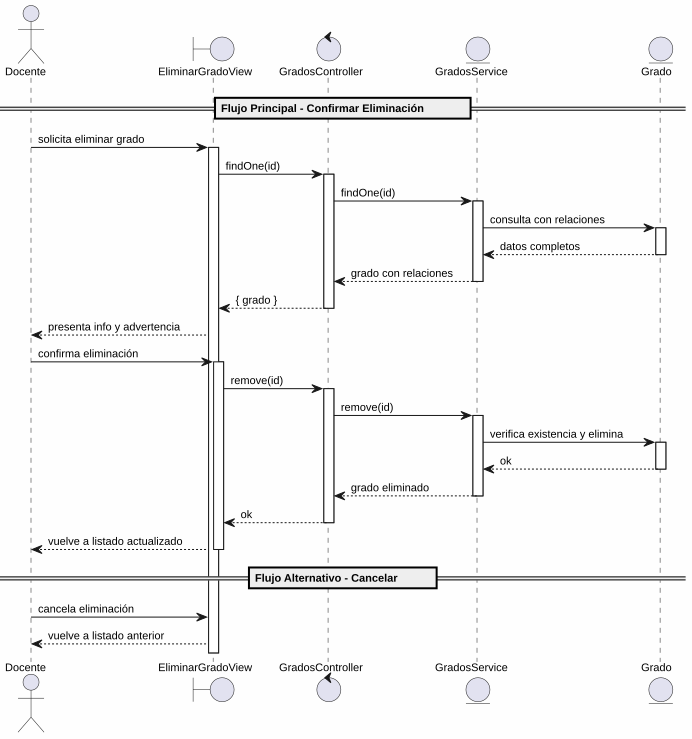

# 25-26-idsw2-sdVC > eliminarGrado > Análisis

## propósito

Análisis de colaboración del caso de uso `eliminarGrado()` mediante el patrón MVC.

## diagrama de colaboración

||
|-|
|Código fuente: [colaboracion.puml](../../../modelosUML/analisis/eliminarGrado/colaboracion.puml)|

## clases de análisis identificadas

### EliminarGradoView (Boundary)
- Recibir solicitud desde 2 orígenes (GRADOS_ABIERTO, GRADO_ABIERTO)
- Presentar información del grado (nombre, código, alumnos enlistados) con advertencia de irreversibilidad
- Confirmar o cancelar eliminación

### GradosController (Control)
- Coordinar carga previa y eliminación
- `findOne(id)` → `GradosService`
- `remove(id)` → `GradosService`

### GradosService (Entity)
- Abstraer acceso a datos de grados
- `findOne(id)` con relaciones
- `remove(id)` con verificación previa de existencia

### Grado (Entity)
- Atributos: id, nombre, codigo
- Relaciones: alumnos, asignaturas

## diagrama de secuencia

||
|-|
|Código fuente: [secuencia.puml](../../../modelosUML/analisis/eliminarGrado/secuencia.puml)|

## estados de análisis

| Estado | Descripción |
|--------|-------------|
| `ConfirmandoEliminacion` | Presenta info del grado + advertencia; espera confirmación o cancelación |
| `EliminandoGrado` | Ejecuta borrado y retorna al listado actualizado |

**Entradas:** GRADOS_ABIERTO, GRADO_ABIERTO
**Salidas:** GRADOS_ABIERTO2 (confirmado), GRADOS_ABIERTO3/4 (cancelación)

## trazabilidad con la implementación

| Capa | Artefacto |
|------|-----------|
| Controlador | `src/apps/backend/src/grados/grados.controller.ts` (`GET /grados/:id`, `DELETE /grados/:id`) |
| Servicio | `src/apps/backend/src/grados/grados.service.ts` (`findOne()`, `remove()`) |
| Vista | `src/apps/frontend/src/views/GradosView.vue` |
| Modelo (BD) | `src/apps/backend/prisma/schema.prisma` (modelo `Grado`) |
