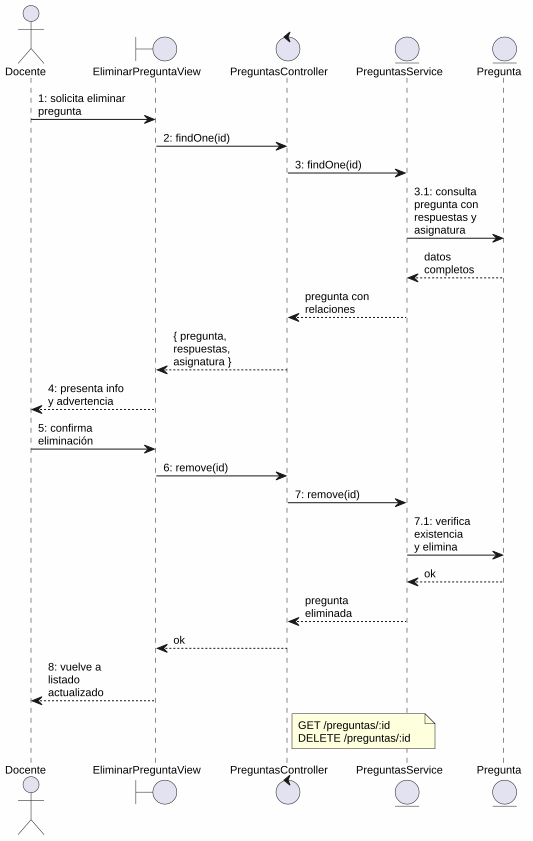
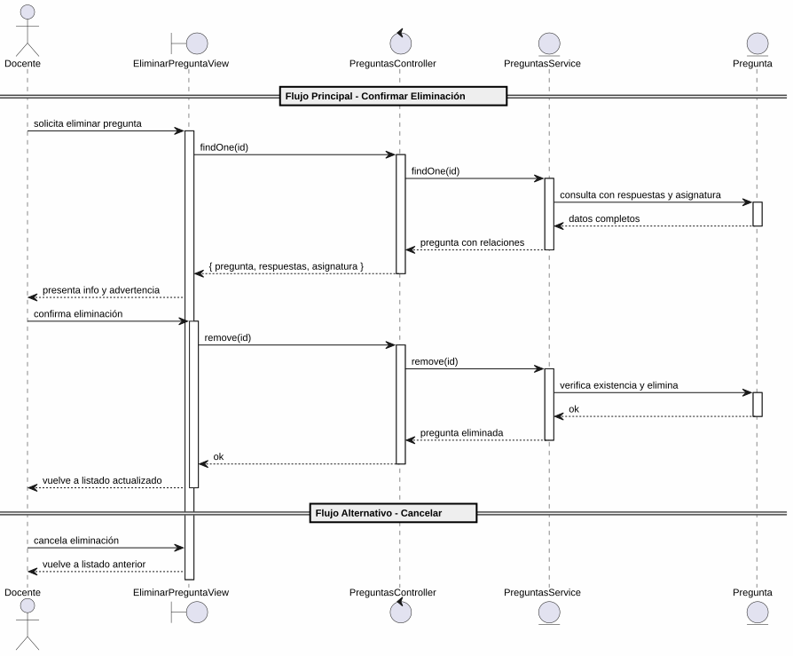

# 25-26-idsw2-sdVC > eliminarPregunta > Análisis

## propósito

Análisis de colaboración del caso de uso `eliminarPregunta()` mediante el patrón MVC.

## diagrama de colaboración

||
|-|
|Código fuente: [colaboracion.puml](../../../modelosUML/analisis/eliminarPregunta/colaboracion.puml)|

## clases de análisis identificadas

### EliminarPreguntaView (Boundary)
- Recibir solicitud desde 2 orígenes (PREGUNTAS_ABIERTO, PREGUNTAS_CONTEXTUALES_ABIERTO)
- Presentar información completa de la pregunta (asignatura, enunciado, tema, dificultad, respuestas) con advertencia de irreversibilidad
- Confirmar o cancelar eliminación
- Navegar de vuelta al listado actualizado o al listado anterior

### PreguntasController (Control)
- Coordinar carga previa y eliminación
- `findOne(id)` → `PreguntasService`
- `remove(id)` → `PreguntasService`

### PreguntasService (Entity)
- Abstraer acceso a datos de preguntas
- `findOne(id)` con `include: { respuestas: true, bateria: { include: { asignatura: true } } }`
- `remove(id)` con verificación previa de existencia

### Pregunta (Entity)
- Atributos: id, enunciado, tema, dificultad, bateriaId
- Relaciones: respuestas[], bateria → asignatura

## diagrama de secuencia

||
|-|
|Código fuente: [secuencia.puml](../../../modelosUML/analisis/eliminarPregunta/secuencia.puml)|

## estados de análisis

| Estado | Descripción |
|--------|-------------|
| `ConfirmandoEliminacion` | Presenta info de la pregunta + advertencia; espera confirmación o cancelación |
| `EliminandoPregunta` | Ejecuta borrado y retorna al listado actualizado |

**Entradas:** PREGUNTAS_ABIERTO, PREGUNTAS_CONTEXTUALES_ABIERTO
**Salidas:** PREGUNTAS_ABIERTO2 (confirmado), PREGUNTAS_ABIERTO3 (cancelado), PREGUNTAS_CONTEXTUALES_ABIERTO2 (confirmado), PREGUNTAS_CONTEXTUALES_ABIERTO3 (cancelado)

## trazabilidad con la implementación

| Capa | Artefacto |
|------|-----------|
| Controlador | `src/apps/backend/src/preguntas/preguntas.controller.ts` (`GET /preguntas/:id`, `DELETE /preguntas/:id`) |
| Servicio | `src/apps/backend/src/preguntas/preguntas.service.ts` (`findOne()`, `remove()`) |
| Vista | `src/apps/frontend/src/views/PreguntasView.vue` |
| Modelo (BD) | `src/apps/backend/prisma/schema.prisma` (modelo `Pregunta`) |
