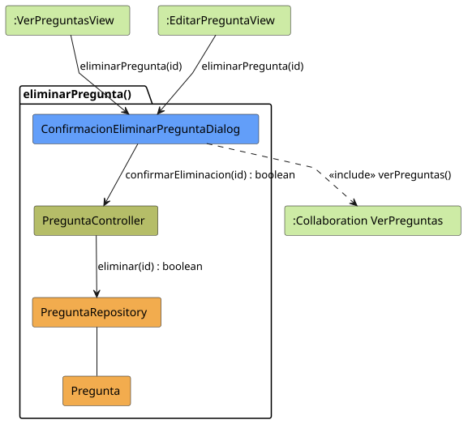
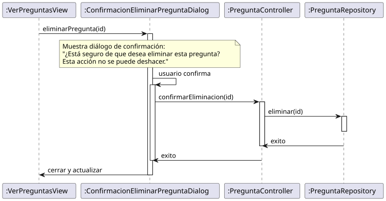

# Jorgestor > eliminarPregunta > Análisis

> |[🏠️](/README.md)|[ 📊](../../../archivosEsenciales/casos-de-uso/diagramasDeContexto/diagramaDeContextoDocente/diagramaContexto.svg)|[Detalle](../../../archivosEsenciales/casos-de-uso/detalladoCasosDeUso/README.md#eliminar-pregunta-docente)|**Análisis**|Diseño|Desarrollo|Pruebas|
> |-|-|-|-|-|-|-|

## información del artefacto

- **Proyecto**: Jorgestor - Sistema de Gestión de Exámenes
- **Fase RUP**: Elaboración
- **Disciplina**: Análisis y Diseño
- **Versión**: 1.0
- **Fecha**: 2026-05-25
- **Autor**: Gemini CLI

## propósito

Análisis de colaboración del caso de uso `eliminarPregunta()` mediante el patrón MVC, identificando las clases de análisis y sus responsabilidades para gestionar la eliminación segura de una pregunta tras la confirmación del Docente.

## diagramas de análisis

### diagrama de colaboración

||
|-|
|Código fuente: [colaboracion.puml](colaboracion.puml)|

### diagrama de secuencia

||
|-|
|Código fuente: [secuencia.puml](secuencia.puml)|

## clases de análisis identificadas

### clases de vista (boundary)

#### ConfirmacionEliminarPreguntaDialog
**Estereotipo**: Vista (Boundary)  
**Responsabilidades**:
- Presentar un diálogo de confirmación al usuario.
- Advertir sobre la irreversibilidad de la acción.
- Capturar la decisión del Docente (Confirmar/Cancelar).
- Notificar el resultado de la operación.

**Colaboraciones**:
- **Entrada**: Recibe `eliminarPregunta(id)` desde `:VerPreguntasView` o `:EditarPreguntaView`.
- **Control**: Se comunica con `PreguntaController`.
- **Salida**: **<<include>>** `:Collaboration VerPreguntas`.

### clases de control

#### PreguntaController
**Estereotipo**: Control  
**Responsabilidades**:
- Coordinar la lógica de eliminación de la pregunta.
- Validar que la pregunta pueda ser eliminada (p.ej., si no está en uso en un examen activo).
- Solicitar la persistencia del borrado al repositorio.

**Colaboraciones**:
- **Vista**: Responde a `ConfirmacionEliminarPreguntaDialog`.
- **Repositorio**: Delega en `PreguntaRepository`.

### clases de entidad (entity)

#### PreguntaRepository
**Estereotipo**: Entidad  
**Responsabilidades**:
- Abstraer el acceso a la base de datos de preguntas.
- Proporcionar métodos para eliminar físicamente o marcar como borrado un registro.

**Colaboraciones**:
- **Control**: Responde a `PreguntaController`.
- **Entidad**: Gestiona instancias de `Pregunta`.

#### Pregunta
**Estereotipo**: Entidad  
**Responsabilidades**:
- Representar la información de una pregunta (enunciado, tipo, dificultad, etc.).

## flujo de colaboración principal

### secuencia: eliminar pregunta

1. **Activación**: El Docente pulsa el botón "Eliminar" desde el listado de preguntas o la vista de edición.
2. **Confirmación**: Se despliega `ConfirmacionEliminarPreguntaDialog` solicitando ratificar la acción.
3. **Solicitud**: El usuario confirma y el diálogo invoca a `PreguntaController.confirmarEliminacion(id)`.
4. **Ejecución**: El controlador solicita al `PreguntaRepository` la eliminación del registro.
5. **Resultado**: Tras la confirmación de éxito, el diálogo se cierra.
6. **Retorno**: La interfaz regresa al listado de preguntas actualizado (`VerPreguntas`).
