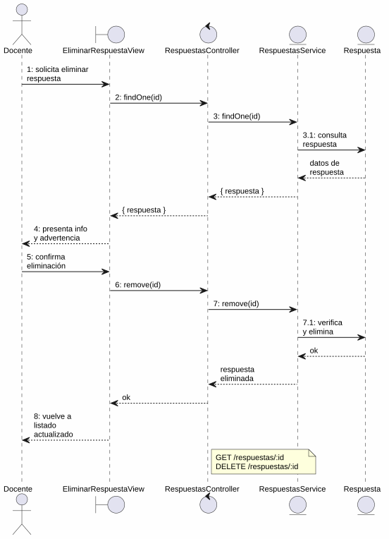
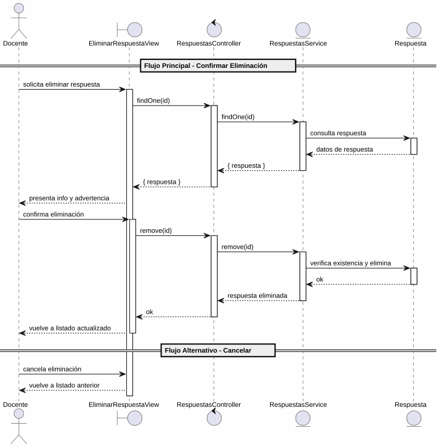

# 25-26-idsw2-sdVC > eliminarRespuesta > Análisis

## propósito

Análisis de colaboración del caso de uso `eliminarRespuesta()` mediante el patrón MVC.

## diagrama de colaboración

||
|-|
|Código fuente: [colaboracion.puml](../../../modelosUML/analisis/eliminarRespuesta/colaboracion.puml)|

## clases de análisis identificadas

### EliminarRespuestaView (Boundary)
- Recibir solicitud desde 2 orígenes (RESPUESTAS_ABIERTO, RESPUESTAS_CONTEXTUALES_ABIERTO)
- Presentar información de la respuesta (contenido, correcta) con advertencia
- Confirmar o cancelar eliminación

### RespuestasController (Control)
- Coordinar carga previa y eliminación
- `findOne(id)`, `remove(id)` → `RespuestasService`

### RespuestasService (Entity)
- `findOne(id)` con verificación de existencia
- `remove(id)` con verificación previa

### Respuesta (Entity)
- Atributos: id, contenido, correcta, preguntaId

## diagrama de secuencia

||
|-|
|Código fuente: [secuencia.puml](../../../modelosUML/analisis/eliminarRespuesta/secuencia.puml)|

## estados de análisis

| Estado | Descripción |
|--------|-------------|
| `ConfirmandoEliminacion` | Presenta info de la respuesta + advertencia; espera confirmación o cancelación |
| `EliminandoRespuesta` | Ejecuta borrado y retorna al listado actualizado |

**Entradas:** RESPUESTAS_ABIERTO, RESPUESTAS_CONTEXTUALES_ABIERTO
**Salidas:** RESPUESTAS_ABIERTO2/RESPUESTAS_CONTEXTUALES_ABIERTO2 (confirmado), RESPUESTAS_ABIERTO3/RESPUESTAS_CONTEXTUALES_ABIERTO3 (cancelado)

## trazabilidad con la implementación

| Capa | Artefacto |
|------|-----------|
| Controlador | `src/apps/backend/src/respuestas/respuestas.controller.ts` (`GET /respuestas/:id`, `DELETE /respuestas/:id`) |
| Servicio | `src/apps/backend/src/respuestas/respuestas.service.ts` (`findOne()`, `remove()`) |
| Vista | `src/apps/frontend/src/views/RespuestasView.vue` |
| Modelo (BD) | `src/apps/backend/prisma/schema.prisma` (modelo `Respuesta`) |
