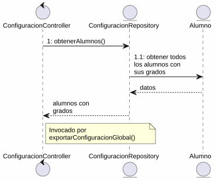
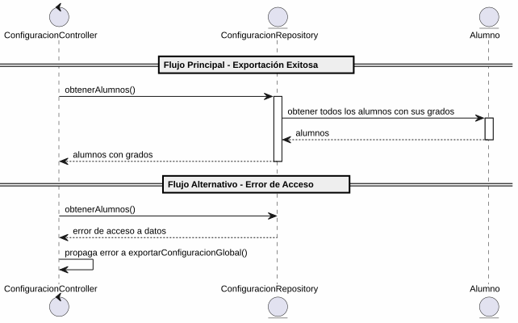

# 25-26-idsw2-sdVC > exportarAlumnos > Análisis

## información del artefacto

- **Proyecto**: Sistema de Gestión de Exámenes Universitarios
- **Fase RUP**: Elaboration (Elaboración)
- **Disciplina**: Análisis y Diseño
- **Versión**: 1.0
- **Fecha**: 2026-05-26
- **Autor**: Marcos Gutierrez

## propósito

Análisis del caso de uso abstracto `exportarAlumnos()`, sub-operación de `exportarConfiguracionGlobal()` mediante el patrón MVC. Este caso de uso no tiene interacción directa con el actor — es invocado por `exportarConfiguracionGlobal()` para obtener todos los alumnos del sistema con sus datos completos (grados asociados) y devolverlos para su compilación en el archivo de configuración exportable.

## diagrama de colaboración

||
|-|
|Código fuente: [colaboracion.puml](../../../modelosUML/analisis/exportarAlumnos/colaboracion.puml)|

## clases de análisis identificadas

### clases de vista (boundary)

No aplica. Al ser un caso de uso abstracto (sub-operación de `exportarConfiguracionGlobal()`), no tiene interacción directa con el actor. La interacción con el Docente se realiza a través de `ExportarConfiguracionGlobalView`.

### clases de control

#### ConfiguracionController
**Estereotipo**: Control
**Responsabilidades**:
- Coordinar la exportación de alumnos como parte del flujo de exportación de configuración global
- Invocar la lectura de alumnos a través del repositorio
- Recibir y estructurar los datos de alumnos para su inclusión en el archivo de configuración

**Colaboraciones**:
- **Caso de uso padre**: Responde a `exportarConfiguracionGlobal()` desde `ExportarConfiguracionGlobalView`
- **Repositorio**: Delega la operación de lectura a `ConfiguracionRepository`

### clases de entidad (entity)

#### ConfiguracionRepository
**Estereotipo**: Entidad
**Responsabilidades**:
- Abstraer el acceso a datos de la entidad `Alumno`
- Proporcionar método para obtener todos los alumnos con sus grados asociados
- Garantizar la integridad de los datos exportados

**Colaboraciones**:
- **Control**: Responde a `ConfiguracionController`
- **Entidad**: Gestiona instancias de `Alumno` y su relación con `Grado`

#### Alumno
**Estereotipo**: Entidad
**Responsabilidades**:
- Representar un alumno matriculado en un grado universitario
- Encapsular atributos: id, nombre, apellidos, dni, email, gradoId
- Relacionarse con su grado

**Atributos relevantes**:
| Campo | Tipo | Descripción |
|-------|------|-------------|
| `id` | Int (PK) | Identificador único del alumno |
| `nombre` | String | Nombre del alumno |
| `apellidos` | String | Apellidos del alumno |
| `dni` | String (unique) | DNI del alumno |
| `email` | String (unique) | Email del alumno |
| `gradoId` | Int (FK) | Referencia al grado |

**Colaboraciones**:
- **ConfiguracionRepository**: Es gestionada por el repositorio
- **Grado**: Relación de pertenencia al grado

#### Grado
**Estereotipo**: Entidad
**Responsabilidades**:
- Representar un grado universitario dentro del sistema
- Encapsular atributos: id, titulo, codigo

**Colaboraciones**:
- **ConfiguracionRepository**: Es consultada para obtener datos del grado asociado al alumno

## diagrama de secuencia

||
|-|
|Código fuente: [secuencia.puml](../../../modelosUML/analisis/exportarAlumnos/secuencia.puml)|

## flujo de colaboración

### secuencia de operaciones (flujo principal)

1. **Inicio**: `exportarConfiguracionGlobal()` → `ConfiguracionController.exportarAlumnos()`
2. **Acceso a datos**: `ConfiguracionController` → `ConfiguracionRepository.obtenerAlumnos()`
3. **Lectura de alumnos**: `ConfiguracionRepository` → `Alumno` → obtiene todos los alumnos con sus grados en una sola operación
4. **Devolución**: `ConfiguracionRepository` → `ConfiguracionController` → datos de alumnos con grados

### flujo alternativo — error de acceso a datos

- Paso 2 falla por error de base de datos o datos inconsistentes
- `ConfiguracionRepository` retorna error a `ConfiguracionController`
- `ConfiguracionController` propaga el error a `exportarConfiguracionGlobal()`
- `ExportarConfiguracionGlobalView` muestra mensaje de error al Docente

## estados de análisis

Los estados se corresponden con el diagrama de estados detallado en `contexto/casos-de-uso/detalladoCasosDeUso/exportarAlumnos/exportarAlumnos.puml`:

| Estado | Descripción |
|--------|-------------|
| `RequiringExport` | `exportarConfiguracionGlobal()` solicita exportar los alumnos del sistema |
| `ProvidingAlumnos` | El sistema permite exportar los datos de alumnos |

**Transiciones clave:**
- `RequiringExport` → `ProvidingAlumnos`: Sistema accede a los datos de alumnos
- `ProvidingAlumnos` → `[*]`: Datos de alumnos obtenidos y devueltos al caso de uso padre

## correspondencia con requisitos

### mapeado con especificación detallada

| Requisito del caso de uso | Clase responsable | Método/Colaboración |
|--------------------------|-------------------|---------------------|
| Obtener todos los alumnos del sistema | `ConfiguracionRepository` | `obtenerAlumnos()` |
| Incluir grado asociado a cada alumno | `ConfiguracionRepository` | Lectura de `Alumno` con relación a `Grado` |
| Compilar datos de alumnos en archivo exportable | `ConfiguracionController` | Estructuración de datos recibidos |

### patrón de colaboración establecido

Este análisis sigue el **patrón metodológico universal** establecido para el proyecto:
- **Caso de uso abstracto**: No tiene interacción directa con el actor — es sub-operación de `exportarConfiguracionGlobal()`
- **Análisis MVC sin capa de vista**: Solo Control y Entidad (la vista pertenece al caso de uso padre)
- **Flujo lineal**: Sin bifurcaciones de confirmación o cancelación
- **Operación de solo lectura**: Exportación de datos existentes, sin modificación del estado del sistema

### consideraciones de filtros

`exportarAlumnos()` **no requiere filtros de búsqueda**. Es una operación de exportación masiva donde el sistema obtiene todos los registros de alumnos. Los datos se exportan completos, sin criterios de filtrado.

## características del análisis

### separación de responsabilidades MVC

- **Control**: Solo coordinación de la operación de exportación
- **Entidad**: Solo datos, reglas de negocio de persistencia y relaciones entre entidades

### agnóstico tecnológicamente

- No especifica tecnología de interfaz de usuario
- No asume formato específico del archivo de exportación (CSV, JSON, XML)
- No asume implementación específica de base de datos
- Mantiene independencia de frameworks

### trazabilidad completa

- **Origen**: Caso de uso detallado `exportarAlumnos()` como sub-operación de `exportarConfiguracionGlobal()`
- **Destino**: Base para diseño arquitectónico e implementación
- **Conexión**: Diagrama de contexto → Análisis de colaboración → Implementación real

## trazabilidad con la implementación

| Capa | Artefacto real |
|------|----------------|
| Controlador | `src/apps/backend/src/alumnos/alumnos.controller.ts` (endpoint `GET /alumnos`) |
| Servicio | `src/apps/backend/src/alumnos/alumnos.service.ts` (método `findAll()` con `include: { grado: true }`) |
| Vista | No aplica (sub-operación de `exportarConfiguracionGlobal()`) |
| Modelo (BD) | `src/apps/backend/prisma/schema.prisma` (entidad `Alumno` con relación a `Grado`) |

> **Nota:** Este caso de uso está priorizado como #7 y es de tipo **Abstracto**. No requiere implementación independiente — la exportación de alumnos se realiza a través del caso de uso `exportarConfiguracionGlobal()` (prioridad #4). En el análisis se usa `ConfiguracionRepository` como clase de análisis (coherente con el caso de uso padre), pero la implementación real del acceso a datos de alumnos reside en `AlumnosService.findAll()` con inclusión de grado. El análisis describe la colaboración interna que ocurre cuando `exportarConfiguracionGlobal()` solicita los datos de alumnos como parte de la exportación completa.

## patrones aplicados

### repository pattern
`ConfiguracionRepository` abstrae el acceso a datos de `Alumno`, permitiendo una operación de lectura completa con la relación a `Grado`.

### mvc pattern
Separación entre lógica de aplicación (`ConfiguracionController`) y datos (`Alumno`, `Grado`, `ConfiguracionRepository`). La capa de vista no aplica por ser caso de uso abstracto.
