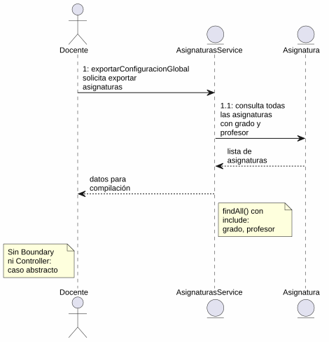
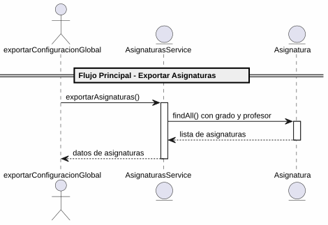

# 25-26-idsw2-sdVC > exportarAsignaturas > Análisis

## propósito

Análisis de colaboración del caso de uso `exportarAsignaturas()` mediante el patrón MVC.

## diagrama de colaboración

||
|-|
|Código fuente: [colaboracion.puml](../../../modelosUML/analisis/exportarAsignaturas/colaboracion.puml)|

## clases de análisis identificadas

### AsignaturasService (Entity)
- Abstraer acceso a datos de asignaturas
- `findAll()` con `include: { grado, profesor }`

### Asignatura (Entity)
- Atributos: id, nombre, codigo, cursoAcademico, gradoId, profesorId

> Caso de uso abstracto, sub-operación de `exportarConfiguracionGlobal`. Sin Boundary ni Controller propio.

## diagrama de secuencia

||
|-|
|Código fuente: [secuencia.puml](../../../modelosUML/analisis/exportarAsignaturas/secuencia.puml)|

## estados de análisis

| Estado | Descripción |
|--------|-------------|
| `RequiringExport` | `exportarConfiguracionGlobal` solicita exportar asignaturas |
| `ProvidingAsignaturas` | Recupera datos y los entrega al padre |

**Entrada:** exportarConfiguracionGlobal
**Salida:** exportarConfiguracionGlobal (con datos)

## trazabilidad con la implementación

| Capa | Artefacto |
|------|-----------|
| Servicio | `src/apps/backend/src/asignaturas/asignaturas.service.ts` (`findAll()`) |
| Modelo (BD) | `src/apps/backend/prisma/schema.prisma` (modelo `Asignatura`) |
