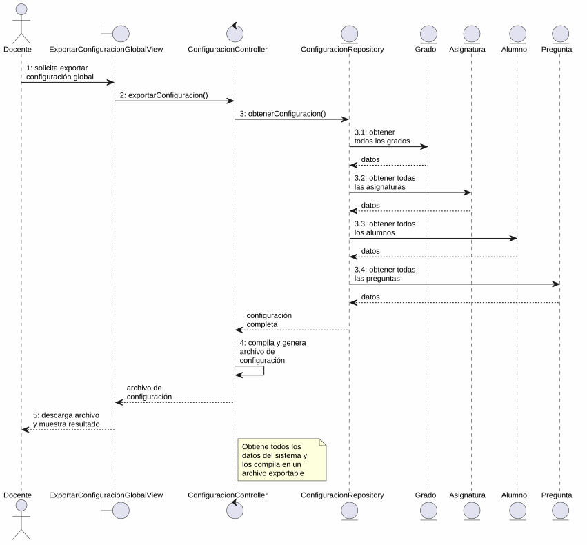
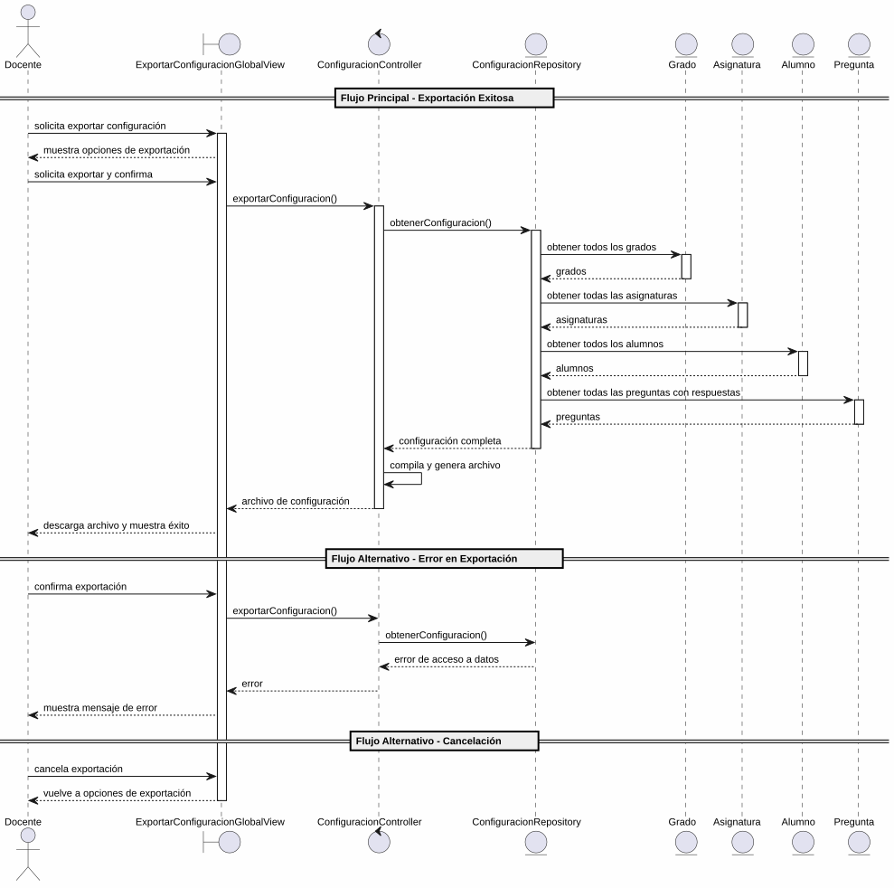

# 25-26-idsw2-sdVC > exportarConfiguracionGlobal > Análisis

## información del artefacto

- **Proyecto**: Sistema de Gestión de Exámenes Universitarios
- **Fase RUP**: Elaboration (Elaboración)
- **Disciplina**: Análisis y Diseño
- **Versión**: 1.0
- **Fecha**: 2026-05-25
- **Autor**: Marcos Gutierrez

## propósito

Análisis de colaboración del caso de uso `exportarConfiguracionGlobal()` mediante el patrón MVC, identificando las clases de análisis, sus responsabilidades y colaboraciones necesarias para cumplir con los requisitos especificados.

## diagrama de colaboración

||
|-|
|Código fuente: [colaboracion.puml](../../../modelosUML/analisis/exportarConfiguracionGlobal/colaboracion.puml)|

## clases de análisis identificadas

### clases de vista (boundary)

#### ExportarConfiguracionGlobalView
**Estereotipo**: Vista (Boundary)
**Responsabilidades**:
- Recibir la solicitud de exportación de configuración global desde el menú principal
- Permitir al docente seleccionar los datos a exportar (alumnos, grados, asignaturas, preguntas)
- Presentar confirmación antes de ejecutar la exportación
- Gestionar la descarga del archivo de configuración generado
- Visualizar el resultado final (éxito o error)
- Manejar la navegación de salida y cancelación

**Colaboraciones**:
- **Entrada**: Recibe `exportarConfiguracionGlobal()` desde `SISTEMA_DISPONIBLE` (menú principal)
- **Control**: Se comunica con `ConfiguracionController`
- **Salida**: Navega a `SISTEMA_DISPONIBLE`

### clases de control

#### ConfiguracionController
**Estereotipo**: Control
**Responsabilidades**:
- Coordinar la lógica de exportación de configuración global
- Obtener todos los datos del sistema (grados, asignaturas, alumnos, preguntas)
- Compilar y estructurar los datos en un formato exportable
- Generar el archivo de configuración global
- Gestionar la respuesta de éxito o error

**Colaboraciones**:
- **Vista**: Responde a solicitudes de `ExportarConfiguracionGlobalView`
- **Repositorio**: Delega operaciones de lectura a `ConfiguracionRepository`

### clases de entidad (entity)

#### ConfiguracionRepository
**Estereotipo**: Entidad
**Responsabilidades**:
- Abstraer el acceso a datos de las entidades del sistema (grados, asignaturas, alumnos, preguntas)
- Proporcionar método para obtener toda la configuración del sistema en una operación
- Garantizar la integridad de los datos exportados

**Colaboraciones**:
- **Control**: Responde a `ConfiguracionController`
- **Entidad**: Gestiona instancias de `Grado`, `Asignatura`, `Alumno`, `Pregunta` y `Respuesta`

#### Grado
**Estereotipo**: Entidad
**Responsabilidades**:
- Representar un grado universitario dentro del sistema
- Encapsular atributos: id, titulo, codigo
- Servir como contenedor de asignaturas y alumnos

**Atributos relevantes**:
| Campo | Tipo | Descripción |
|-------|------|-------------|
| `id` | Int (PK) | Identificador único del grado |
| `titulo` | String | Nombre del grado |
| `codigo` | String (unique) | Código identificador del grado |

**Colaboraciones**:
- **ConfiguracionRepository**: Es gestionada por el repositorio
- **Asignatura**: Relación de composición con las asignaturas del grado

#### Asignatura
**Estereotipo**: Entidad
**Responsabilidades**:
- Representar una asignatura perteneciente a un grado
- Encapsular atributos: id, titulo, codigo, cursoAcademico, gradoId
- Relacionarse con su grado y su batería de preguntas

**Atributos relevantes**:
| Campo | Tipo | Descripción |
|-------|------|-------------|
| `id` | Int (PK) | Identificador único de la asignatura |
| `titulo` | String | Nombre de la asignatura |
| `codigo` | String | Código de la asignatura |
| `cursoAcademico` | String | Curso académico |
| `gradoId` | Int (FK) | Referencia al grado |

**Colaboraciones**:
- **ConfiguracionRepository**: Es gestionada por el repositorio
- **Grado**: Relación de pertenencia al grado padre

#### Alumno
**Estereotipo**: Entidad
**Responsabilidades**:
- Representar un alumno matriculado en un grado
- Encapsular atributos: id, nombre, apellidos, dni, email, gradoId
- Relacionarse con sus asignaturas y exámenes

**Atributos relevantes**:
| Campo | Tipo | Descripción |
|-------|------|-------------|
| `id` | Int (PK) | Identificador único del alumno |
| `nombre` | String | Nombre del alumno |
| `apellidos` | String | Apellidos del alumno |
| `dni` | String (unique) | DNI del alumno |
| `email` | String (unique) | Email del alumno |
| `gradoId` | Int (FK) | Referencia al grado |

**Colaboraciones**:
- **ConfiguracionRepository**: Es gestionada por el repositorio
- **Grado**: Relación de pertenencia al grado

#### Pregunta
**Estereotipo**: Entidad
**Responsabilidades**:
- Representar una pregunta del banco de preguntas con sus opciones de respuesta
- Encapsular atributos: id, enunciado, tema, dificultad, estado, bateriaId
- Relacionarse con sus respuestas y la batería de preguntas

**Atributos relevantes**:
| Campo | Tipo | Descripción |
|-------|------|-------------|
| `id` | Int (PK) | Identificador único de la pregunta |
| `enunciado` | String | Texto de la pregunta |
| `tema` | String | Tema al que pertenece |
| `dificultad` | Dificultad (enum) | BAJA \| MEDIA \| ALTA |
| `estado` | EstadoPregunta (enum) | Estado de la pregunta |
| `bateriaId` | Int (FK) | Referencia a la batería de preguntas |

**Colaboraciones**:
- **ConfiguracionRepository**: Es gestionada por el repositorio
- **BateriaDePreguntas**: Relación de pertenencia a la batería
- **Respuesta**: Relación de composición con las opciones de respuesta

## diagrama de secuencia

||
|-|
|Código fuente: [secuencia.puml](../../../modelosUML/analisis/exportarConfiguracionGlobal/secuencia.puml)|

## flujo de colaboración

### secuencia de operaciones (flujo principal)

1. **Inicio**: `SISTEMA_DISPONIBLE` → `ExportarConfiguracionGlobalView.exportarConfiguracionGlobal()`
2. **Selección de datos**: `ExportarConfiguracionGlobalView` muestra opciones; Docente solicita exportar configuración global (grados, asignaturas, alumnos, preguntas)
3. **Confirmación**: `ExportarConfiguracionGlobalView` solicita confirmación; Docente confirma la exportación
4. **Exportación**: `ExportarConfiguracionGlobalView` → `ConfiguracionController.exportarConfiguracion()`
5. **Acceso a datos**: `ConfiguracionController` → `ConfiguracionRepository.obtenerConfiguracion()`
6. **Lectura de grados**: `ConfiguracionRepository` → `Grado` → obtiene todos los grados
7. **Lectura de asignaturas**: `ConfiguracionRepository` → `Asignatura` → obtiene todas las asignaturas con sus grados
8. **Lectura de alumnos**: `ConfiguracionRepository` → `Alumno` → obtiene todos los alumnos con sus grados
9. **Lectura de preguntas**: `ConfiguracionRepository` → `Pregunta` → obtiene todas las preguntas con sus respuestas
10. **Compilación**: `ConfiguracionController` compila y estructura todos los datos en un archivo de configuración exportable
11. **Resultado**: `ConfiguracionController` → `ExportarConfiguracionGlobalView` → Docente: archivo de configuración generado + mensaje de éxito

### flujo alternativo — error en la exportación

- Paso 5 falla por error de acceso a datos o datos inconsistentes
- `ConfiguracionController` retorna error a `ExportarConfiguracionGlobalView`
- `ExportarConfiguracionGlobalView` muestra mensaje de error al Docente
- El sistema regresa al estado `ProporcionandoConfiguracion`

### flujo alternativo — cancelación

- Docente selecciona "Cancelar" en el diálogo de confirmación
- `ExportarConfiguracionGlobalView` regresa al estado `ProporcionandoConfiguracion`
- No se ejecuta ninguna exportación ni lectura de datos

### sub-operaciones de exportación

`exportarConfiguracionGlobal()` delega la exportación de cada tipo de entidad a casos de uso específicos:

| Sub-operación | Descripción |
|--------------|-------------|
| `exportarGrados()` | Exporta los grados del sistema |
| `exportarAsignaturas()` | Exporta las asignaturas del sistema |
| `exportarAlumnos()` | Exporta los alumnos del sistema |
| `exportarPreguntas()` | Exporta las preguntas del sistema |

Estas sub-operaciones se definen como estados hijos en el diagrama de estados detallado y se relacionan mediante `<<include>>` en el diagrama de casos de uso.

### opciones de navegación disponibles

| Acción | Destino | Descripción |
|--------|---------|-------------|
| `Confirmar exportación` | `SISTEMA_DISPONIBLE` | Ejecuta la exportación y vuelve al menú principal |
| `Cancelar` | `ProporcionandoConfiguracion` | Vuelve a la selección de datos sin ejecutar exportación |
| `Salir de exportación` | `SISTEMA_DISPONIBLE` | Sale sin realizar ninguna exportación |

## estados de análisis

Los estados se corresponden con el diagrama de estados detallado en `contexto/casos-de-uso/detalladoCasosDeUso/exportarConfiguracionGlobal/exportarConfiguracionGlobal.puml`:

| Estado | Descripción |
|--------|-------------|
| `RequiriendoExportacionGlobal` | El docente solicita exportar configuración global desde el menú principal |
| `ProporcionandoConfiguracion` | El sistema permite exportar configuración global (alumnos, grados, asignaturas, preguntas) o salir |
| `ProporcionandoConfirmacion` | El sistema presenta confirmación; el docente confirma o cancela la exportación |
| `Exportando` (choice) | Punto de decisión: exportación exitosa → finaliza; error o cancelación → vuelve a `ProporcionandoConfiguracion` |

**Transiciones clave:**
- `RequiriendoExportacionGlobal` → `ProporcionandoConfiguracion`: Sistema muestra interfaz de exportación
- `ProporcionandoConfiguracion` → `ProporcionandoConfirmacion`: Docente solicita exportar configuración global
- `ProporcionandoConfirmacion` → `Exportando`: Docente confirma exportación
- `Exportando` → `ProporcionandoConfiguracion`: Error en exportación o cancelación
- `Exportando` → `[*]`: Exportación exitosa (salida a `SISTEMA_DISPONIBLE`)
- `ProporcionandoConfiguracion` → `[*]`: Docente solicita salir (salida a `SISTEMA_DISPONIBLE`)

## correspondencia con requisitos

### mapeado con especificación detallada

| Requisito del caso de uso | Clase responsable | Método/Colaboración |
|--------------------------|-------------------|---------------------|
| Mostrar opciones de exportación | `ExportarConfiguracionGlobalView` | Interfaz de selección de datos a exportar |
| Confirmar exportación | `ExportarConfiguracionGlobalView` | Diálogo de confirmación |
| Obtener todos los datos del sistema | `ConfiguracionRepository` | `obtenerConfiguracion()` |
| Exportar grados | `ConfiguracionRepository` | Lectura de todos los grados |
| Exportar asignaturas | `ConfiguracionRepository` | Lectura de todas las asignaturas |
| Exportar alumnos | `ConfiguracionRepository` | Lectura de todos los alumnos |
| Exportar preguntas | `ConfiguracionRepository` | Lectura de todas las preguntas con respuestas |
| Compilar archivo de configuración | `ConfiguracionController` | Estructuración y generación del archivo exportable |
| Mostrar resultado (éxito/error) | `ExportarConfiguracionGlobalView` | Presentación de mensaje de resultado y descarga |
| Salir de exportación | `ExportarConfiguracionGlobalView` | Navegación a `SISTEMA_DISPONIBLE` |

### patrón de colaboración establecido

Este análisis sigue el **patrón metodológico universal** establecido para el proyecto:
- **Entrada única**: Desde `SISTEMA_DISPONIBLE` (menú principal del docente)
- **Análisis MVC completo**: Vista, Control y Entidad claramente separados
- **Salida única**: `SISTEMA_DISPONIBLE` tras exportación exitosa
- **Flujo con transiciones**: Confirmación, cancelación y error contemplados en el análisis
- **Operación inversa a importación**: Exporta los datos del sistema a un archivo de configuración

### consideraciones de filtros

`exportarConfiguracionGlobal()` **no requiere filtros de búsqueda**. Es un caso de uso transaccional de exportación masiva donde el sistema obtiene todos los datos (grados, asignaturas, alumnos, preguntas) y los compila en un archivo de configuración. No existen criterios de filtrado sobre los datos a exportar.

## características del análisis

### separación de responsabilidades MVC

- **Vista**: Solo presentación de opciones, confirmación y gestión de descarga del archivo exportado
- **Control**: Solo coordinación, compilación de datos y generación del archivo de configuración
- **Entidad**: Solo datos, reglas de negocio de persistencia y relaciones entre entidades

### agnóstico tecnológicamente

- No especifica tecnología de interfaz de usuario
- No asume formato específico del archivo de configuración exportado (CSV, JSON, XML)
- No asume implementación específica de base de datos
- Mantiene independencia de frameworks

### trazabilidad completa

- **Origen**: Caso de uso detallado `exportarConfiguracionGlobal()` y prototipos asociados
- **Destino**: Base para diseño arquitectónico e implementación
- **Conexión**: Diagrama de contexto → Análisis de colaboración → Implementación real

## trazabilidad con la implementación

| Capa | Artefacto real |
|------|----------------|
| Controlador | *Pendiente de implementar* |
| Servicio | *Pendiente de implementar* |
| DTO | *Pendiente de implementar* |
| Vista | *Pendiente de implementar* |
| Modelo (BD) | `src/apps/backend/prisma/schema.prisma` (Grado, Asignatura, Alumno, Pregunta, Respuesta, BateriaDePreguntas) |

> **Nota:** Este caso de uso está priorizado como #4 en el proyecto pero aún no tiene implementación en código. Es el caso de uso complementario a `importarConfiguracionGlobal()` (prioridad #3) y ambos pertenecen al "Módulo Configuración General". El análisis se ha realizado a partir de los artefactos de requisitos (diagrama de estados detallado y prototipos de interfaz).

## patrones aplicados

### repository pattern
`ConfiguracionRepository` abstrae el acceso a datos de todas las entidades del sistema (grados, asignaturas, alumnos, preguntas), permitiendo una operación de exportación completa y unificada.

### mvc pattern
Separación clara entre presentación (`ExportarConfiguracionGlobalView`), lógica de aplicación (`ConfiguracionController`) y datos (`Grado`, `Asignatura`, `Alumno`, `Pregunta`, `ConfiguracionRepository`).

### navigation pattern
Las opciones de "Cancelar", "Confirmar exportación" y "Salir de exportación" permiten al docente controlar el flujo, con retorno siempre al menú principal (`SISTEMA_DISPONIBLE`) tanto en éxito como en salida.
