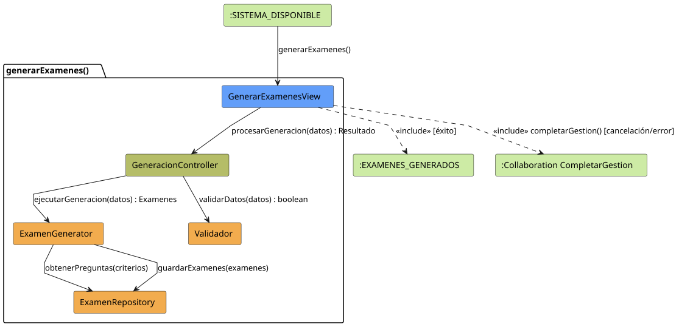

# generarExamenes() (Análisis)

## información del artefacto

- **Proyecto**: Jorgestor - Sistema de Gestión de Exámenes
- **Fase RUP**: Elaboración
- **Disciplina**: Análisis y Diseño
- **Versión**: 1.1
- **Autor**: Gemini CLI

## propósito

Análisis de colaboración del caso de uso `generarExamenes()` mediante el patrón MVC, identificando las clases de análisis, sus responsabilidades y colaboraciones necesarias para la generación algorítmica de exámenes.

## diagramas de análisis

### diagrama de colaboración

||
|-|
|Código fuente: [colaboracion.puml](colaboracion.puml)|

### diagrama de secuencia

||
|-|
|Código fuente: [secuencia.puml](secuencia.puml)|

## clases de análisis identificadas

### clases de vista (boundary)

#### GenerarExamenesView
**Estereotipo**: Vista (Boundary)  
**Responsabilidades**:
- Capturar los parámetros de generación (Asignatura, Temas, nº de exámenes, etc.).
- Presentar la previsualización de los exámenes generados.
- Permitir la descarga o confirmación de la generación.

**Colaboraciones**:
- **Entrada**: Docente.
- **Control**: `ExamenController`.

### clases de control

#### ExamenController
**Estereotipo**: Control  
**Responsabilidades**:
- Orquestar la lógica de selección aleatoria de preguntas basada en filtros.
- Gestionar el ensamblado de los objetos de examen.
- Coordinar la persistencia de la generación.

**Colaboraciones**:
- **Vista**: Responde a `GenerarExamenesView`.
- **Repositorio**: `PreguntaRepository`, `ExamenRepository`.

### clases de entidad (entity)

#### PreguntaRepository
**Estereotipo**: Entidad  
**Responsabilidades**:
- Proporcionar acceso filtrado a las preguntas de la batería.

**Colaboraciones**:
- **Control**: Responde a `ExamenController`.
