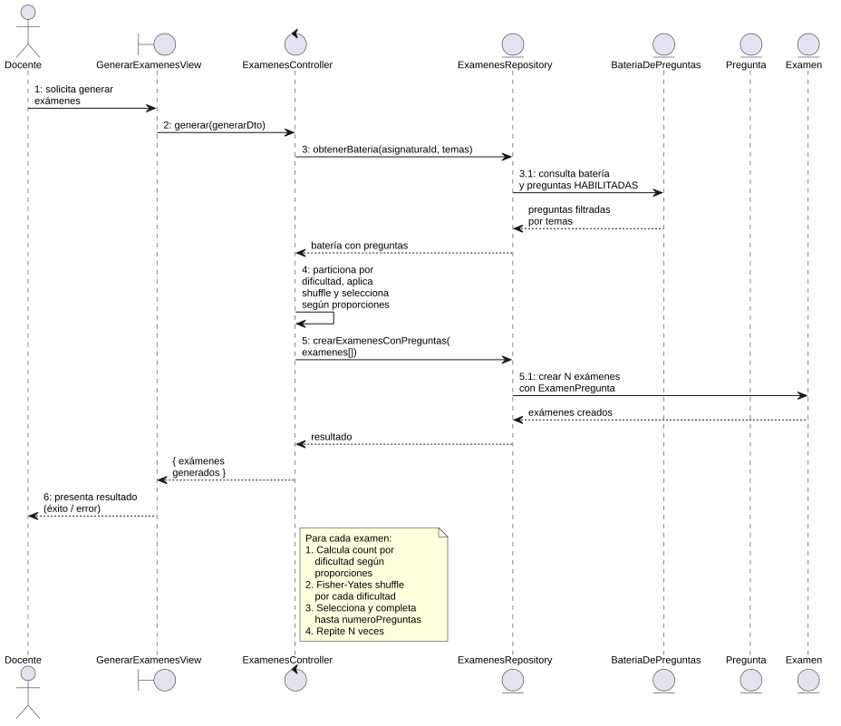
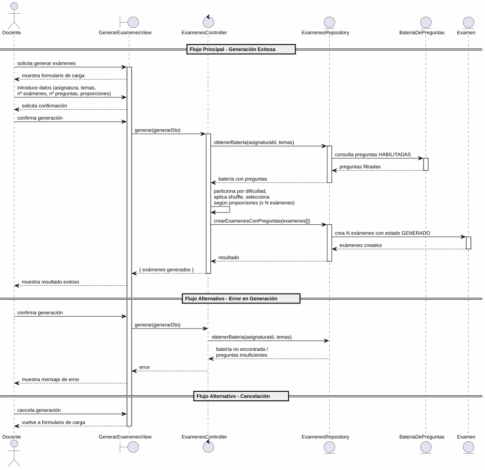

# 25-26-idsw2-sdVC > generarExamenes > Análisis

## información del artefacto

- **Proyecto**: Sistema de Gestión de Exámenes Universitarios
- **Fase RUP**: Elaboration (Elaboración)
- **Disciplina**: Análisis y Diseño
- **Versión**: 1.0
- **Fecha**: 2026-05-25
- **Autor**: Marcos Gutierrez

## propósito

Análisis de colaboración del caso de uso `generarExamenes()` mediante el patrón MVC, identificando las clases de análisis, sus responsabilidades y colaboraciones necesarias para cumplir con los requisitos especificados.

## diagrama de colaboración

||
|-|
|Código fuente: [colaboracion.puml](../../../modelosUML/analisis/generarExamenes/colaboracion.puml)|

## clases de análisis identificadas

### clases de vista (boundary)

#### GenerarExamenesView
**Estereotipo**: Vista (Boundary)
**Responsabilidades**:
- Recibir la solicitud de generación de exámenes desde el menú principal o desde una asignatura abierta
- Presentar formulario con todos los campos requeridos: asignatura, temas, evaluación, número de exámenes, número de preguntas, proporciones de dificultad
- Validar visualmente los datos introducidos antes de enviar
- Mostrar confirmación antes de ejecutar la generación
- Visualizar el resultado final (éxito o error)
- Manejar la navegación de salida y cancelación

**Colaboraciones**:
- **Entrada**: Recibe `generarExamenes()` desde `SISTEMA_DISPONIBLE` (menú principal) o `ASIGNATURA_ABIERTO` (contextual)
- **Control**: Se comunica con `ExamenesController`
- **Salida**: Navega a `EXAMENES_GENERADOS` o `EXAMENES_GENERADOS_CONTEXTUALES`

### clases de control

#### ExamenesController
**Estereotipo**: Control
**Responsabilidades**:
- Coordinar la lógica de generación de exámenes
- Validar los datos de entrada (asignaturaId, temas, numeroExamenes, numeroPreguntas, evaluacion, proporciones)
- Selección aleatoria de preguntas por dificultad (BAJA, MEDIA, ALTA) según las proporciones indicadas
- Creación de los exámenes con sus preguntas asociadas en la base de datos
- Asignación del estado inicial `GENERADO` a cada examen creado

**Colaboraciones**:
- **Vista**: Responde a solicitudes de `GenerarExamenesView`
- **Repositorio**: Delega operaciones de datos a `ExamenesRepository`

### clases de entidad (entity)

#### ExamenesRepository
**Estereotipo**: Entidad
**Responsabilidades**:
- Abstraer el acceso a datos de exámenes, baterías de preguntas y asignaturas
- Proporcionar método para obtener la batería de preguntas filtrada por asignatura, temas y estado habilitado
- Implementar la creación de exámenes con sus preguntas asociadas (ExamenPregunta)
- Mantener la consistencia en la creación batch de múltiples exámenes

**Colaboraciones**:
- **Control**: Responde a `ExamenesController`
- **Entidad**: Gestiona instancias de `Examen`, `ExamenPregunta`, `BateriaDePreguntas` y `Pregunta`

#### BateriaDePreguntas
**Estereotipo**: Entidad
**Responsabilidades**:
- Representar el banco de preguntas asociado a una asignatura
- Agrupar las preguntas disponibles para la generación
- Mantener la relación con la asignatura y sus preguntas

**Atributos relevantes**:
| Campo | Tipo | Descripción |
|-------|------|-------------|
| `id` | Int (PK) | Identificador único de la batería |
| `asignaturaId` | Int (FK, unique) | Referencia a la asignatura |

**Colaboraciones**:
- **ExamenesRepository**: Es gestionada por el repositorio
- **Pregunta**: Relación de composición con las preguntas del banco

#### Examen
**Estereotipo**: Entidad
**Responsabilidades**:
- Representar el examen generado con sus preguntas seleccionadas
- Encapsular atributos: id, evaluacion, estado, asignaturaId
- Mantener el estado inicial `GENERADO` tras la creación
- Relacionarse con sus preguntas a través de ExamenPregunta

**Atributos relevantes**:
| Campo | Tipo | Descripción |
|-------|------|-------------|
| `id` | Int (PK) | Identificador único del examen |
| `evaluacion` | Evaluacion (enum) | Tipo de evaluación |
| `estado` | EstadoExamen (enum) | `GENERADO` tras la creación |
| `asignaturaId` | Int (FK) | Referencia a la asignatura |

**Colaboraciones**:
- **ExamenesRepository**: Es gestionada por el repositorio
- **ExamenPregunta**: Relación de composición con las preguntas del examen

#### Pregunta
**Estereotipo**: Entidad
**Responsabilidades**:
- Representar una pregunta disponible en la batería para ser seleccionada
- Encapsular atributos: id, enunciado, tema, dificultad, estado
- Ser seleccionable solo si su estado es `HABILITADA`

**Atributos relevantes**:
| Campo | Tipo | Descripción |
|-------|------|-------------|
| `id` | Int (PK) | Identificador único de la pregunta |
| `enunciado` | String | Texto de la pregunta |
| `tema` | String | Tema al que pertenece |
| `dificultad` | Dificultad (enum) | BAJA \| MEDIA \| ALTA |
| `estado` | EstadoPregunta (enum) | `HABILITADA` para ser seleccionable |
| `bateriaId` | Int (FK) | Referencia a la batería de preguntas |

**Colaboraciones**:
- **ExamenesRepository**: Es gestionada por el repositorio
- **ExamenPregunta**: Relación con los exámenes en los que es seleccionada

## diagrama de secuencia

||
|-|
|Código fuente: [secuencia.puml](../../../modelosUML/analisis/generarExamenes/secuencia.puml)|

## flujo de colaboración

### secuencia de operaciones (flujo principal)

1. **Inicio**: `SISTEMA_DISPONIBLE` / `ASIGNATURA_ABIERTO` → `GenerarExamenesView.generarExamenes()`
2. **Carga de datos**: `GenerarExamenesView` muestra formulario; Docente introduce los datos de generación (asignatura, temas, número de exámenes, número de preguntas, evaluación, proporciones de dificultad)
3. **Confirmación**: `GenerarExamenesView` solicita confirmación; Docente confirma la generación
4. **Generación**: `GenerarExamenesView` → `ExamenesController.generar(generarDto)`
5. **Acceso a datos**: `ExamenesController` → `ExamenesRepository.obtenerBateria(asignaturaId, temas)`
6. **Consulta de entidad**: `ExamenesRepository` → `BateriaDePreguntas` → devuelve preguntas `HABILITADAS` filtradas por temas
7. **Selección de preguntas**: `ExamenesController` particiona preguntas por dificultad, aplica Fisher-Yates shuffle y selecciona según proporciones `(proporcionFacil, proporcionMedia, proporcionDificil)` para cada examen
8. **Persistencia**: `ExamenesController` → `ExamenesRepository.crearExamenesConPreguntas(examenes)`
9. **Creación de entidades**: `ExamenesRepository` → `Examen` + `ExamenPregunta` → crea N exámenes con sus preguntas asociadas
10. **Resultado**: `ExamenesRepository` → `ExamenesController` → `GenerarExamenesView` → `{ exámenes creados }`

### flujo alternativo — error en la generación

- Paso 5 falla si la batería no existe o no hay preguntas suficientes
- `ExamenesController` retorna error a `GenerarExamenesView`
- `GenerarExamenesView` muestra mensaje de error al Docente
- El sistema regresa al estado `ProporcionandoDatos`

### flujo alternativo — cancelación

- Docente selecciona "Cancelar" en el diálogo de confirmación
- `GenerarExamenesView` regresa al formulario de carga de datos
- No se ejecuta ninguna generación ni persistencia

### opciones de navegación disponibles

| Acción | Destino | Descripción |
|--------|---------|-------------|
| `Confirmar y Generar` | `EXAMENES_GENERADOS` / `EXAMENES_GENERADOS_CONTEXTUALES` | Ejecuta la generación y navega al listado de exámenes generados |
| `Cancelar` | `ProporcionandoDatos` | Vuelve al formulario de carga sin ejecutar generación |
| `Salir` | `EXAMENES_GENERADOS` / `EXAMENES_GENERADOS_CONTEXTUALES` | Sale de la generación y navega al listado de exámenes |

## estados de análisis

Los estados se corresponden con el diagrama de estados detallado en `contexto/casos-de-uso/detalladoCasosDeUso/generarExamenes/generarExamenes.puml`:

| Estado | Descripción |
|--------|-------------|
| `RequiriendoGeneracion` | El docente solicita generar exámenes desde el menú principal o desde una asignatura abierta |
| `ProporcionandoDatos` | El sistema muestra el formulario; el docente introduce los datos requeridos (asignatura, temas, nº exámenes, nº preguntas, evaluación, proporciones) o solicita salir |
| `ProporcionandoConfirmacion` | El sistema presenta confirmación; el docente confirma o cancela la generación |
| `Generando` (choice) | Punto de decisión: datos suficientes y generación exitosa → finaliza; datos insuficientes o error → vuelve a `ProporcionandoDatos`; cancelación → vuelve a `ProporcionandoDatos` |

**Transiciones clave:**
- `RequiriendoGeneracion` → `ProporcionandoDatos`: Sistema muestra formulario de carga
- `ProporcionandoDatos` → `ProporcionandoConfirmacion`: Docente introduce datos mínimos requeridos
- `ProporcionandoConfirmacion` → `Generando`: Docente confirma generación
- `Generando` → `ProporcionandoDatos`: Datos insuficientes, error en generación o cancelación
- `Generando` → `[*]`: Generación exitosa (salida a `EXAMENES_GENERADOS` o `EXAMENES_GENERADOS_CONTEXTUALES`)
- `ProporcionandoDatos` → `[*]`: Docente solicita salir (salida a `EXAMENES_GENERADOS` o `EXAMENES_GENERADOS_CONTEXTUALES`)

## correspondencia con requisitos

### mapeado con especificación detallada

| Requisito del caso de uso | Clase responsable | Método/Colaboración |
|--------------------------|-------------------|---------------------|
| Mostrar formulario con campos requeridos | `GenerarExamenesView` | Presentación de asignatura, temas, nº exámenes, nº preguntas, evaluación, proporciones |
| Confirmar generación | `GenerarExamenesView` | Diálogo de confirmación |
| Validar datos de entrada | `ExamenesController` | Validación del `GenerarExamenesDto` |
| Obtener batería de preguntas por asignatura y temas | `ExamenesRepository` | `obtenerBateria(asignaturaId, temas)` |
| Seleccionar preguntas por dificultad y proporción | `ExamenesController` | Algoritmo de selección aleatoria con Fisher-Yates shuffle |
| Crear exámenes con preguntas asociadas | `ExamenesRepository` | `crearExamenesConPreguntas(examenes)` |
| Asignar estado inicial GENERADO | `ExamenesRepository` | `EstadoExamen.GENERADO` en creación |
| Mostrar resultado (éxito/error) | `GenerarExamenesView` | Presentación de exámenes creados o mensaje de error |
| Salir de generación | `GenerarExamenesView` | Navegación a `EXAMENES_GENERADOS` o `EXAMENES_GENERADOS_CONTEXTUALES` |

### patrón de colaboración establecido

Este análisis sigue el **patrón metodológico universal** establecido para el proyecto:
- **Entrada dual**: Desde `SISTEMA_DISPONIBLE` (menú principal del docente) o desde `ASIGNATURA_ABIERTO` (contextual)
- **Análisis MVC completo**: Vista, Control y Entidad claramente separados
- **Salida dual**: `EXAMENES_GENERADOS` o `EXAMENES_GENERADOS_CONTEXTUALES` según el punto de entrada
- **Flujo con transiciones**: Confirmación, cancelación y error contemplados en el análisis
- **Algoritmo de selección**: Selección pseudoaleatoria de preguntas con distribución por dificultad

### consideraciones de filtros

A diferencia de casos de uso como `verRespuestas()`, `generarExamenes()` **no requiere filtros de búsqueda** sobre entidades existentes. Los datos de entrada (asignatura, temas, evaluacion) son criterios de configuración para la generación, no filtros sobre un listado. El único filtrado implícito ocurre a nivel de repositorio al consultar la batería: preguntas `HABILITADAS` que pertenezcan a los temas seleccionados.

## características del análisis

### separación de responsabilidades MVC

- **Vista**: Solo presentación del formulario, captura de datos e interacción con el docente
- **Control**: Solo coordinación, algoritmo de selección de preguntas y lógica de generación
- **Entidad**: Solo datos, reglas de negocio de persistencia y relaciones entre entidades

### agnóstico tecnológicamente

- No especifica tecnología de interfaz de usuario
- No asume implementación específica de base de datos
- Mantiene independencia de frameworks

### trazabilidad completa

- **Origen**: Caso de uso detallado `generarExamenes()` y prototipos asociados
- **Destino**: Base para diseño arquitectónico e implementación
- **Conexión**: Diagrama de contexto → Análisis de colaboración → Implementación real

## trazabilidad con la implementación

| Capa | Artefacto real |
|------|----------------|
| Controlador | `src/apps/backend/src/examenes/examenes.controller.ts` (`POST /examenes/generar`) |
| Servicio | `src/apps/backend/src/examenes/examenes.service.ts` (`generar()`) |
| DTO | `src/apps/backend/src/examenes/dto/generar-examenes.dto.ts` |
| Vista | `src/apps/frontend/src/views/ExamenesView.vue` (tab "Generar") |
| Modelo (BD) | `src/apps/backend/prisma/schema.prisma` (Examen, ExamenPregunta, BateriaDePreguntas, Pregunta) |

## patrones aplicados

### repository pattern
`ExamenesRepository` abstrae el acceso a datos de baterías, preguntas y exámenes, permitiendo diferentes implementaciones sin afectar al controlador. Encapsula las operaciones de lectura (obtener batería con preguntas filtradas) y escritura (crear exámenes con preguntas asociadas).

### mvc pattern
Separación clara entre presentación (`GenerarExamenesView`), lógica de aplicación (`ExamenesController`) y datos (`BateriaDePreguntas`, `Examen`, `Pregunta`, `ExamenesRepository`).

### navigation pattern
Las opciones de "Cancelar", "Confirmar y Generar" y "Salir" permiten al docente controlar el flujo, con salida diferenciada según el punto de entrada (menú principal vs contextual desde asignatura).
