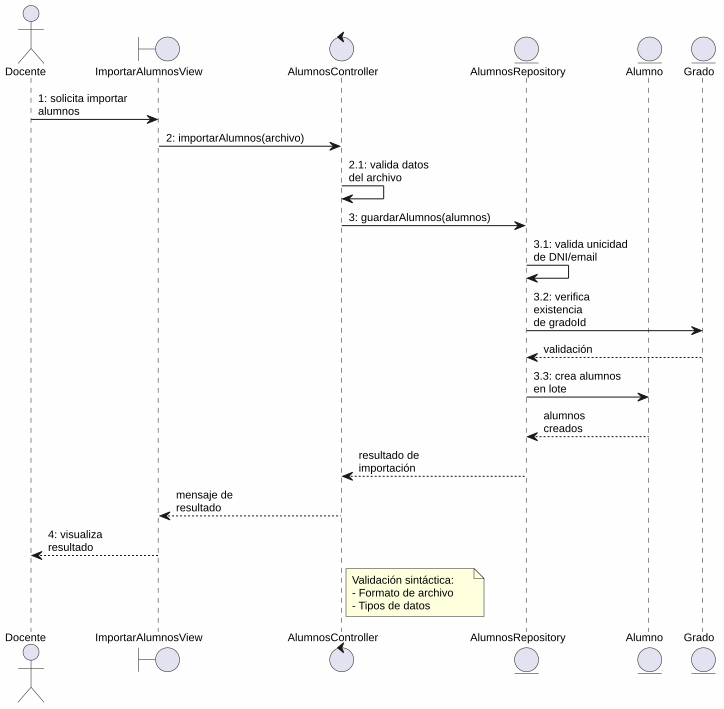
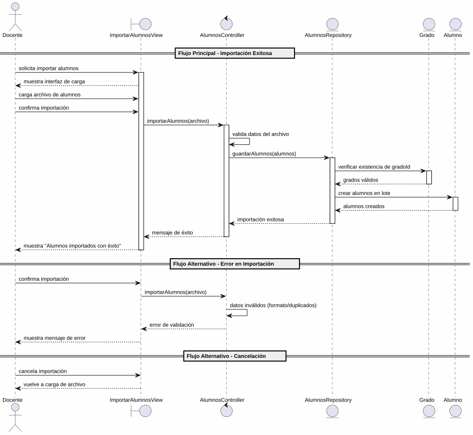

# 25-26-idsw2-sdVC > importarAlumnos > Análisis

## información del artefacto

- **Proyecto**: Sistema de Gestión de Exámenes Universitarios
- **Fase RUP**: Elaboration (Elaboración)
- **Disciplina**: Análisis y Diseño
- **Versión**: 1.0
- **Fecha**: 2026-05-26
- **Autor**: Marcos Gutierrez

## propósito

Análisis del caso de uso `importarAlumnos()` mediante el patrón MVC, identificando las clases de análisis, sus responsabilidades y colaboraciones necesarias para cumplir con los requisitos especificados. Este caso de uso permite al Docente importar alumnos al sistema mediante carga masiva desde un archivo externo.

## diagrama de colaboración

||
|-|
|Código fuente: [colaboracion.puml](../../../modelosUML/analisis/importarAlumnos/colaboracion.puml)|

## clases de análisis identificadas

### clases de vista (boundary)

#### ImportarAlumnosView
**Estereotipo**: Vista (Boundary)
**Responsabilidades**:
- Recibir la solicitud de importación de alumnos desde `ALUMNOS_ABIERTO`
- Permitir al docente cargar el archivo con los datos de alumnos a importar
- Presentar confirmación antes de ejecutar la importación
- Permitir cancelar o salir del flujo de importación
- Visualizar el resultado final (éxito o error)

**Colaboraciones**:
- **Entrada**: Recibe `importarAlumnos()` desde `ALUMNOS_ABIERTO` (gestión de alumnos)
- **Control**: Se comunica con `AlumnosController`
- **Salida**: Navega a `ALUMNOS_ABIERTO`

### clases de control

#### AlumnosController
**Estereotipo**: Control
**Responsabilidades**:
- Coordinar la lógica de importación masiva de alumnos
- Validar sintácticamente los datos del archivo cargado (formato, estructura, tipos básicos)
- Procesar la creación batch de entidades `Alumno`
- Garantizar la integridad transaccional de la importación
- Gestionar la respuesta de éxito o error

**Colaboraciones**:
- **Vista**: Responde a solicitudes de `ImportarAlumnosView`
- **Repositorio**: Delega operaciones de persistencia a `AlumnosRepository`

### clases de entidad (entity)

#### AlumnosRepository
**Estereotipo**: Entidad
**Responsabilidades**:
- Abstraer el acceso a datos de la entidad `Alumno`
- Proporcionar método para importación batch de alumnos
- Validar la unicidad de DNI y email durante la importación masiva
- Mantener la consistencia referencial con `Grado`

**Colaboraciones**:
- **Control**: Responde a `AlumnosController`
- **Entidad**: Gestiona instancias de `Alumno` y su relación con `Grado`

#### Alumno
**Estereotipo**: Entidad
**Responsabilidades**:
- Representar un alumno matriculado en un grado universitario
- Encapsular atributos: id, nombre, apellidos, dni, email, gradoId
- Relacionarse con sus asignaturas y exámenes

**Atributos relevantes**:
| Campo | Tipo | Descripción |
|-------|------|-------------|
| `id` | Int (PK) | Identificador único del alumno |
| `nombre` | String | Nombre del alumno |
| `apellidos` | String | Apellidos del alumno |
| `dni` | String (unique) | DNI del alumno |
| `email` | String (unique) | Email del alumno |
| `gradoId` | Int (FK) | Referencia al grado |

**Colaboraciones**:
- **AlumnosRepository**: Es gestionada por el repositorio
- **Grado**: Relación de pertenencia al grado

#### Grado
**Estereotipo**: Entidad
**Responsabilidades**:
- Representar un grado universitario dentro del sistema
- Encapsular atributos: id, titulo, codigo
- Servir como contenedor de alumnos

**Colaboraciones**:
- **AlumnosRepository**: Es consultada para validar la existencia del grado referenciado

## diagrama de secuencia

||
|-|
|Código fuente: [secuencia.puml](../../../modelosUML/analisis/importarAlumnos/secuencia.puml)|

## flujo de colaboración

### secuencia de operaciones (flujo principal)

1. **Inicio**: `ALUMNOS_ABIERTO` → `ImportarAlumnosView.importarAlumnos()`
2. **Carga**: `ImportarAlumnosView` muestra interfaz de importación; Docente carga el archivo de alumnos
3. **Confirmación**: `ImportarAlumnosView` solicita confirmación; Docente confirma la importación
4. **Importación**: `ImportarAlumnosView` → `AlumnosController.importarAlumnos(archivo)`
5. **Validación sintáctica**: `AlumnosController` valida el formato del archivo (encabezados, tipos de datos básicos)
6. **Persistencia batch**: `AlumnosController` → `AlumnosRepository.guardarAlumnos(alumnos)`
7. **Validación semántica**: `AlumnosRepository` verifica unicidad de DNI/email y existencia de cada `gradoId` contra `Grado`
8. **Creación de alumnos**: `AlumnosRepository` → `Alumno` → crea los alumnos en lote
9. **Resultado**: `AlumnosRepository` → `AlumnosController` → `ImportarAlumnosView` → Docente: mensaje de éxito

### flujo alternativo — error en la importación

- Paso 5 o 7 falla por datos inválidos en el archivo (formato incorrecto, DNI/email duplicados, gradoId inexistente)
- `AlumnosController` retorna error a `ImportarAlumnosView`
- `ImportarAlumnosView` muestra mensaje de error al Docente con opciones reintentar o cancelar
- Docente elige "Importar alumnos" (reintentar) → sistema regresa a `ProvidingAlumnos` para corregir datos
- Docente elige "Cancelar" → sistema regresa a `ProvidingAlumnos` sin persistir cambios

### flujo alternativo — cancelación

- Docente selecciona "Cancelar Importación" en el diálogo de confirmación
- `ImportarAlumnosView` regresa al estado `ProvidingAlumnos`
- No se ejecuta ninguna importación ni persistencia

### opciones de navegación disponibles

| Acción | Destino | Descripción |
|--------|---------|-------------|
| `Confirmar Importación` | `ALUMNOS_ABIERTO` | Ejecuta la importación y vuelve a la gestión de alumnos |
| `Cancelar Importación` | `ProvidingAlumnos` | Vuelve a la carga de archivo sin ejecutar importación |
| `Importar alumnos` (reintentar) | `ProvidingAlumnos` | Vuelve a la carga de archivo tras un error para corregir datos |
| `Cancelar` (desde error) | `ProvidingAlumnos` | Sale del flujo de error sin reintentar |
| `Salir de importación` | `ALUMNOS_ABIERTO` | Sale sin realizar ninguna importación |

## estados de análisis

Los estados se corresponden con el diagrama de estados detallado en `contexto/casos-de-uso/detalladoCasosDeUso/importarAlumnos/importarAlumnos.puml`:

| Estado | Descripción |
|--------|-------------|
| `RequiringImport` | El docente solicita importar alumnos desde `ALUMNOS_ABIERTO` |
| `ProvidingAlumnos` | El sistema permite cargar el archivo de alumnos a importar o salir |
| `ProvidingConfirmation` | El sistema presenta confirmación; el docente confirma o cancela la importación |
| `Importando` (choice) | Punto de decisión: importación exitosa → finaliza; error o cancelación → vuelve a `ProvidingAlumnos` |

**Transiciones clave:**
- `RequiringImport` → `ProvidingAlumnos`: Sistema muestra interfaz de carga
- `ProvidingAlumnos` → `ProvidingConfirmation`: Docente introduce los alumnos a importar
- `ProvidingConfirmation` → `Importando`: Docente confirma importación
- `Importando` → `ProvidingAlumnos`: Error en importación o cancelación
- `Importando` → `[*]`: Importación exitosa (salida a `ALUMNOS_ABIERTO`)
- `ProvidingAlumnos` → `[*]`: Docente solicita salir (salida a `ALUMNOS_ABIERTO`)

## correspondencia con requisitos

### mapeado con especificación detallada

| Requisito del caso de uso | Clase responsable | Método/Colaboración |
|--------------------------|-------------------|---------------------|
| Cargar archivo de alumnos | `ImportarAlumnosView` | Interfaz de carga de archivo |
| Confirmar importación | `ImportarAlumnosView` | Diálogo de confirmación |
| Validar datos del archivo | `AlumnosController` | Validación de formato, unicidad e integridad referencial |
| Importar alumnos batch | `AlumnosRepository` | Creación batch de alumnos con verificación de grado |
| Mostrar resultado (éxito/error) | `ImportarAlumnosView` | Presentación de mensaje de resultado |
| Salir de importación | `ImportarAlumnosView` | Navegación a `ALUMNOS_ABIERTO` |

### patrón de colaboración establecido

Este análisis sigue el **patrón metodológico universal** establecido para el proyecto:
- **Entrada única**: Desde `ALUMNOS_ABIERTO` (gestión de alumnos dentro del módulo correspondiente)
- **Análisis MVC completo**: Vista, Control y Entidad claramente separados
- **Salida única**: `ALUMNOS_ABIERTO` tras importación exitosa
- **Flujo con transiciones**: Confirmación, cancelación y error contemplados en el análisis
- **Operación batch específica**: Importación masiva exclusiva de alumnos, a diferencia de `importarConfiguracionGlobal()` que abarcaba múltiples entidades

### consideraciones de filtros

`importarAlumnos()` **no requiere filtros de búsqueda**. Es un caso de uso transaccional de importación masiva donde el docente carga un archivo completo de alumnos y el sistema procesa la creación de todas las entidades validadas. Los únicos filtros implícitos ocurren durante la validación de los datos importados (duplicados por DNI o email, grados inexistentes).

## características del análisis

### separación de responsabilidades MVC

- **Vista**: Solo presentación de la interfaz de carga, confirmación e interacción con el docente
- **Control**: Solo coordinación, validación de datos y lógica de importación batch
- **Entidad**: Solo datos, reglas de negocio de persistencia y relaciones entre entidades

### agnóstico tecnológicamente

- No especifica tecnología de interfaz de usuario
- No asume formato específico del archivo de importación (CSV, JSON, XML)
- No asume implementación específica de base de datos
- Mantiene independencia de frameworks

### trazabilidad completa

- **Origen**: Caso de uso detallado `importarAlumnos()` y prototipos asociados
- **Destino**: Base para diseño arquitectónico e implementación
- **Conexión**: Diagrama de contexto → Análisis de colaboración → Implementación real

## trazabilidad con la implementación

| Capa | Artefacto real |
|------|----------------|
| Controlador | `src/apps/backend/src/alumnos/alumnos.controller.ts` |
| Servicio | `src/apps/backend/src/alumnos/alumnos.service.ts` |
| DTO | `src/apps/backend/src/alumnos/dto/create-alumno.dto.ts` |
| Vista | `src/apps/frontend/src/views/AlumnosView.vue` |
| Modelo (BD) | `src/apps/backend/prisma/schema.prisma` (entidad `Alumno`) |

> **Nota:** Este caso de uso está priorizado como #5. El backend ya dispone de CRUD para `Alumno` (create, findAll, findOne, update, remove). La funcionalidad de importación batch (`importarAlumnos()`) no está implementada actualmente y requeriría extender `AlumnosController` y `AlumnosService` con un nuevo endpoint de carga masiva. El análisis se ha realizado a partir de los artefactos de requisitos (diagrama de estados detallado, prototipos de interfaz) y la implementación existente como referencia.

## patrones aplicados

### repository pattern
`AlumnosRepository` abstrae el acceso a datos de `Alumno`, permitiendo una operación de importación batch que verifica la integridad referencial con `Grado`.

### mvc pattern
Separación clara entre presentación (`ImportarAlumnosView`), lógica de aplicación (`AlumnosController`) y datos (`Alumno`, `Grado`, `AlumnosRepository`).

### navigation pattern
Las opciones de "Cancelar", "Confirmar Importación" y "Salir de importación" permiten al docente controlar el flujo, con retorno siempre a `ALUMNOS_ABIERTO` tanto en éxito como en salida.
