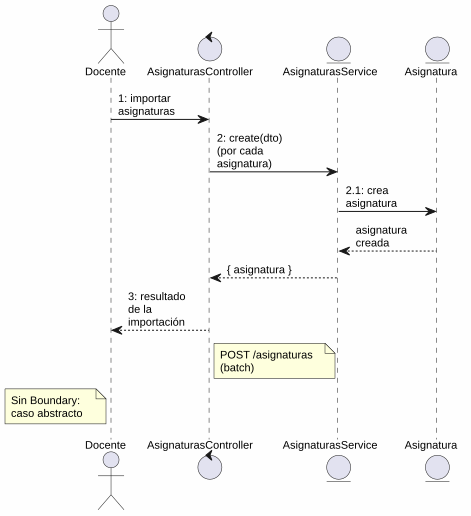
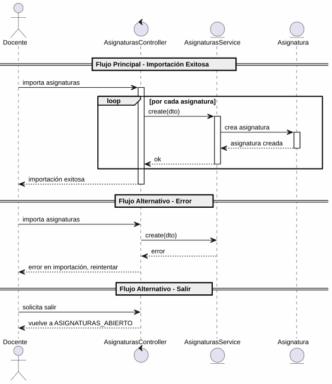

# 25-26-idsw2-sdVC > importarAsignaturas > Análisis

## propósito

Análisis de colaboración del caso de uso `importarAsignaturas()` mediante el patrón MVC.

## diagrama de colaboración

||
|-|
|Código fuente: [colaboracion.puml](../../../modelosUML/analisis/importarAsignaturas/colaboracion.puml)|

## clases de análisis identificadas

### AsignaturasController (Control)
- Coordinar importación batch de asignaturas
- `create(dto)` múltiples → `AsignaturasService`

### AsignaturasService (Entity)
- Abstraer acceso a datos de asignaturas
- `create(createAsignaturaDto)` para cada registro

### Asignatura (Entity)
- Atributos: id, nombre, codigo, cursoAcademico, gradoId, profesorId

> Caso de uso abstracto — no tiene capa de Boundary propia. La vista es gestionada por el caso de uso padre `importarConfiguracionGlobal()`.

## diagrama de secuencia

||
|-|
|Código fuente: [secuencia.puml](../../../modelosUML/analisis/importarAsignaturas/secuencia.puml)|

## estados de análisis

| Estado | Descripción |
|--------|-------------|
| `RequiringImport` | Solicita archivo/datos de asignaturas a importar |
| `ProvidingAsignaturas` | Procesa datos introducidos; permite confirmar, cancelar o salir |
| `ProvidingConfirmation` | Validación: éxito → ASIGNATURAS_ABIERTO, error → reintento |

**Entrada:** ASIGNATURAS_ABIERTO
**Salida:** ASIGNATURAS_ABIERTO2

## trazabilidad con la implementación

| Capa | Artefacto |
|------|-----------|
| Controlador | `src/apps/backend/src/asignaturas/asignaturas.controller.ts` (`POST /asignaturas`) |
| Servicio | `src/apps/backend/src/asignaturas/asignaturas.service.ts` (`create()`) |
| Modelo (BD) | `src/apps/backend/prisma/schema.prisma` (modelo `Asignatura`) |
