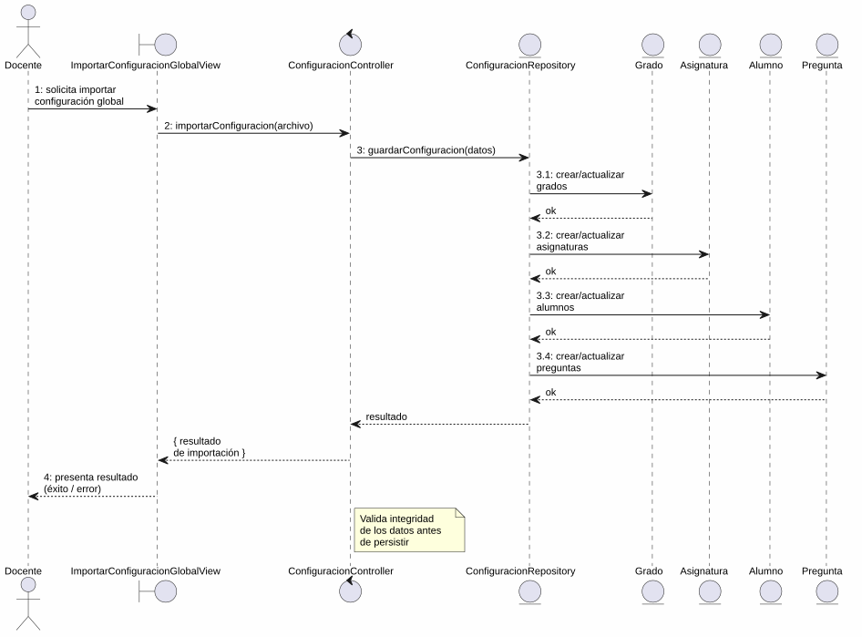
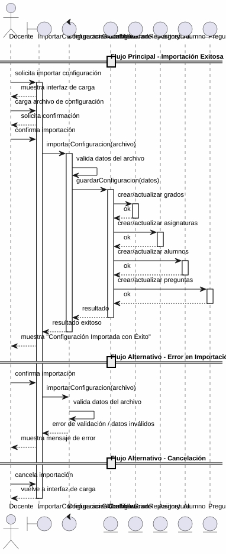

# 25-26-idsw2-sdVC > importarConfiguracionGlobal > Análisis

## información del artefacto

- **Proyecto**: Sistema de Gestión de Exámenes Universitarios
- **Fase RUP**: Elaboration (Elaboración)
- **Disciplina**: Análisis y Diseño
- **Versión**: 1.0
- **Fecha**: 2026-05-25
- **Autor**: Marcos Gutierrez

## propósito

Análisis de colaboración del caso de uso `importarConfiguracionGlobal()` mediante el patrón MVC, identificando las clases de análisis, sus responsabilidades y colaboraciones necesarias para cumplir con los requisitos especificados.

## diagrama de colaboración

||
|-|
|Código fuente: [colaboracion.puml](../../../modelosUML/analisis/importarConfiguracionGlobal/colaboracion.puml)|

## clases de análisis identificadas

### clases de vista (boundary)

#### ImportarConfiguracionGlobalView
**Estereotipo**: Vista (Boundary)
**Responsabilidades**:
- Recibir la solicitud de importación de configuración global desde el menú principal
- Permitir al docente cargar el archivo de configuración global (alumnos, grados, asignaturas, preguntas)
- Presentar confirmación antes de ejecutar la importación
- Visualizar el resultado final (éxito o error)
- Manejar la navegación de salida y cancelación

**Colaboraciones**:
- **Entrada**: Recibe `importarConfiguracionGlobal()` desde `SISTEMA_DISPONIBLE` (menú principal)
- **Control**: Se comunica con `ConfiguracionController`
- **Salida**: Navega a `SISTEMA_DISPONIBLE`

### clases de control

#### ConfiguracionController
**Estereotipo**: Control
**Responsabilidades**:
- Coordinar la lógica de importación de configuración global
- Validar los datos del archivo de configuración importado
- Procesar la creación masiva de entidades: grados, asignaturas, alumnos y preguntas
- Garantizar la integridad transaccional de la importación
- Gestionar la respuesta de éxito o error

**Colaboraciones**:
- **Vista**: Responde a solicitudes de `ImportarConfiguracionGlobalView`
- **Repositorio**: Delega operaciones de persistencia a `ConfiguracionRepository`

### clases de entidad (entity)

#### ConfiguracionRepository
**Estereotipo**: Entidad
**Responsabilidades**:
- Abstraer el acceso a datos de las entidades del sistema (grados, asignaturas, alumnos, preguntas)
- Proporcionar método para importar configuración completa en una operación batch
- Mantener la consistencia de los datos durante la importación masiva
- Validar la integridad referencial entre las entidades importadas

**Colaboraciones**:
- **Control**: Responde a `ConfiguracionController`
- **Entidad**: Gestiona instancias de `Grado`, `Asignatura`, `Alumno` y `Pregunta`

#### Grado
**Estereotipo**: Entidad
**Responsabilidades**:
- Representar un grado universitario dentro del sistema
- Encapsular atributos: id, titulo, codigo
- Servir como contenedor de asignaturas y alumnos

**Atributos relevantes**:
| Campo | Tipo | Descripción |
|-------|------|-------------|
| `id` | Int (PK) | Identificador único del grado |
| `titulo` | String | Nombre del grado |
| `codigo` | String (unique) | Código identificador del grado |

**Colaboraciones**:
- **ConfiguracionRepository**: Es gestionada por el repositorio
- **Asignatura**: Relación de composición con las asignaturas del grado

#### Asignatura
**Estereotipo**: Entidad
**Responsabilidades**:
- Representar una asignatura perteneciente a un grado
- Encapsular atributos: id, titulo, codigo, cursoAcademico, gradoId
- Relacionarse con su grado y su batería de preguntas

**Atributos relevantes**:
| Campo | Tipo | Descripción |
|-------|------|-------------|
| `id` | Int (PK) | Identificador único de la asignatura |
| `titulo` | String | Nombre de la asignatura |
| `codigo` | String | Código de la asignatura |
| `cursoAcademico` | String | Curso académico |
| `gradoId` | Int (FK) | Referencia al grado |

**Colaboraciones**:
- **ConfiguracionRepository**: Es gestionada por el repositorio
- **Grado**: Relación de pertenencia al grado padre

#### Alumno
**Estereotipo**: Entidad
**Responsabilidades**:
- Representar un alumno matriculado en un grado
- Encapsular atributos: id, nombre, apellidos, dni, email, gradoId
- Relacionarse con sus asignaturas y exámenes

**Atributos relevantes**:
| Campo | Tipo | Descripción |
|-------|------|-------------|
| `id` | Int (PK) | Identificador único del alumno |
| `nombre` | String | Nombre del alumno |
| `apellidos` | String | Apellidos del alumno |
| `dni` | String (unique) | DNI del alumno |
| `email` | String (unique) | Email del alumno |
| `gradoId` | Int (FK) | Referencia al grado |

**Colaboraciones**:
- **ConfiguracionRepository**: Es gestionada por el repositorio
- **Grado**: Relación de pertenencia al grado

#### Pregunta
**Estereotipo**: Entidad
**Responsabilidades**:
- Representar una pregunta del banco de preguntas con sus opciones de respuesta
- Encapsular atributos: id, enunciado, tema, dificultad, estado, bateriaId
- Relacionarse con sus respuestas y la batería de preguntas

**Atributos relevantes**:
| Campo | Tipo | Descripción |
|-------|------|-------------|
| `id` | Int (PK) | Identificador único de la pregunta |
| `enunciado` | String | Texto de la pregunta |
| `tema` | String | Tema al que pertenece |
| `dificultad` | Dificultad (enum) | BAJA \| MEDIA \| ALTA |
| `estado` | EstadoPregunta (enum) | Estado de la pregunta |
| `bateriaId` | Int (FK) | Referencia a la batería de preguntas |

**Colaboraciones**:
- **ConfiguracionRepository**: Es gestionada por el repositorio
- **BateriaDePreguntas**: Relación de pertenencia a la batería
- **Respuesta**: Relación de composición con las opciones de respuesta

## diagrama de secuencia

||
|-|
|Código fuente: [secuencia.puml](../../../modelosUML/analisis/importarConfiguracionGlobal/secuencia.puml)|

## flujo de colaboración

### secuencia de operaciones (flujo principal)

1. **Inicio**: `SISTEMA_DISPONIBLE` → `ImportarConfiguracionGlobalView.importarConfiguracionGlobal()`
2. **Carga de configuración**: `ImportarConfiguracionGlobalView` muestra interfaz; Docente carga el archivo de configuración global (grados, asignaturas, alumnos, preguntas)
3. **Confirmación**: `ImportarConfiguracionGlobalView` solicita confirmación; Docente confirma la importación
4. **Importación**: `ImportarConfiguracionGlobalView` → `ConfiguracionController.importarConfiguracion(archivo)`
5. **Validación**: `ConfiguracionController` valida los datos del archivo de configuración
6. **Persistencia batch**: `ConfiguracionController` → `ConfiguracionRepository.guardarConfiguracion(datos)`
7. **Creación de grados**: `ConfiguracionRepository` → `Grado` → crea o actualiza grados
8. **Creación de asignaturas**: `ConfiguracionRepository` → `Asignatura` → crea o actualiza asignaturas asociadas a grados
9. **Creación de alumnos**: `ConfiguracionRepository` → `Alumno` → crea o actualiza alumnos asociados a grados
10. **Creación de preguntas**: `ConfiguracionRepository` → `Pregunta` → crea o actualiza preguntas con sus respuestas
11. **Resultado**: `ConfiguracionRepository` → `ConfiguracionController` → `ImportarConfiguracionGlobalView` → Docente: mensaje de éxito

### flujo alternativo — error en la importación

- Paso 5 falla por datos inválidos en el archivo de configuración
- `ConfiguracionController` retorna error a `ImportarConfiguracionGlobalView`
- `ImportarConfiguracionGlobalView` muestra mensaje de error al Docente
- El sistema regresa al estado `ProporcionandoConfiguracion`

### flujo alternativo — cancelación

- Docente selecciona "Cancelar" en el diálogo de confirmación o en la pantalla de error
- `ImportarConfiguracionGlobalView` regresa al estado `ProporcionandoConfiguracion`
- No se ejecuta ninguna importación ni persistencia

### opciones de navegación disponibles

| Acción | Destino | Descripción |
|--------|---------|-------------|
| `Confirmar Importación` | `SISTEMA_DISPONIBLE` | Ejecuta la importación y vuelve al menú principal |
| `Cancelar` | `ProporcionandoConfiguracion` | Vuelve a la carga de configuración sin ejecutar importación |
| `Salir de importación` | `SISTEMA_DISPONIBLE` | Sale sin realizar ninguna importación |

## estados de análisis

Los estados se corresponden con el diagrama de estados detallado en `contexto/casos-de-uso/detalladoCasosDeUso/importarConfiguracionGlobal/importarConfiguracionGlobal.puml`:

| Estado | Descripción |
|--------|-------------|
| `RequiriendoImportacionGlobal` | El docente solicita importar configuración global desde el menú principal |
| `ProporcionandoConfiguracion` | El sistema permite cargar configuración global (alumnos, grados, asignaturas, preguntas) o salir |
| `ProporcionandoConfirmacion` | El sistema presenta confirmación; el docente confirma o cancela la importación |
| `Importando` (choice) | Punto de decisión: importación exitosa → finaliza; error o cancelación → vuelve a `ProporcionandoConfiguracion` |

**Transiciones clave:**
- `RequiriendoImportacionGlobal` → `ProporcionandoConfiguracion`: Sistema muestra interfaz de carga
- `ProporcionandoConfiguracion` → `ProporcionandoConfirmacion`: Docente introduce configuración global
- `ProporcionandoConfirmacion` → `Importando`: Docente confirma importación
- `Importando` → `ProporcionandoConfiguracion`: Error en importación o cancelación
- `Importando` → `[*]`: Importación exitosa (salida a `SISTEMA_DISPONIBLE`)
- `ProporcionandoConfiguracion` → `[*]`: Docente solicita salir (salida a `SISTEMA_DISPONIBLE`)

## correspondencia con requisitos

### mapeado con especificación detallada

| Requisito del caso de uso | Clase responsable | Método/Colaboración |
|--------------------------|-------------------|---------------------|
| Cargar archivo de configuración global | `ImportarConfiguracionGlobalView` | Interfaz de carga de archivo |
| Confirmar importación | `ImportarConfiguracionGlobalView` | Diálogo de confirmación |
| Validar datos del archivo de configuración | `ConfiguracionController` | Validación de integridad y formato de datos |
| Importar grados | `ConfiguracionRepository` | Creación o actualización batch de grados |
| Importar asignaturas | `ConfiguracionRepository` | Creación o actualización batch de asignaturas |
| Importar alumnos | `ConfiguracionRepository` | Creación o actualización batch de alumnos |
| Importar preguntas | `ConfiguracionRepository` | Creación o actualización batch de preguntas |
| Mostrar resultado (éxito/error) | `ImportarConfiguracionGlobalView` | Presentación de mensaje de resultado |
| Salir de importación | `ImportarConfiguracionGlobalView` | Navegación a `SISTEMA_DISPONIBLE` |

### patrón de colaboración establecido

Este análisis sigue el **patrón metodológico universal** establecido para el proyecto:
- **Entrada única**: Desde `SISTEMA_DISPONIBLE` (menú principal del docente)
- **Análisis MVC completo**: Vista, Control y Entidad claramente separados
- **Salida única**: `SISTEMA_DISPONIBLE` tras importación exitosa
- **Flujo con transiciones**: Confirmación, cancelación y error contemplados en el análisis
- **Operación batch**: Importación masiva de múltiples entidades en una sola operación

### consideraciones de filtros

`importarConfiguracionGlobal()` **no requiere filtros de búsqueda**. Es un caso de uso transaccional de importación masiva donde el docente carga un archivo completo de configuración y el sistema procesa la creación o actualización de todas las entidades. El único filtrado implícito ocurre durante la validación de los datos importados.

## características del análisis

### separación de responsabilidades MVC

- **Vista**: Solo presentación de la interfaz de carga, confirmación e interacción con el docente
- **Control**: Solo coordinación, validación de datos y lógica de importación batch
- **Entidad**: Solo datos, reglas de negocio de persistencia y relaciones entre entidades

### agnóstico tecnológicamente

- No especifica tecnología de interfaz de usuario
- No asume formato específico del archivo de configuración (CSV, JSON, XML)
- No asume implementación específica de base de datos
- Mantiene independencia de frameworks

### trazabilidad completa

- **Origen**: Caso de uso detallado `importarConfiguracionGlobal()` y prototipos asociados
- **Destino**: Base para diseño arquitectónico e implementación
- **Conexión**: Diagrama de contexto → Análisis de colaboración → Implementación real

## trazabilidad con la implementación

| Capa | Artefacto real |
|------|----------------|
| Controlador | *Pendiente de implementar* |
| Servicio | *Pendiente de implementar* |
| DTO | *Pendiente de implementar* |
| Vista | *Pendiente de implementar* |
| Modelo (BD) | `src/apps/backend/prisma/schema.prisma` (Grado, Asignatura, Alumno, Pregunta, Respuesta, BateriaDePreguntas) |

> **Nota:** Este caso de uso está priorizado como #3 en el proyecto pero aún no tiene implementación en código. El análisis se ha realizado a partir de los artefactos de requisitos (diagrama de estados detallado y prototipos de interfaz).

## patrones aplicados

### repository pattern
`ConfiguracionRepository` abstrae el acceso a datos de todas las entidades del sistema (grados, asignaturas, alumnos, preguntas), permitiendo una operación de importación batch unificada.

### mvc pattern
Separación clara entre presentación (`ImportarConfiguracionGlobalView`), lógica de aplicación (`ConfiguracionController`) y datos (`Grado`, `Asignatura`, `Alumno`, `Pregunta`, `ConfiguracionRepository`).

### navigation pattern
Las opciones de "Cancelar", "Confirmar Importación" y "Salir de importación" permiten al docente controlar el flujo, con retorno siempre al menú principal (`SISTEMA_DISPONIBLE`) tanto en éxito como en salida.
