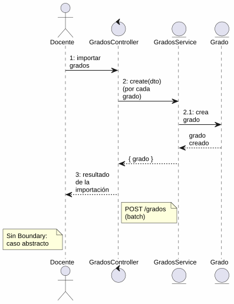
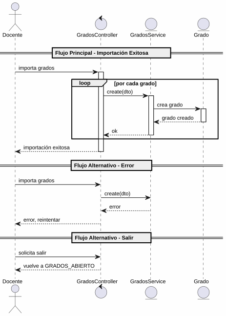

# 25-26-idsw2-sdVC > importarGrados > Análisis

## propósito

Análisis de colaboración del caso de uso `importarGrados()` mediante el patrón MVC.

## diagrama de colaboración

||
|-|
|Código fuente: [colaboracion.puml](../../../modelosUML/analisis/importarGrados/colaboracion.puml)|

## clases de análisis identificadas

### GradosController (Control)
- Coordinar importación batch de grados
- `create(dto)` múltiples → `GradosService`

### GradosService (Entity)
- Abstraer acceso a datos de grados
- `create(createGradoDto)` para cada registro

### Grado (Entity)
- Atributos: id, nombre, codigo

> Caso de uso abstracto — no tiene capa de Boundary propia.

## diagrama de secuencia

||
|-|
|Código fuente: [secuencia.puml](../../../modelosUML/analisis/importarGrados/secuencia.puml)|

## estados de análisis

| Estado | Descripción |
|--------|-------------|
| `RequiringImport` | Solicita datos de grados a importar |
| `ProvidingGrados` | Procesa datos; permite confirmar, cancelar o salir |
| `ProvidingConfirmation` | Validación: éxito → GRADOS_ABIERTO, error → reintento |

**Entrada:** GRADOS_ABIERTO
**Salida:** GRADOS_ABIERTO2

## trazabilidad con la implementación

| Capa | Artefacto |
|------|-----------|
| Controlador | `src/apps/backend/src/grados/grados.controller.ts` (`POST /grados`) |
| Servicio | `src/apps/backend/src/grados/grados.service.ts` (`create()`) |
| Modelo (BD) | `src/apps/backend/prisma/schema.prisma` (modelo `Grado`) |
