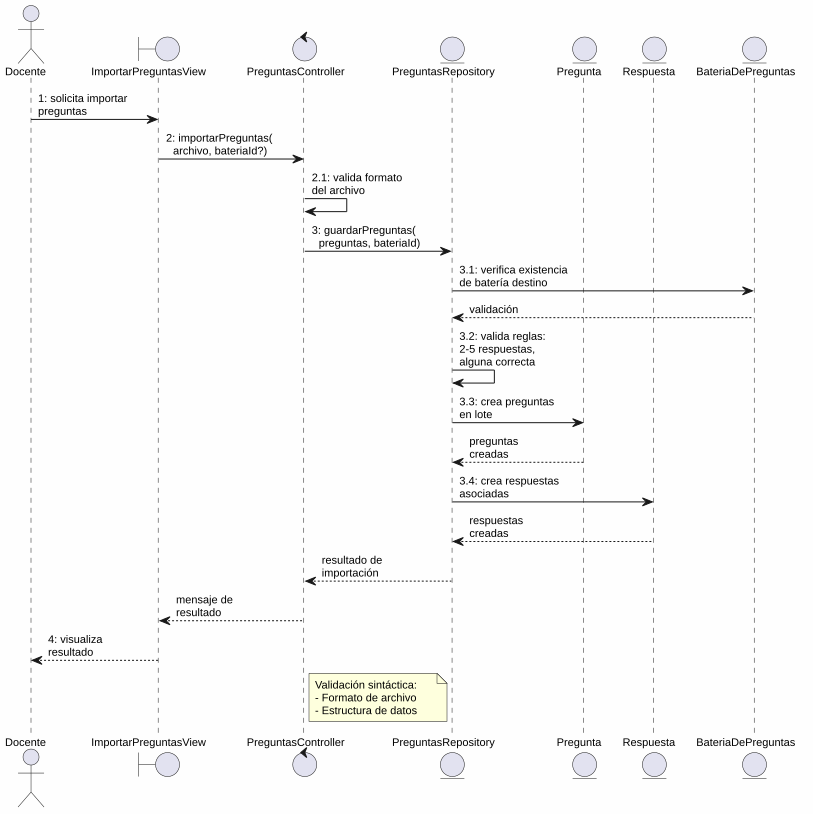
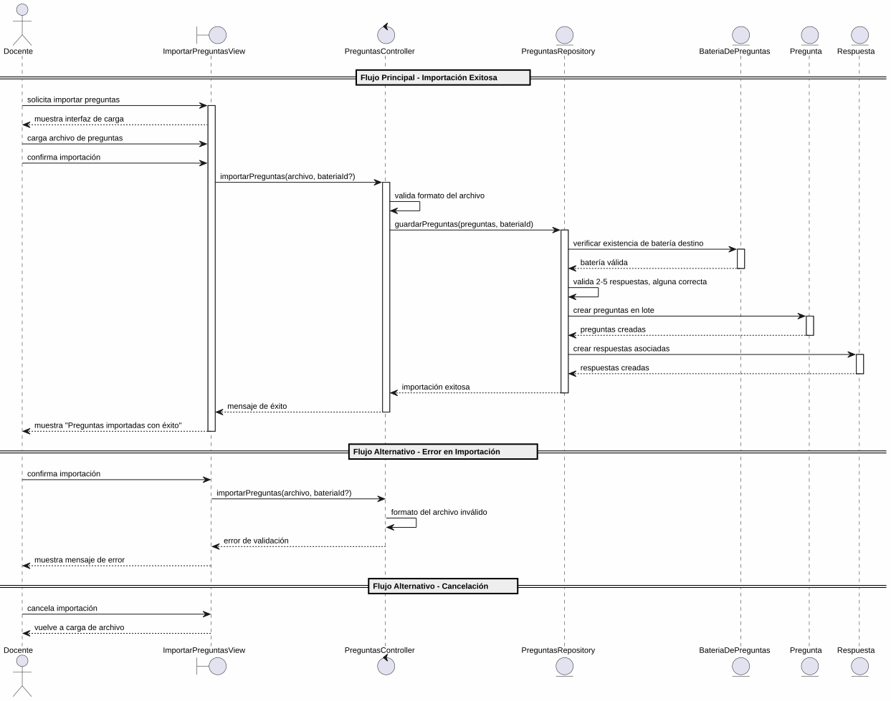

# 25-26-idsw2-sdVC > importarPreguntas > Análisis

## información del artefacto

- **Proyecto**: Sistema de Gestión de Exámenes Universitarios
- **Fase RUP**: Elaboration (Elaboración)
- **Disciplina**: Análisis y Diseño
- **Versión**: 1.0
- **Fecha**: 2026-05-26
- **Autor**: Marcos Gutierrez

## propósito

Análisis del caso de uso `importarPreguntas()` mediante el patrón MVC, identificando las clases de análisis, sus responsabilidades y colaboraciones necesarias para cumplir con los requisitos especificados. Este caso de uso permite al Docente importar preguntas con sus respuestas al sistema mediante carga masiva desde un archivo externo, pudiendo hacerlo desde la lista general de preguntas o desde el contexto de una batería de preguntas concreta.

## diagrama de colaboración

||
|-|
|Código fuente: [colaboracion.puml](../../../modelosUML/analisis/importarPreguntas/colaboracion.puml)|

## clases de análisis identificadas

### clases de vista (boundary)

#### ImportarPreguntasView
**Estereotipo**: Vista (Boundary)
**Responsabilidades**:
- Recibir la solicitud de importación de preguntas desde `PREGUNTAS_ABIERTO` o `PREGUNTAS_CONTEXTUALES_ABIERTO`
- Permitir al docente cargar el archivo con los datos de preguntas y respuestas a importar
- Presentar confirmación antes de ejecutar la importación
- Permitir cancelar o salir del flujo de importación
- Visualizar el resultado final (éxito o error)
- Indicar la batería de preguntas destino cuando se accede desde contexto

**Colaboraciones**:
- **Entrada**: Recibe `importarPreguntas()` desde `PREGUNTAS_ABIERTO` (lista general) o `PREGUNTAS_CONTEXTUALES_ABIERTO` (batería concreta)
- **Control**: Se comunica con `PreguntasController`
- **Salida**: Navega a `PREGUNTAS_ABIERTO` o `PREGUNTAS_CONTEXTUALES_ABIERTO`

### clases de control

#### PreguntasController
**Estereotipo**: Control
**Responsabilidades**:
- Coordinar la lógica de importación masiva de preguntas con sus respuestas
- Validar sintácticamente los datos del archivo cargado (formato, estructura, tipos básicos)
- Procesar la creación batch de entidades `Pregunta` con sus `Respuesta` asociadas
- Garantizar la integridad transaccional de la importación (pregunta + respuestas)
- Gestionar la respuesta de éxito o error

**Colaboraciones**:
- **Vista**: Responde a solicitudes de `ImportarPreguntasView`
- **Repositorio**: Delega operaciones de persistencia a `PreguntasRepository`

### clases de entidad (entity)

#### PreguntasRepository
**Estereotipo**: Entidad
**Responsabilidades**:
- Abstraer el acceso a datos de las entidades `Pregunta` y `Respuesta`
- Proporcionar método para importación batch de preguntas con sus respuestas
- Validar la existencia de la `BateriaDePreguntas` destino
- Validar la regla de negocio: máximo 5 respuestas por pregunta
- Validar que cada pregunta tenga al menos una respuesta correcta
- Mantener la consistencia referencial entre pregunta, respuestas y batería

**Colaboraciones**:
- **Control**: Responde a `PreguntasController`
- **Entidad**: Gestiona instancias de `Pregunta`, `Respuesta` y `BateriaDePreguntas`

#### Pregunta
**Estereotipo**: Entidad
**Responsabilidades**:
- Representar una pregunta del banco de preguntas con sus opciones de respuesta
- Encapsular atributos: id, enunciado, tema, dificultad, estado, bateriaId
- Relacionarse con sus respuestas y la batería de preguntas

**Atributos relevantes**:
| Campo | Tipo | Descripción |
|-------|------|-------------|
| `id` | Int (PK) | Identificador único de la pregunta |
| `enunciado` | String | Texto de la pregunta |
| `tema` | String | Tema al que pertenece |
| `dificultad` | Dificultad (enum) | BAJA \| MEDIA \| ALTA |
| `estado` | EstadoPregunta (enum) | EN_CONSTRUCCION \| HABILITADA \| INHABILITADA |
| `bateriaId` | Int (FK) | Referencia a la batería de preguntas |

**Colaboraciones**:
- **PreguntasRepository**: Es gestionada por el repositorio
- **BateriaDePreguntas**: Relación de pertenencia a la batería
- **Respuesta**: Relación de composición con las opciones de respuesta

#### Respuesta
**Estereotipo**: Entidad
**Responsabilidades**:
- Representar una opción de respuesta asociada a una pregunta
- Encapsular atributos: id, opcion, esCorrecta, preguntaId
- Relacionarse con su pregunta padre

**Atributos relevantes**:
| Campo | Tipo | Descripción |
|-------|------|-------------|
| `id` | Int (PK) | Identificador único de la respuesta |
| `opcion` | String | Texto de la opción de respuesta |
| `esCorrecta` | Boolean | Indica si la opción es correcta |
| `preguntaId` | Int (FK) | Referencia a la pregunta padre |

**Colaboraciones**:
- **PreguntasRepository**: Es gestionada por el repositorio
- **Pregunta**: Relación de pertenencia a la pregunta

#### BateriaDePreguntas
**Estereotipo**: Entidad
**Responsabilidades**:
- Representar el contenedor de preguntas asociado a una asignatura
- Encapsular atributos: id, asignaturaId
- Relacionarse con las preguntas que contiene

**Colaboraciones**:
- **PreguntasRepository**: Es consultada para validar la existencia de la batería destino

## diagrama de secuencia

||
|-|
|Código fuente: [secuencia.puml](../../../modelosUML/analisis/importarPreguntas/secuencia.puml)|

## flujo de colaboración

### secuencia de operaciones (flujo principal)

1. **Inicio**: `PREGUNTAS_ABIERTO` (o `PREGUNTAS_CONTEXTUALES_ABIERTO`) → `ImportarPreguntasView.importarPreguntas()`
2. **Carga**: `ImportarPreguntasView` muestra interfaz de importación; Docente carga el archivo de preguntas con respuestas
3. **Confirmación**: `ImportarPreguntasView` solicita confirmación; Docente confirma la importación
4. **Importación**: `ImportarPreguntasView` → `PreguntasController.importarPreguntas(archivo, bateriaId?)`
5. **Validación sintáctica**: `PreguntasController` valida el formato del archivo (estructura, tipos básicos)
6. **Persistencia batch**: `PreguntasController` → `PreguntasRepository.guardarPreguntas(preguntas, bateriaId)`
7. **Validación semántica**: `PreguntasRepository` verifica existencia de `BateriaDePreguntas`, que cada pregunta tenga entre 2 y 5 respuestas, y que haya al menos una respuesta correcta
8. **Creación de preguntas**: `PreguntasRepository` → `Pregunta` → crea las preguntas en lote
9. **Creación de respuestas**: `PreguntasRepository` → `Respuesta` → crea las respuestas asociadas a cada pregunta
10. **Resultado**: `PreguntasRepository` → `PreguntasController` → `ImportarPreguntasView` → Docente: mensaje de éxito

### flujo alternativo — error en la importación

- Paso 5 falla por formato incorrecto del archivo → `PreguntasController` retorna error directamente
- Paso 7 falla por batería inexistente, respuestas fuera de rango (2-5), o ninguna respuesta correcta → `PreguntasRepository` retorna error → `PreguntasController` propaga error
- `ImportarPreguntasView` muestra mensaje de error al Docente con opciones reintentar o cancelar
- Docente elige "Importar preguntas" (reintentar) → sistema regresa a `ProvidingPreguntas` para corregir datos
- Docente elige "Cancelar" → sistema regresa a `ProvidingPreguntas` sin persistir cambios

### flujo alternativo — cancelación

- Docente selecciona "Cancelar Importación" en el diálogo de confirmación
- `ImportarPreguntasView` regresa al estado `ProvidingPreguntas`
- No se ejecuta ninguna importación ni persistencia

### opciones de navegación disponibles

| Acción | Destino | Descripción |
|--------|---------|-------------|
| `Confirmar Importación` | `PREGUNTAS_ABIERTO` / `PREGUNTAS_CONTEXTUALES_ABIERTO` | Ejecuta la importación y vuelve según el origen |
| `Cancelar Importación` | `ProvidingPreguntas` | Vuelve a la carga de archivo sin ejecutar importación |
| `Importar preguntas` (reintentar) | `ProvidingPreguntas` | Vuelve a la carga de archivo tras un error para corregir datos |
| `Cancelar` (desde error) | `ProvidingPreguntas` | Sale del flujo de error sin reintentar |
| `Salir de importación` | `PREGUNTAS_ABIERTO` / `PREGUNTAS_CONTEXTUALES_ABIERTO` | Sale sin realizar ninguna importación |

## estados de análisis

Los estados se corresponden con el diagrama de estados detallado en `contexto/casos-de-uso/detalladoCasosDeUso/importarPreguntas/importarPreguntas.puml`:

| Estado | Descripción |
|--------|-------------|
| `RequiringImport` | El docente solicita importar preguntas desde `PREGUNTAS_ABIERTO` o `PREGUNTAS_CONTEXTUALES_ABIERTO` |
| `ProvidingPreguntas` | El sistema permite cargar el archivo de preguntas a importar o salir |
| `ProvidingConfirmation` | El sistema presenta confirmación; el docente confirma o cancela la importación |
| `Importando` (choice) | Punto de decisión: importación exitosa → finaliza; error o cancelación → vuelve a `ProvidingPreguntas` |

**Transiciones clave:**
- `RequiringImport` → `ProvidingPreguntas`: Sistema muestra interfaz de carga
- `ProvidingPreguntas` → `ProvidingConfirmation`: Docente introduce las preguntas a importar
- `ProvidingConfirmation` → `Importando`: Docente confirma importación
- `Importando` → `ProvidingPreguntas`: Error en importación o cancelación
- `Importando` → `[*]`: Importación exitosa (salida a `PREGUNTAS_ABIERTO` o `PREGUNTAS_CONTEXTUALES_ABIERTO`)
- `ProvidingPreguntas` → `[*]`: Docente solicita salir (salida a `PREGUNTAS_ABIERTO` o `PREGUNTAS_CONTEXTUALES_ABIERTO`)

## correspondencia con requisitos

### mapeado con especificación detallada

| Requisito del caso de uso | Clase responsable | Método/Colaboración |
|--------------------------|-------------------|---------------------|
| Cargar archivo de preguntas | `ImportarPreguntasView` | Interfaz de carga de archivo |
| Confirmar importación | `ImportarPreguntasView` | Diálogo de confirmación |
| Validar datos del archivo | `PreguntasController` | Validación sintáctica de formato y estructura |
| Validar reglas de negocio | `PreguntasRepository` | 2-5 respuestas, al menos una correcta, batería existente |
| Importar preguntas batch | `PreguntasRepository` | Creación batch de preguntas con respuestas asociadas |
| Mostrar resultado (éxito/error) | `ImportarPreguntasView` | Presentación de mensaje de resultado |
| Salir de importación | `ImportarPreguntasView` | Navegación al origen correspondiente |

### patrón de colaboración establecido

Este análisis sigue el **patrón metodológico universal** establecido para el proyecto:
- **Entrada dual**: Desde `PREGUNTAS_ABIERTO` (lista general) o `PREGUNTAS_CONTEXTUALES_ABIERTO` (batería concreta)
- **Análisis MVC completo**: Vista, Control y Entidad claramente separados
- **Salida dual**: Retorna al origen desde el que se invocó
- **Flujo con transiciones**: Confirmación, cancelación y error contemplados en el análisis
- **Operación batch compuesta**: Importación masiva de preguntas con sus respuestas anidadas

### consideraciones de filtros

`importarPreguntas()` **no requiere filtros de búsqueda**. Es un caso de uso transaccional de importación masiva donde el docente carga un archivo completo de preguntas y el sistema procesa la creación de todas las entidades validadas. La batería de preguntas destino se determina por el contexto de entrada (si se accede desde `PREGUNTAS_CONTEXTUALES_ABIERTO`) o se selecciona durante la carga.

## características del análisis

### separación de responsabilidades MVC

- **Vista**: Solo presentación de la interfaz de carga, confirmación e interacción con el docente
- **Control**: Solo coordinación, validación sintáctica y lógica de importación batch
- **Entidad**: Solo datos, reglas de negocio de persistencia (máx. 5 respuestas, 1 correcta) y relaciones entre entidades

### agnóstico tecnológicamente

- No especifica tecnología de interfaz de usuario
- No asume formato específico del archivo de importación (CSV, JSON, XML)
- No asume implementación específica de base de datos
- Mantiene independencia de frameworks

### trazabilidad completa

- **Origen**: Caso de uso detallado `importarPreguntas()` y prototipos asociados
- **Destino**: Base para diseño arquitectónico e implementación
- **Conexión**: Diagrama de contexto → Análisis de colaboración → Implementación real

## trazabilidad con la implementación

| Capa | Artefacto real |
|------|----------------|
| Controlador | `src/apps/backend/src/preguntas/preguntas.controller.ts` |
| Servicio | `src/apps/backend/src/preguntas/preguntas.service.ts` |
| DTO | `src/apps/backend/src/preguntas/dto/create-pregunta.dto.ts` |
| Vista | `src/apps/frontend/src/views/PreguntasView.vue` |
| Modelo (BD) | `src/apps/backend/prisma/schema.prisma` (entidades `Pregunta`, `Respuesta`, `BateriaDePreguntas`) |

> **Nota:** Este caso de uso está priorizado como #6. El backend ya dispone de CRUD para `Pregunta` (create, findAll con filtros, findOne, update, remove) con creación individual. La funcionalidad de importación batch (`importarPreguntas()`) no está implementada actualmente y requeriría extender `PreguntasController` y `PreguntasService` con un nuevo endpoint de carga masiva que maneje la creación transaccional de preguntas con sus respuestas. El análisis se ha realizado a partir de los artefactos de requisitos (diagrama de estados detallado, prototipos de interfaz) y la implementación existente como referencia.

## patrones aplicados

### repository pattern
`PreguntasRepository` abstrae el acceso a datos de `Pregunta` y `Respuesta`, permitiendo una operación de importación batch que respeta las reglas de negocio (máximo 5 respuestas, al menos una correcta) y verifica la integridad referencial con `BateriaDePreguntas`.

### mvc pattern
Separación clara entre presentación (`ImportarPreguntasView`), lógica de aplicación (`PreguntasController`) y datos (`Pregunta`, `Respuesta`, `BateriaDePreguntas`, `PreguntasRepository`).

### navigation pattern
Las opciones de "Cancelar", "Confirmar Importación", "Reintentar" y "Salir de importación" permiten al docente controlar el flujo, con retorno al origen correspondiente (`PREGUNTAS_ABIERTO` o `PREGUNTAS_CONTEXTUALES_ABIERTO`) tanto en éxito como en salida.
