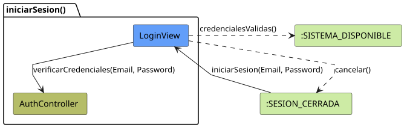
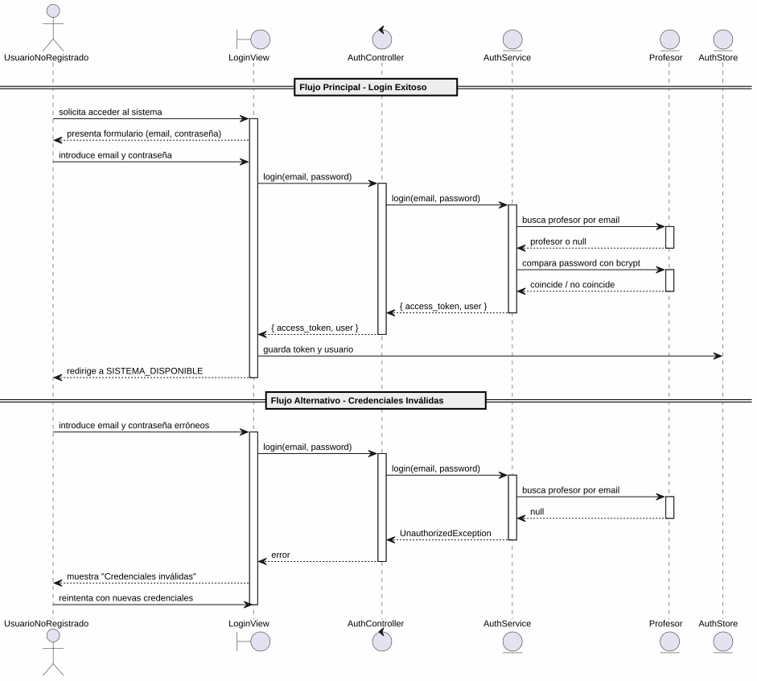

# 25-26-idsw2-sdVC > iniciarSesion > Análisis

## propósito

Análisis de colaboración del caso de uso `iniciarSesion()` mediante el patrón MVC.

## diagrama de colaboración

||
|-|
|Código fuente: [colaboracion.puml](../../../modelosUML/analisis/iniciarSesion/colaboracion.puml)|

## clases de análisis identificadas

### LoginView (Boundary)
- Recibir solicitud desde SESION_CERRADA
- Presentar formulario de ingreso (email, contraseña)
- Mostrar error en caso de credenciales inválidas
- Navegar al dashboard del sistema

### AuthController (Control)
- Coordinar autenticación
- `login(email, password)` → `AuthService`

### AuthService (Entity)
- Validar credenciales contra `Profesor` en BD
- Comparar password con bcrypt
- Generar JWT con payload (`sub`, `email`, `rol`)

### Profesor (Entity)
- Atributos: id, nombre, apellidos, dni, email, password, rol

### AuthStore (State)
- Almacenar token JWT y datos del usuario en Pinia
- Persistir token en `localStorage`

## diagrama de secuencia

||
|-|
|Código fuente: [secuencia.puml](../../../modelosUML/analisis/iniciarSesion/secuencia.puml)|

## estados de análisis

| Estado | Descripción |
|--------|-------------|
| `SolicitandoAcceso` | Pantalla inicial de login; espera que el usuario introduzca credenciales |
| `ProporcionandoCredenciales` | Usuario ingresa email y contraseña |
| `ValidandoCredenciales` | Sistema verifica contra BD (choice: válidas → SISTEMA_DISPONIBLE, inválidas → SolicitandoAcceso) |

**Entrada:** SESION_CERRADA
**Salida:** SISTEMA_DISPONIBLE

## trazabilidad con la implementación

| Capa | Artefacto |
|------|-----------|
| Controlador | `src/apps/backend/src/auth/auth.controller.ts` (`POST /auth/login`) |
| Servicio | `src/apps/backend/src/auth/auth.service.ts` (`login()`) |
| Vista | `src/apps/frontend/src/views/LoginView.vue` |
| Store | `src/apps/frontend/src/stores/auth.ts` (Pinia store) |
| Modelo (BD) | `src/apps/backend/prisma/schema.prisma` (modelo `Profesor`) |
