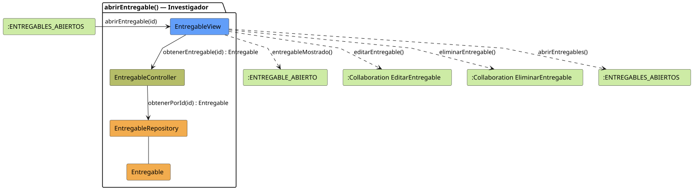

# FUNIBER GIPF > abrirEntregable > Análisis

## información del artefacto

- **Proyecto**: FUNIBER GIPF - Plataforma Interna de Investigación
- **Fase**: Análisis
- **Disciplina**: Análisis y Diseño
- **Versión**: 1.0
- **Fecha**: 2026-06-05
- **Autor**: Diego Martínez

## propósito

Análisis de colaboración del caso de uso `abrirEntregable()` mediante el patrón MVC, identificando las clases de análisis, sus responsabilidades y colaboraciones necesarias para que el investigador consulte el detalle de un entregable y acceda a las opciones de gestión.

## diagrama de colaboración

||
|-|
|Código fuente: [abrirEntregable.puml](../../../modelosUML/analisis/investigador/abrirEntregable.puml)|

## clases de análisis identificadas

### clases de vista (boundary)

#### EntregableView
**Estereotipo**: Vista (Boundary)  
**Responsabilidades**:
- Recibir la solicitud `abrirEntregable(id)` desde `:ENTREGABLES_ABIERTOS`
- Solicitar al controlador los datos del entregable mediante `obtenerEntregable(id) : Entregable`
- Mostrar el detalle del entregable al investigador
- Ofrecer acceso a las colaboraciones de edición y eliminación
- Navegar de vuelta al listado de entregables

**Colaboraciones**:
- **Entrada**: Desde `:ENTREGABLES_ABIERTOS` con `abrirEntregable(id)`
- **Control**: Se comunica con `EntregableController` mediante `obtenerEntregable(id) : Entregable`
- **Salida**: Transita a `:ENTREGABLE_ABIERTO` (`entregableMostrado()`), `:Collaboration EditarEntregable` (`editarEntregable()`), `:Collaboration EliminarEntregable` (`eliminarEntregable()`), `:ENTREGABLES_ABIERTOS` (`abrirEntregables()`)

### clases de control

#### EntregableController
**Estereotipo**: Control  
**Responsabilidades**:
- Recibir `obtenerEntregable(id)` y delegar en el repositorio la obtención del entregable

**Colaboraciones**:
- **Vista**: Responde a solicitudes de `EntregableView`
- **Repositorio**: Delega en `EntregableRepository` mediante `obtenerPorId(id) : Entregable`

### clases de entidad (entity)

#### EntregableRepository
**Estereotipo**: Entidad  
**Responsabilidades**:
- Recuperar un entregable por id mediante `obtenerPorId(id) : Entregable`

**Colaboraciones**:
- **Control**: Responde a `EntregableController`
- **Entidad**: Gestiona instancias de `Entregable`

#### Entregable
**Estereotipo**: Entidad  
**Responsabilidades**:
- Representar los datos completos del entregable a mostrar

**Colaboraciones**:
- **Repositorio**: Es gestionado por `EntregableRepository`

## flujo de colaboración

### secuencia de operaciones

1. El sistema está en `:ENTREGABLES_ABIERTOS`
2. El investigador selecciona un entregable: `EntregableView` recibe `abrirEntregable(id)`
3. `EntregableView` invoca `obtenerEntregable(id)` en `EntregableController`
4. `EntregableController` delega en `EntregableRepository.obtenerPorId(id)` y obtiene un objeto `Entregable`
5. La vista muestra el detalle → transita a `:ENTREGABLE_ABIERTO` con `entregableMostrado()`
6. Desde `:ENTREGABLE_ABIERTO` el investigador puede navegar a `editarEntregable()`, `eliminarEntregable()` o `abrirEntregables()`

## correspondencia con requisitos

|Requisito del caso de uso|Clase responsable|Método/Colaboración|
|-|-|-|
|Obtener datos del entregable|`EntregableController`|`obtenerEntregable(id) : Entregable`|
|Acceder al entregable por id|`EntregableRepository`|`obtenerPorId(id) : Entregable`|
|Mostrar detalle del entregable|`EntregableView`|`entregableMostrado()`|
|Editar entregable|`EntregableView`|`editarEntregable()`|
|Eliminar entregable|`EntregableView`|`eliminarEntregable()`|
|Volver al listado|`EntregableView`|`abrirEntregables()`|

## características del análisis

### separación de responsabilidades MVC

- **Vista**: Solo presentación e interacción con el investigador
- **Control**: Solo coordinación y obtención del entregable
- **Entidad**: Solo datos y reglas de negocio del entregable

### agnóstico tecnológicamente

- No especifica tecnología de interfaz de usuario
- No asume implementación específica de base de datos
- Mantiene independencia de frameworks

### trazabilidad completa

- **Origen**: Caso de uso detallado `abrirEntregable()`
- **Destino**: Base para diseño arquitectónico
- **Conexión**: Diagrama de estados → Análisis de colaboración

## patrones aplicados

### repository pattern
`EntregableRepository` abstrae el acceso a datos, permitiendo diferentes implementaciones sin afectar al controlador.

### mvc pattern
Separación clara entre presentación (`EntregableView`), lógica de aplicación (`EntregableController`) y datos (`Entregable`, `EntregableRepository`).

## referencias

- [Especificación detallada: abrirEntregable()](../../../context/casosDeUso/detalle/investigador/abrirEntregable/abrirEntregable.md)
- [Modelo del dominio](../../../context/modeloDelDominio/modeloDominio.md)
