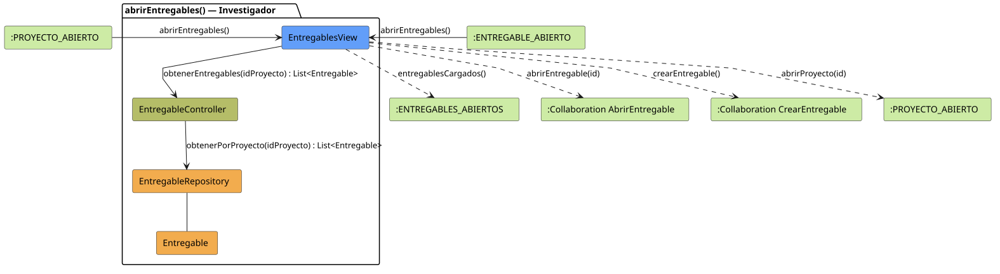

# FUNIBER GIPF > abrirEntregables > Análisis

## información del artefacto

- **Proyecto**: FUNIBER GIPF - Plataforma Interna de Investigación
- **Fase**: Análisis
- **Disciplina**: Análisis y Diseño
- **Versión**: 1.0
- **Fecha**: 2026-06-05
- **Autor**: Diego Martínez

## propósito

Análisis de colaboración del caso de uso `abrirEntregables()` mediante el patrón MVC, identificando las clases de análisis, sus responsabilidades y colaboraciones necesarias para que el investigador liste los entregables de un proyecto.

## diagrama de colaboración

||
|-|
|Código fuente: [abrirEntregables.puml](../../../modelosUML/analisis/investigador/abrirEntregables.puml)|

## clases de análisis identificadas

### clases de vista (boundary)

#### EntregablesView
**Estereotipo**: Vista (Boundary)  
**Responsabilidades**:
- Recibir la solicitud `abrirEntregables()` desde `:PROYECTO_ABIERTO` o desde `:ENTREGABLE_ABIERTO`
- Solicitar al controlador la lista de entregables del proyecto mediante `obtenerEntregables(idProyecto) : List<Entregable>`
- Mostrar la lista de entregables al investigador
- Ofrecer acceso a entregables individuales, a la creación y vuelta al proyecto

**Colaboraciones**:
- **Entrada**: Desde `:PROYECTO_ABIERTO` o `:ENTREGABLE_ABIERTO` con `abrirEntregables()`
- **Control**: Se comunica con `EntregableController` mediante `obtenerEntregables(idProyecto) : List<Entregable>`
- **Salida**: Transita a `:ENTREGABLES_ABIERTOS` (`entregablesCargados()`), `:Collaboration AbrirEntregable` (`abrirEntregable(id)`), `:Collaboration CrearEntregable` (`crearEntregable()`), `:PROYECTO_ABIERTO` (`abrirProyecto(id)`)

### clases de control

#### EntregableController
**Estereotipo**: Control  
**Responsabilidades**:
- Recibir `obtenerEntregables(idProyecto)` y delegar en el repositorio la obtención de los entregables

**Colaboraciones**:
- **Vista**: Responde a solicitudes de `EntregablesView`
- **Repositorio**: Delega en `EntregableRepository` mediante `obtenerPorProyecto(idProyecto) : List<Entregable>`

### clases de entidad (entity)

#### EntregableRepository
**Estereotipo**: Entidad  
**Responsabilidades**:
- Recuperar los entregables de un proyecto mediante `obtenerPorProyecto(idProyecto) : List<Entregable>`

**Colaboraciones**:
- **Control**: Responde a `EntregableController`
- **Entidad**: Gestiona instancias de `Entregable`

#### Entregable
**Estereotipo**: Entidad  
**Responsabilidades**:
- Representar los datos de un entregable en el listado

**Colaboraciones**:
- **Repositorio**: Es gestionado por `EntregableRepository`

## flujo de colaboración

### secuencia de operaciones

1. El sistema está en `:PROYECTO_ABIERTO` o `:ENTREGABLE_ABIERTO`
2. El investigador solicita ver entregables: `EntregablesView` recibe `abrirEntregables()`
3. `EntregablesView` invoca `obtenerEntregables(idProyecto)` en `EntregableController`
4. `EntregableController` delega en `EntregableRepository.obtenerPorProyecto(idProyecto)` y obtiene `List<Entregable>`
5. La vista muestra la lista → transita a `:ENTREGABLES_ABIERTOS` con `entregablesCargados()`
6. Desde `:ENTREGABLES_ABIERTOS` el investigador puede navegar a `abrirEntregable(id)`, `crearEntregable()` o `abrirProyecto(id)`

## correspondencia con requisitos

|Requisito del caso de uso|Clase responsable|Método/Colaboración|
|-|-|-|
|Obtener entregables del proyecto|`EntregableController`|`obtenerEntregables(idProyecto) : List<Entregable>`|
|Acceder a entregables en repositorio|`EntregableRepository`|`obtenerPorProyecto(idProyecto) : List<Entregable>`|
|Mostrar lista de entregables|`EntregablesView`|`entregablesCargados()`|
|Abrir entregable concreto|`EntregablesView`|`abrirEntregable(id)`|
|Crear nuevo entregable|`EntregablesView`|`crearEntregable()`|
|Volver al proyecto|`EntregablesView`|`abrirProyecto(id)`|

## características del análisis

### separación de responsabilidades MVC

- **Vista**: Solo presentación e interacción con el investigador
- **Control**: Solo coordinación y obtención de entregables
- **Entidad**: Solo datos y reglas de negocio del entregable

### agnóstico tecnológicamente

- No especifica tecnología de interfaz de usuario
- No asume implementación específica de base de datos
- Mantiene independencia de frameworks

### trazabilidad completa

- **Origen**: Caso de uso detallado `abrirEntregables()`
- **Destino**: Base para diseño arquitectónico
- **Conexión**: Diagrama de estados → Análisis de colaboración

## patrones aplicados

### repository pattern
`EntregableRepository` abstrae el acceso a datos, permitiendo diferentes implementaciones sin afectar al controlador.

### mvc pattern
Separación clara entre presentación (`EntregablesView`), lógica de aplicación (`EntregableController`) y datos (`Entregable`, `EntregableRepository`).

## referencias

- [Especificación detallada: abrirEntregables()](../../../context/casosDeUso/detalle/investigador/abrirEntregables/abrirEntregables.md)
- [Modelo del dominio](../../../context/modeloDelDominio/modeloDominio.md)
