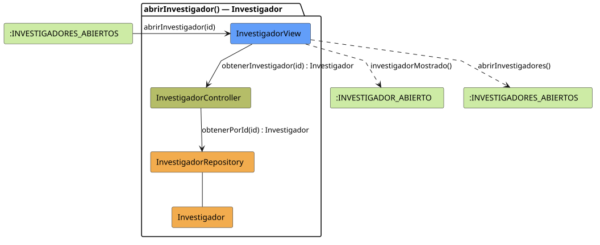

# FUNIBER GIPF > abrirInvestigador > Análisis

## información del artefacto

- **Proyecto**: FUNIBER GIPF - Plataforma Interna de Investigación
- **Fase**: Análisis
- **Disciplina**: Análisis y Diseño
- **Versión**: 1.0
- **Fecha**: 2026-06-05
- **Autor**: Diego Martínez

## propósito

Análisis de colaboración del caso de uso `abrirInvestigador()` mediante el patrón MVC, identificando las clases de análisis, sus responsabilidades y colaboraciones necesarias para que el investigador consulte el perfil de otro investigador.

## diagrama de colaboración

||
|-|
|Código fuente: [abrirInvestigador.puml](../../../modelosUML/analisis/investigador/abrirInvestigador.puml)|

## clases de análisis identificadas

### clases de vista (boundary)

#### InvestigadorView
**Estereotipo**: Vista (Boundary)  
**Responsabilidades**:
- Recibir la solicitud `abrirInvestigador(id)` desde `:INVESTIGADORES_ABIERTOS`
- Solicitar al controlador los datos del investigador mediante `obtenerInvestigador(id) : Investigador`
- Mostrar el perfil del investigador al investigador en modo consulta
- Navegar de vuelta al listado de investigadores

**Colaboraciones**:
- **Entrada**: Desde `:INVESTIGADORES_ABIERTOS` con `abrirInvestigador(id)`
- **Control**: Se comunica con `InvestigadorController` mediante `obtenerInvestigador(id) : Investigador`
- **Salida**: Transita a `:INVESTIGADOR_ABIERTO` (`investigadorMostrado()`) y a `:INVESTIGADORES_ABIERTOS` (`abrirInvestigadores()`)

### clases de control

#### InvestigadorController
**Estereotipo**: Control  
**Responsabilidades**:
- Recibir `obtenerInvestigador(id)` y delegar en el repositorio la obtención del investigador

**Colaboraciones**:
- **Vista**: Responde a solicitudes de `InvestigadorView`
- **Repositorio**: Delega en `InvestigadorRepository` mediante `obtenerPorId(id) : Investigador`

### clases de entidad (entity)

#### InvestigadorRepository
**Estereotipo**: Entidad  
**Responsabilidades**:
- Recuperar un investigador por id mediante `obtenerPorId(id) : Investigador`

**Colaboraciones**:
- **Control**: Responde a `InvestigadorController`
- **Entidad**: Gestiona instancias de `Investigador`

#### Investigador
**Estereotipo**: Entidad  
**Responsabilidades**:
- Representar los datos del perfil del investigador a mostrar

**Colaboraciones**:
- **Repositorio**: Es gestionado por `InvestigadorRepository`

## flujo de colaboración

### secuencia de operaciones

1. El sistema está en `:INVESTIGADORES_ABIERTOS`
2. El investigador selecciona un investigador: `InvestigadorView` recibe `abrirInvestigador(id)`
3. `InvestigadorView` invoca `obtenerInvestigador(id)` en `InvestigadorController`
4. `InvestigadorController` delega en `InvestigadorRepository.obtenerPorId(id)` y obtiene un objeto `Investigador`
5. La vista muestra el perfil → transita a `:INVESTIGADOR_ABIERTO` con `investigadorMostrado()`
6. Desde `:INVESTIGADOR_ABIERTO` el investigador puede navegar con `abrirInvestigadores()`

## correspondencia con requisitos

|Requisito del caso de uso|Clase responsable|Método/Colaboración|
|-|-|-|
|Obtener datos del investigador|`InvestigadorController`|`obtenerInvestigador(id) : Investigador`|
|Acceder al investigador por id|`InvestigadorRepository`|`obtenerPorId(id) : Investigador`|
|Mostrar perfil del investigador|`InvestigadorView`|`investigadorMostrado()`|
|Volver al directorio|`InvestigadorView`|`abrirInvestigadores()`|

## características del análisis

### separación de responsabilidades MVC

- **Vista**: Solo presentación e interacción con el investigador
- **Control**: Solo coordinación y obtención del perfil
- **Entidad**: Solo datos y reglas de negocio del investigador

### agnóstico tecnológicamente

- No especifica tecnología de interfaz de usuario
- No asume implementación específica de base de datos
- Mantiene independencia de frameworks

### trazabilidad completa

- **Origen**: Caso de uso detallado `abrirInvestigador()`
- **Destino**: Base para diseño arquitectónico
- **Conexión**: Diagrama de estados → Análisis de colaboración

## patrones aplicados

### repository pattern
`InvestigadorRepository` abstrae el acceso a datos, permitiendo diferentes implementaciones sin afectar al controlador.

### mvc pattern
Separación clara entre presentación (`InvestigadorView`), lógica de aplicación (`InvestigadorController`) y datos (`Investigador`, `InvestigadorRepository`).

## referencias

- [Especificación detallada: abrirInvestigador()](../../../context/casosDeUso/detalle/investigador/abrirInvestigador/abrirInvestigador.md)
- [Modelo del dominio](../../../context/modeloDelDominio/modeloDominio.md)
