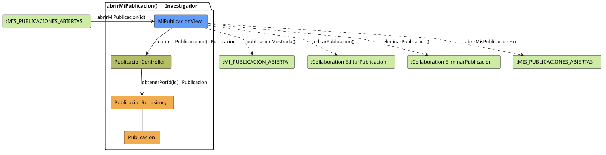

# FUNIBER GIPF > abrirMiPublicacion > Análisis

## información del artefacto

- **Proyecto**: FUNIBER GIPF - Plataforma Interna de Investigación
- **Fase**: Análisis
- **Disciplina**: Análisis y Diseño
- **Versión**: 1.0
- **Fecha**: 2026-06-05
- **Autor**: Diego Martínez

## propósito

Análisis de colaboración del caso de uso `abrirMiPublicacion()` mediante el patrón MVC, identificando las clases de análisis, sus responsabilidades y colaboraciones necesarias para que el investigador consulte el detalle de una publicación propia y acceda a las opciones de gestión.

## diagrama de colaboración

||
|-|
|Código fuente: [abrirMiPublicacion.puml](../../../modelosUML/analisis/investigador/abrirMiPublicacion.puml)|

## clases de análisis identificadas

### clases de vista (boundary)

#### MiPublicacionView
**Estereotipo**: Vista (Boundary)  
**Responsabilidades**:
- Recibir la solicitud `abrirMiPublicacion(id)` desde `:MIS_PUBLICACIONES_ABIERTAS`
- Solicitar al controlador los datos de la publicación mediante `obtenerPublicacion(id) : Publicacion`
- Mostrar el detalle de la publicación propia al investigador
- Ofrecer acceso a las colaboraciones de edición y eliminación
- Navegar de vuelta al listado de mis publicaciones

**Colaboraciones**:
- **Entrada**: Desde `:MIS_PUBLICACIONES_ABIERTAS` con `abrirMiPublicacion(id)`
- **Control**: Se comunica con `PublicacionController` mediante `obtenerPublicacion(id) : Publicacion`
- **Salida**: Transita a `:MI_PUBLICACION_ABIERTA` (`publicacionMostrada()`), `:Collaboration EditarPublicacion` (`editarPublicacion()`), `:Collaboration EliminarPublicacion` (`eliminarPublicacion()`), `:MIS_PUBLICACIONES_ABIERTAS` (`abrirMisPublicaciones()`)

### clases de control

#### PublicacionController
**Estereotipo**: Control  
**Responsabilidades**:
- Recibir `obtenerPublicacion(id)` y delegar en el repositorio la obtención de la publicación

**Colaboraciones**:
- **Vista**: Responde a solicitudes de `MiPublicacionView`
- **Repositorio**: Delega en `PublicacionRepository` mediante `obtenerPorId(id) : Publicacion`

### clases de entidad (entity)

#### PublicacionRepository
**Estereotipo**: Entidad  
**Responsabilidades**:
- Recuperar una publicación por id mediante `obtenerPorId(id) : Publicacion`

**Colaboraciones**:
- **Control**: Responde a `PublicacionController`
- **Entidad**: Gestiona instancias de `Publicacion`

#### Publicacion
**Estereotipo**: Entidad  
**Responsabilidades**:
- Representar los datos completos de la publicación propia a mostrar

**Colaboraciones**:
- **Repositorio**: Es gestionado por `PublicacionRepository`

## flujo de colaboración

### secuencia de operaciones

1. El sistema está en `:MIS_PUBLICACIONES_ABIERTAS`
2. El investigador selecciona una publicación propia: `MiPublicacionView` recibe `abrirMiPublicacion(id)`
3. `MiPublicacionView` invoca `obtenerPublicacion(id)` en `PublicacionController`
4. `PublicacionController` delega en `PublicacionRepository.obtenerPorId(id)` y obtiene un objeto `Publicacion`
5. La vista muestra el detalle → transita a `:MI_PUBLICACION_ABIERTA` con `publicacionMostrada()`
6. Desde `:MI_PUBLICACION_ABIERTA` el investigador puede navegar a `editarPublicacion()`, `eliminarPublicacion()` o `abrirMisPublicaciones()`

## correspondencia con requisitos

|Requisito del caso de uso|Clase responsable|Método/Colaboración|
|-|-|-|
|Obtener datos de la publicación|`PublicacionController`|`obtenerPublicacion(id) : Publicacion`|
|Acceder a la publicación por id|`PublicacionRepository`|`obtenerPorId(id) : Publicacion`|
|Mostrar detalle de la publicación|`MiPublicacionView`|`publicacionMostrada()`|
|Editar publicación|`MiPublicacionView`|`editarPublicacion()`|
|Eliminar publicación|`MiPublicacionView`|`eliminarPublicacion()`|
|Volver al listado|`MiPublicacionView`|`abrirMisPublicaciones()`|

## características del análisis

### separación de responsabilidades MVC

- **Vista**: Solo presentación e interacción con el investigador
- **Control**: Solo coordinación y obtención de la publicación
- **Entidad**: Solo datos y reglas de negocio de la publicación

### agnóstico tecnológicamente

- No especifica tecnología de interfaz de usuario
- No asume implementación específica de base de datos
- Mantiene independencia de frameworks

### trazabilidad completa

- **Origen**: Caso de uso detallado `abrirMiPublicacion()`
- **Destino**: Base para diseño arquitectónico
- **Conexión**: Diagrama de estados → Análisis de colaboración

## patrones aplicados

### repository pattern
`PublicacionRepository` abstrae el acceso a datos, permitiendo diferentes implementaciones sin afectar al controlador.

### mvc pattern
Separación clara entre presentación (`MiPublicacionView`), lógica de aplicación (`PublicacionController`) y datos (`Publicacion`, `PublicacionRepository`).

## referencias

- [Especificación detallada: abrirMiPublicacion()](../../../context/casosDeUso/detalle/investigador/abrirMiPublicacion/abrirMiPublicacion.md)
- [Modelo del dominio](../../../context/modeloDelDominio/modeloDominio.md)
