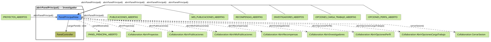

# FUNIBER GIPF > abrirPanelPrincipal > Análisis

## información del artefacto

- **Proyecto**: FUNIBER GIPF - Plataforma Interna de Investigación
- **Fase**: Análisis
- **Disciplina**: Análisis y Diseño
- **Versión**: 1.0
- **Fecha**: 2026-06-05
- **Autor**: Diego Martínez

## propósito

Análisis de colaboración del caso de uso `abrirPanelPrincipal()` mediante el patrón MVC, identificando las clases de análisis, sus responsabilidades y colaboraciones necesarias para presentar el panel principal del investigador y ofrecer acceso a sus funcionalidades.

## diagrama de colaboración

||
|-|
|Código fuente: [abrirPanelPrincipal.puml](../../../modelosUML/analisis/investigador/abrirPanelPrincipal.puml)|

## clases de análisis identificadas

### clases de vista (boundary)

#### PanelPrincipalView
**Estereotipo**: Vista (Boundary)  
**Responsabilidades**:
- Recibir la solicitud `abrirPanelPrincipal()` desde múltiples estados del sistema
- Solicitar al controlador la carga del panel mediante `cargarPanel() : void`
- Mostrar el panel principal con todas las opciones de navegación disponibles para el investigador
- Ofrecer acceso a proyectos, publicaciones, mis publicaciones, recompensas, investigadores, perfil, carga de trabajo y cierre de sesión

**Colaboraciones**:
- **Entrada**: Desde `:PROYECTOS_ABIERTOS`, `:PUBLICACIONES_ABIERTAS`, `:MIS_PUBLICACIONES_ABIERTAS`, `:RECOMPENSAS_ABIERTAS`, `:INVESTIGADORES_ABIERTOS`, `:OPCIONES_CARGA_TRABAJO_ABIERTAS`, `:OPCIONES_PERFIL_ABIERTO`
- **Control**: Se comunica con `PanelController` mediante `cargarPanel() : void`
- **Salida**: Transita a `:PANEL_PRINCIPAL_ABIERTO` (`panelMostrado()`); ofrece colaboraciones `abrirProyectos()`, `abrirPublicaciones()`, `abrirMisPublicaciones()`, `abrirRecompensas()`, `abrirInvestigadores()`, `abrirOpcionesPerfil()`, `abrirOpcionesCargaTrabajo()`, `cerrarSesion()`

### clases de control

#### PanelController
**Estereotipo**: Control  
**Responsabilidades**:
- Recibir `cargarPanel()` y preparar el estado del panel principal

**Colaboraciones**:
- **Vista**: Responde a solicitudes de `PanelPrincipalView`

## flujo de colaboración

### secuencia de operaciones

1. El sistema recibe `abrirPanelPrincipal()` desde cualquiera de los 7 estados de entrada
2. `PanelPrincipalView` invoca `cargarPanel() : void` en `PanelController`
3. La vista muestra el panel → transita a `:PANEL_PRINCIPAL_ABIERTO` con `panelMostrado()`
4. Desde `:PANEL_PRINCIPAL_ABIERTO` el investigador puede navegar a cualquiera de las 8 colaboraciones disponibles

## correspondencia con requisitos

|Requisito del caso de uso|Clase responsable|Método/Colaboración|
|-|-|-|
|Cargar el panel principal|`PanelController`|`cargarPanel() : void`|
|Mostrar panel principal|`PanelPrincipalView`|`panelMostrado()`|
|Acceder a proyectos|`PanelPrincipalView`|`abrirProyectos()`|
|Acceder a publicaciones|`PanelPrincipalView`|`abrirPublicaciones()`|
|Acceder a mis publicaciones|`PanelPrincipalView`|`abrirMisPublicaciones()`|
|Acceder a recompensas|`PanelPrincipalView`|`abrirRecompensas()`|
|Acceder a investigadores|`PanelPrincipalView`|`abrirInvestigadores()`|
|Acceder a opciones de perfil|`PanelPrincipalView`|`abrirOpcionesPerfil()`|
|Acceder a carga de trabajo|`PanelPrincipalView`|`abrirOpcionesCargaTrabajo()`|
|Cerrar sesión|`PanelPrincipalView`|`cerrarSesion()`|

## características del análisis

### separación de responsabilidades MVC

- **Vista**: Solo presentación del panel e interacción con el investigador
- **Control**: Solo coordinación de la carga del panel

### agnóstico tecnológicamente

- No especifica tecnología de interfaz de usuario
- Mantiene independencia de frameworks

### trazabilidad completa

- **Origen**: Caso de uso detallado `abrirPanelPrincipal()`
- **Destino**: Base para diseño arquitectónico
- **Conexión**: Diagrama de estados → Análisis de colaboración

## patrones aplicados

### mvc pattern
Separación clara entre presentación (`PanelPrincipalView`) y lógica de aplicación (`PanelController`). El panel actúa como hub de navegación hacia el resto del sistema. El investigador no tiene acceso a convocatorias.

## referencias

- [Especificación detallada: abrirPanelPrincipal()](../../../context/casosDeUso/detalle/investigador/abrirPanelPrincipal/abrirPanelPrincipal.md)
- [Modelo del dominio](../../../context/modeloDelDominio/modeloDominio.md)
