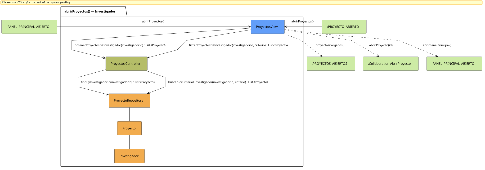

# FUNIBER GIPF > abrirProyectos > Análisis

## información del artefacto

- **Proyecto**: FUNIBER GIPF - Plataforma Interna de Investigación
- **Fase**: Análisis
- **Disciplina**: Análisis y Diseño
- **Versión**: 1.0
- **Fecha**: 2026-06-05
- **Autor**: Diego Martínez

## propósito

Análisis de colaboración del caso de uso `abrirProyectos()` mediante el patrón MVC, identificando las clases de análisis, sus responsabilidades y colaboraciones necesarias para que el investigador consulte únicamente los proyectos en los que participa.

## diagrama de colaboración

||
|-|
|Código fuente: [abrirProyectos.puml](../../../modelosUML/analisis/investigador/abrirProyectos.puml)|

## clases de análisis identificadas

### clases de vista (boundary)

#### ProyectosView
**Estereotipo**: Vista (Boundary)  
**Responsabilidades**:
- Recibir la solicitud `abrirProyectos()` desde `:PANEL_PRINCIPAL_ABIERTO` o `:PROYECTO_ABIERTO`
- Solicitar al controlador los proyectos del investigador mediante `obtenerProyectosDeInvestigador(investigadorId) : List<Proyecto>`
- Permitir filtrar los proyectos mediante `filtrarProyectosDeInvestigador(investigadorId, criterio) : List<Proyecto>`
- Mostrar únicamente los proyectos en los que participa el investigador
- Ofrecer acceso a un proyecto concreto y vuelta al panel principal

**Colaboraciones**:
- **Entrada**: Desde `:PANEL_PRINCIPAL_ABIERTO` o `:PROYECTO_ABIERTO` con `abrirProyectos()`
- **Control**: Se comunica con `ProyectosController` mediante `obtenerProyectosDeInvestigador(investigadorId)` y `filtrarProyectosDeInvestigador(investigadorId, criterio)`
- **Salida**: Transita a `:PROYECTOS_ABIERTOS` (`proyectosCargados()`), `:Collaboration AbrirProyecto` (`abrirProyecto(id)`), `:PANEL_PRINCIPAL_ABIERTO` (`abrirPanelPrincipal()`)

### clases de control

#### ProyectosController
**Estereotipo**: Control  
**Responsabilidades**:
- Recibir `obtenerProyectosDeInvestigador(investigadorId)` y delegar en el repositorio la obtención filtrada
- Recibir `filtrarProyectosDeInvestigador(investigadorId, criterio)` y delegar la búsqueda al repositorio

**Colaboraciones**:
- **Vista**: Responde a solicitudes de `ProyectosView`
- **Repositorio**: Delega en `ProyectoRepository` mediante `findByInvestigadorId(investigadorId) : List<Proyecto>` y `buscarPorCriterioEInvestigador(investigadorId, criterio) : List<Proyecto>`

### clases de entidad (entity)

#### ProyectoRepository
**Estereotipo**: Entidad  
**Responsabilidades**:
- Recuperar proyectos de un investigador mediante `findByInvestigadorId(investigadorId) : List<Proyecto>`
- Buscar proyectos con criterio filtrado por investigador mediante `buscarPorCriterioEInvestigador(investigadorId, criterio) : List<Proyecto>`

**Colaboraciones**:
- **Control**: Responde a `ProyectosController`
- **Entidad**: Gestiona instancias de `Proyecto` e `Investigador`

#### Proyecto
**Estereotipo**: Entidad  
**Responsabilidades**:
- Representar los datos de un proyecto del investigador en el listado

**Colaboraciones**:
- **Repositorio**: Es gestionado por `ProyectoRepository`

#### Investigador
**Estereotipo**: Entidad  
**Responsabilidades**:
- Identificar al investigador autenticado para filtrar sus proyectos

**Colaboraciones**:
- **Repositorio**: Relacionado con `Proyecto` a través de `ProyectoRepository`

## flujo de colaboración

### secuencia de operaciones

1. El sistema está en `:PANEL_PRINCIPAL_ABIERTO` o `:PROYECTO_ABIERTO`
2. El investigador solicita ver sus proyectos: `ProyectosView` recibe `abrirProyectos()`
3. `ProyectosView` invoca `obtenerProyectosDeInvestigador(investigadorId)` en `ProyectosController`
4. `ProyectosController` delega en `ProyectoRepository.findByInvestigadorId(investigadorId)` y obtiene `List<Proyecto>`
5. La vista muestra la lista → transita a `:PROYECTOS_ABIERTOS` con `proyectosCargados()`
6. El investigador puede filtrar: `ProyectosView` invoca `filtrarProyectosDeInvestigador(investigadorId, criterio)` → delega en `ProyectoRepository.buscarPorCriterioEInvestigador(investigadorId, criterio)`
7. Desde `:PROYECTOS_ABIERTOS` puede navegar a `abrirProyecto(id)` o `abrirPanelPrincipal()`

## correspondencia con requisitos

|Requisito del caso de uso|Clase responsable|Método/Colaboración|
|-|-|-|
|Obtener proyectos del investigador|`ProyectosController`|`obtenerProyectosDeInvestigador(investigadorId) : List<Proyecto>`|
|Acceder a proyectos por investigador|`ProyectoRepository`|`findByInvestigadorId(investigadorId) : List<Proyecto>`|
|Filtrar proyectos|`ProyectosController`|`filtrarProyectosDeInvestigador(investigadorId, criterio) : List<Proyecto>`|
|Buscar proyectos con criterio|`ProyectoRepository`|`buscarPorCriterioEInvestigador(investigadorId, criterio) : List<Proyecto>`|
|Mostrar lista de proyectos|`ProyectosView`|`proyectosCargados()`|
|Abrir proyecto concreto|`ProyectosView`|`abrirProyecto(id)`|
|Volver al panel principal|`ProyectosView`|`abrirPanelPrincipal()`|

## características del análisis

### separación de responsabilidades MVC

- **Vista**: Solo presentación e interacción con el investigador
- **Control**: Solo coordinación y lógica de filtrado por investigador
- **Entidad**: Solo datos y reglas de negocio del proyecto

### agnóstico tecnológicamente

- No especifica tecnología de interfaz de usuario
- No asume implementación específica de base de datos
- Mantiene independencia de frameworks

### trazabilidad completa

- **Origen**: Caso de uso detallado `abrirProyectos()`
- **Destino**: Base para diseño arquitectónico
- **Conexión**: Diagrama de estados → Análisis de colaboración

## patrones aplicados

### repository pattern
`ProyectoRepository` abstrae el acceso a datos, permitiendo diferentes implementaciones sin afectar al controlador.

### mvc pattern
Separación clara entre presentación (`ProyectosView`), lógica de aplicación (`ProyectosController`) y datos (`Proyecto`, `ProyectoRepository`).

## referencias

- [Especificación detallada: abrirProyectos()](../../../context/casosDeUso/detalle/investigador/abrirProyectos/abrirProyectos.md)
- [Modelo del dominio](../../../context/modeloDelDominio/modeloDominio.md)
