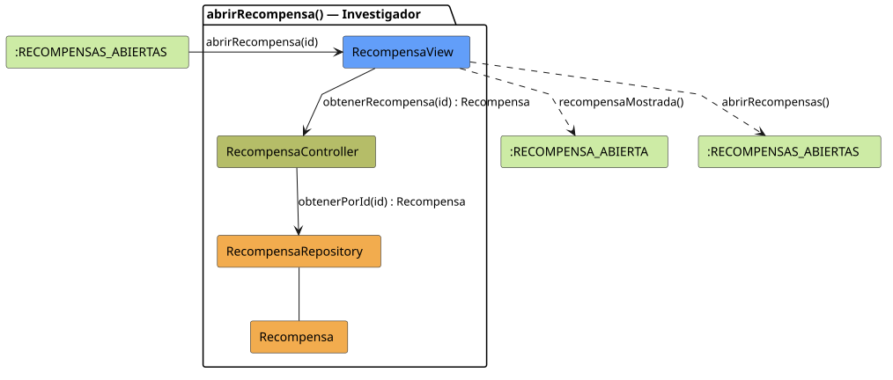

# FUNIBER GIPF > abrirRecompensa > Análisis

## información del artefacto

- **Proyecto**: FUNIBER GIPF - Plataforma Interna de Investigación
- **Fase**: Análisis
- **Disciplina**: Análisis y Diseño
- **Versión**: 1.0
- **Fecha**: 2026-06-05
- **Autor**: Diego Martínez

## propósito

Análisis de colaboración del caso de uso `abrirRecompensa()` mediante el patrón MVC, identificando las clases de análisis, sus responsabilidades y colaboraciones necesarias para que el investigador consulte el detalle de una recompensa.

## diagrama de colaboración

||
|-|
|Código fuente: [abrirRecompensa.puml](../../../modelosUML/analisis/investigador/abrirRecompensa.puml)|

## clases de análisis identificadas

### clases de vista (boundary)

#### RecompensaView
**Estereotipo**: Vista (Boundary)  
**Responsabilidades**:
- Recibir la solicitud `abrirRecompensa(id)` desde `:RECOMPENSAS_ABIERTAS`
- Solicitar al controlador los datos de la recompensa mediante `obtenerRecompensa(id) : Recompensa`
- Mostrar el detalle de la recompensa al investigador
- Ofrecer vuelta al listado de recompensas

**Colaboraciones**:
- **Entrada**: Desde `:RECOMPENSAS_ABIERTAS` con `abrirRecompensa(id)`
- **Control**: Se comunica con `RecompensaController` mediante `obtenerRecompensa(id) : Recompensa`
- **Salida**: Transita a `:RECOMPENSA_ABIERTA` (`recompensaMostrada()`), `:RECOMPENSAS_ABIERTAS` (`abrirRecompensas()`)

### clases de control

#### RecompensaController
**Estereotipo**: Control  
**Responsabilidades**:
- Recibir `obtenerRecompensa(id)` y delegar en el repositorio la obtención de la recompensa

**Colaboraciones**:
- **Vista**: Responde a solicitudes de `RecompensaView`
- **Repositorio**: Delega en `RecompensaRepository` mediante `obtenerPorId(id) : Recompensa`

### clases de entidad (entity)

#### RecompensaRepository
**Estereotipo**: Entidad  
**Responsabilidades**:
- Recuperar una recompensa por id mediante `obtenerPorId(id) : Recompensa`

**Colaboraciones**:
- **Control**: Responde a `RecompensaController`
- **Entidad**: Gestiona instancias de `Recompensa`

#### Recompensa
**Estereotipo**: Entidad  
**Responsabilidades**:
- Representar los datos completos de la recompensa a mostrar

**Colaboraciones**:
- **Repositorio**: Es gestionado por `RecompensaRepository`

## flujo de colaboración

### secuencia de operaciones

1. El sistema está en `:RECOMPENSAS_ABIERTAS`
2. El investigador selecciona una recompensa: `RecompensaView` recibe `abrirRecompensa(id)`
3. `RecompensaView` invoca `obtenerRecompensa(id)` en `RecompensaController`
4. `RecompensaController` delega en `RecompensaRepository.obtenerPorId(id)` y obtiene un objeto `Recompensa`
5. La vista muestra el detalle → transita a `:RECOMPENSA_ABIERTA` con `recompensaMostrada()`
6. Desde `:RECOMPENSA_ABIERTA` el investigador puede volver con `abrirRecompensas()`

## correspondencia con requisitos

|Requisito del caso de uso|Clase responsable|Método/Colaboración|
|-|-|-|
|Obtener datos de la recompensa|`RecompensaController`|`obtenerRecompensa(id) : Recompensa`|
|Acceder a la recompensa por id|`RecompensaRepository`|`obtenerPorId(id) : Recompensa`|
|Mostrar detalle de la recompensa|`RecompensaView`|`recompensaMostrada()`|
|Volver al listado de recompensas|`RecompensaView`|`abrirRecompensas()`|

## características del análisis

### separación de responsabilidades MVC

- **Vista**: Solo presentación e interacción con el investigador
- **Control**: Solo coordinación y obtención de la recompensa
- **Entidad**: Solo datos y reglas de negocio de la recompensa

### agnóstico tecnológicamente

- No especifica tecnología de interfaz de usuario
- No asume implementación específica de base de datos
- Mantiene independencia de frameworks

### trazabilidad completa

- **Origen**: Caso de uso detallado `abrirRecompensa()`
- **Destino**: Base para diseño arquitectónico
- **Conexión**: Diagrama de estados → Análisis de colaboración

## patrones aplicados

### repository pattern
`RecompensaRepository` abstrae el acceso a datos, permitiendo diferentes implementaciones sin afectar al controlador.

### mvc pattern
Separación clara entre presentación (`RecompensaView`), lógica de aplicación (`RecompensaController`) y datos (`Recompensa`, `RecompensaRepository`).

## referencias

- [Especificación detallada: abrirRecompensa()](../../../context/casosDeUso/detalle/investigador/abrirRecompensa/abrirRecompensa.md)
- [Modelo del dominio](../../../context/modeloDelDominio/modeloDominio.md)
