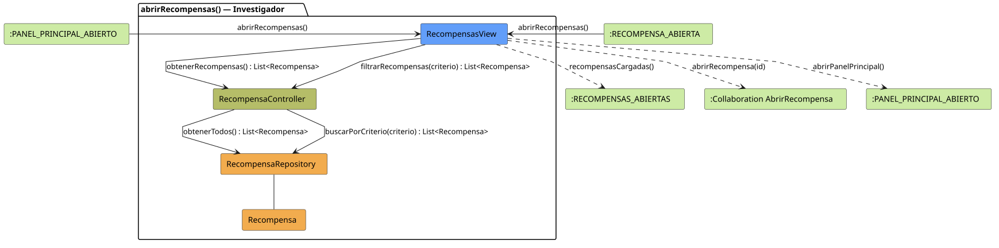

# FUNIBER GIPF > abrirRecompensas > Análisis

## información del artefacto

- **Proyecto**: FUNIBER GIPF - Plataforma Interna de Investigación
- **Fase**: Análisis
- **Disciplina**: Análisis y Diseño
- **Versión**: 1.0
- **Fecha**: 2026-06-05
- **Autor**: Diego Martínez

## propósito

Análisis de colaboración del caso de uso `abrirRecompensas()` mediante el patrón MVC, identificando las clases de análisis, sus responsabilidades y colaboraciones necesarias para que el investigador consulte el catálogo de recompensas disponibles.

## diagrama de colaboración

||
|-|
|Código fuente: [abrirRecompensas.puml](../../../modelosUML/analisis/investigador/abrirRecompensas.puml)|

## clases de análisis identificadas

### clases de vista (boundary)

#### RecompensasView
**Estereotipo**: Vista (Boundary)  
**Responsabilidades**:
- Recibir la solicitud `abrirRecompensas()` desde `:PANEL_PRINCIPAL_ABIERTO` o `:RECOMPENSA_ABIERTA`
- Solicitar al controlador el catálogo de recompensas mediante `obtenerRecompensas() : List<Recompensa>`
- Permitir filtrar recompensas mediante `filtrarRecompensas(criterio) : List<Recompensa>`
- Mostrar la lista de recompensas disponibles al investigador
- Ofrecer acceso al detalle de una recompensa concreta y vuelta al panel principal

**Colaboraciones**:
- **Entrada**: Desde `:PANEL_PRINCIPAL_ABIERTO` o `:RECOMPENSA_ABIERTA` con `abrirRecompensas()`
- **Control**: Se comunica con `RecompensaController` mediante `obtenerRecompensas()` y `filtrarRecompensas(criterio)`
- **Salida**: Transita a `:RECOMPENSAS_ABIERTAS` (`recompensasCargadas()`), `:Collaboration AbrirRecompensa` (`abrirRecompensa(id)`), `:PANEL_PRINCIPAL_ABIERTO` (`abrirPanelPrincipal()`)

### clases de control

#### RecompensaController
**Estereotipo**: Control  
**Responsabilidades**:
- Recibir `obtenerRecompensas()` y delegar en el repositorio la obtención del catálogo completo
- Recibir `filtrarRecompensas(criterio)` y delegar la búsqueda filtrada al repositorio

**Colaboraciones**:
- **Vista**: Responde a solicitudes de `RecompensasView`
- **Repositorio**: Delega en `RecompensaRepository` mediante `obtenerTodos() : List<Recompensa>` y `buscarPorCriterio(criterio) : List<Recompensa>`

### clases de entidad (entity)

#### RecompensaRepository
**Estereotipo**: Entidad  
**Responsabilidades**:
- Recuperar todas las recompensas mediante `obtenerTodos() : List<Recompensa>`
- Buscar recompensas por criterio mediante `buscarPorCriterio(criterio) : List<Recompensa>`

**Colaboraciones**:
- **Control**: Responde a `RecompensaController`
- **Entidad**: Gestiona instancias de `Recompensa`

#### Recompensa
**Estereotipo**: Entidad  
**Responsabilidades**:
- Representar los datos de una recompensa en el catálogo

**Colaboraciones**:
- **Repositorio**: Es gestionado por `RecompensaRepository`

## flujo de colaboración

### secuencia de operaciones

1. El sistema está en `:PANEL_PRINCIPAL_ABIERTO` o `:RECOMPENSA_ABIERTA`
2. El investigador solicita ver el catálogo: `RecompensasView` recibe `abrirRecompensas()`
3. `RecompensasView` invoca `obtenerRecompensas()` en `RecompensaController`
4. `RecompensaController` delega en `RecompensaRepository.obtenerTodos()` y obtiene `List<Recompensa>`
5. La vista muestra el catálogo → transita a `:RECOMPENSAS_ABIERTAS` con `recompensasCargadas()`
6. El investigador puede filtrar: `RecompensasView` invoca `filtrarRecompensas(criterio)` → delega en `RecompensaRepository.buscarPorCriterio(criterio)`
7. Desde `:RECOMPENSAS_ABIERTAS` puede navegar a `abrirRecompensa(id)` o `abrirPanelPrincipal()`

## correspondencia con requisitos

|Requisito del caso de uso|Clase responsable|Método/Colaboración|
|-|-|-|
|Obtener catálogo de recompensas|`RecompensaController`|`obtenerRecompensas() : List<Recompensa>`|
|Acceder a recompensas en repositorio|`RecompensaRepository`|`obtenerTodos() : List<Recompensa>`|
|Filtrar recompensas|`RecompensaController`|`filtrarRecompensas(criterio) : List<Recompensa>`|
|Buscar recompensas con criterio|`RecompensaRepository`|`buscarPorCriterio(criterio) : List<Recompensa>`|
|Mostrar catálogo de recompensas|`RecompensasView`|`recompensasCargadas()`|
|Abrir recompensa concreta|`RecompensasView`|`abrirRecompensa(id)`|
|Volver al panel principal|`RecompensasView`|`abrirPanelPrincipal()`|

## características del análisis

### separación de responsabilidades MVC

- **Vista**: Solo presentación e interacción con el investigador
- **Control**: Solo coordinación y lógica de filtrado
- **Entidad**: Solo datos y reglas de negocio de la recompensa

### agnóstico tecnológicamente

- No especifica tecnología de interfaz de usuario
- No asume implementación específica de base de datos
- Mantiene independencia de frameworks

### trazabilidad completa

- **Origen**: Caso de uso detallado `abrirRecompensas()`
- **Destino**: Base para diseño arquitectónico
- **Conexión**: Diagrama de estados → Análisis de colaboración

## patrones aplicados

### repository pattern
`RecompensaRepository` abstrae el acceso a datos, permitiendo diferentes implementaciones sin afectar al controlador.

### mvc pattern
Separación clara entre presentación (`RecompensasView`), lógica de aplicación (`RecompensaController`) y datos (`Recompensa`, `RecompensaRepository`).

## referencias

- [Especificación detallada: abrirRecompensas()](../../../context/casosDeUso/detalle/investigador/abrirRecompensas/abrirRecompensas.md)
- [Modelo del dominio](../../../context/modeloDelDominio/modeloDominio.md)
