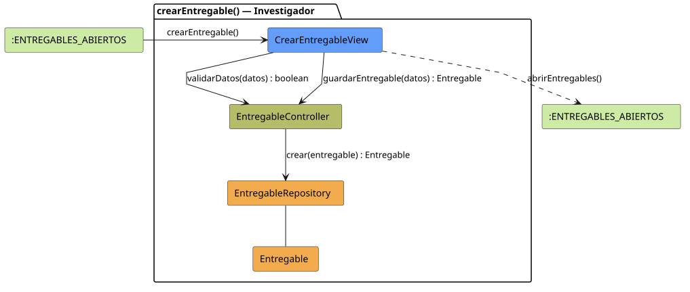

# FUNIBER GIPF > crearEntregable > Análisis

## información del artefacto

- **Proyecto**: FUNIBER GIPF - Plataforma Interna de Investigación
- **Fase**: Análisis
- **Disciplina**: Análisis y Diseño
- **Versión**: 1.0
- **Fecha**: 2026-06-05
- **Autor**: Diego Martínez

## propósito

Análisis de colaboración del caso de uso `crearEntregable()` mediante el patrón MVC, identificando las clases de análisis, sus responsabilidades y colaboraciones necesarias para que el investigador registre un nuevo entregable en un proyecto.

## diagrama de colaboración

||
|-|
|Código fuente: [crearEntregable.puml](../../../modelosUML/analisis/investigador/crearEntregable.puml)|

## clases de análisis identificadas

### clases de vista (boundary)

#### CrearEntregableView
**Estereotipo**: Vista (Boundary)  
**Responsabilidades**:
- Recibir la solicitud `crearEntregable()` desde `:ENTREGABLES_ABIERTOS`
- Solicitar la validación de datos mediante `validarDatos(datos) : boolean`
- Solicitar el guardado del entregable mediante `guardarEntregable(datos) : Entregable`
- Mostrar el formulario de creación al investigador
- Transitar a `:ENTREGABLES_ABIERTOS` al finalizar

**Colaboraciones**:
- **Entrada**: Desde `:ENTREGABLES_ABIERTOS` con `crearEntregable()`
- **Control**: Se comunica con `EntregableController` mediante `validarDatos(datos) : boolean` y `guardarEntregable(datos) : Entregable`
- **Salida**: Transita a `:ENTREGABLES_ABIERTOS` con `abrirEntregables()`

### clases de control

#### EntregableController
**Estereotipo**: Control  
**Responsabilidades**:
- Recibir `validarDatos(datos)` y verificar la corrección de los datos del formulario
- Recibir `guardarEntregable(datos)` y delegar la persistencia en el repositorio

**Colaboraciones**:
- **Vista**: Responde a solicitudes de `CrearEntregableView`
- **Repositorio**: Delega en `EntregableRepository` mediante `crear(entregable) : Entregable`

### clases de entidad (entity)

#### EntregableRepository
**Estereotipo**: Entidad  
**Responsabilidades**:
- Persistir un nuevo entregable mediante `crear(entregable) : Entregable`

**Colaboraciones**:
- **Control**: Responde a `EntregableController`
- **Entidad**: Gestiona instancias de `Entregable`

#### Entregable
**Estereotipo**: Entidad  
**Responsabilidades**:
- Representar los datos del nuevo entregable a persistir

**Colaboraciones**:
- **Repositorio**: Es gestionado por `EntregableRepository`

## flujo de colaboración

### secuencia de operaciones

1. El sistema está en `:ENTREGABLES_ABIERTOS`
2. El investigador solicita crear un entregable: `CrearEntregableView` recibe `crearEntregable()`
3. El investigador rellena el formulario y confirma
4. `CrearEntregableView` invoca `validarDatos(datos) : boolean` en `EntregableController`
5. `CrearEntregableView` invoca `guardarEntregable(datos) : Entregable` en `EntregableController`
6. `EntregableController` delega en `EntregableRepository.crear(entregable)` y obtiene el `Entregable` persistido
7. La vista transita a `:ENTREGABLES_ABIERTOS` con `abrirEntregables()`

## correspondencia con requisitos

|Requisito del caso de uso|Clase responsable|Método/Colaboración|
|-|-|-|
|Validar datos del formulario|`EntregableController`|`validarDatos(datos) : boolean`|
|Guardar el entregable|`EntregableController`|`guardarEntregable(datos) : Entregable`|
|Persistir nuevo entregable|`EntregableRepository`|`crear(entregable) : Entregable`|
|Volver al listado de entregables|`CrearEntregableView`|`abrirEntregables()`|

## características del análisis

### separación de responsabilidades MVC

- **Vista**: Solo presentación del formulario e interacción con el investigador
- **Control**: Solo coordinación de la validación y persistencia
- **Entidad**: Solo datos y reglas de negocio del entregable

### agnóstico tecnológicamente

- No especifica tecnología de interfaz de usuario
- No asume implementación específica de base de datos
- Mantiene independencia de frameworks

### trazabilidad completa

- **Origen**: Caso de uso detallado `crearEntregable()`
- **Destino**: Base para diseño arquitectónico
- **Conexión**: Diagrama de estados → Análisis de colaboración

## patrones aplicados

### repository pattern
`EntregableRepository` abstrae el acceso a datos, permitiendo diferentes implementaciones sin afectar al controlador.

### mvc pattern
Separación clara entre presentación (`CrearEntregableView`), lógica de aplicación (`EntregableController`) y datos (`Entregable`, `EntregableRepository`).

## referencias

- [Especificación detallada: crearEntregable()](../../../context/casosDeUso/detalle/investigador/crearEntregable/crearEntregable.md)
- [Modelo del dominio](../../../context/modeloDelDominio/modeloDominio.md)
