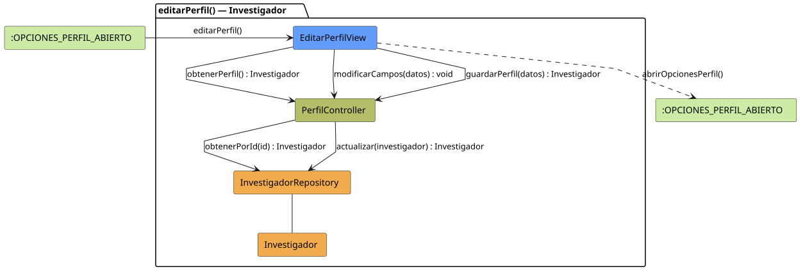

# FUNIBER GIPF > editarPerfil > Análisis

## información del artefacto

- **Proyecto**: FUNIBER GIPF - Plataforma Interna de Investigación
- **Fase**: Análisis
- **Disciplina**: Análisis y Diseño
- **Versión**: 1.0
- **Fecha**: 2026-06-05
- **Autor**: Diego Martínez

## propósito

Análisis de colaboración del caso de uso `editarPerfil()` mediante el patrón MVC, identificando las clases de análisis, sus responsabilidades y colaboraciones necesarias para que el investigador modifique sus datos personales.

## diagrama de colaboración

||
|-|
|Código fuente: [editarPerfil.puml](../../../modelosUML/analisis/investigador/editarPerfil.puml)|

## clases de análisis identificadas

### clases de vista (boundary)

#### EditarPerfilView
**Estereotipo**: Vista (Boundary)  
**Responsabilidades**:
- Recibir la solicitud `editarPerfil()` desde `:OPCIONES_PERFIL_ABIERTO`
- Solicitar los datos actuales del perfil mediante `obtenerPerfil() : Investigador`
- Notificar los campos modificados mediante `modificarCampos(datos) : void`
- Solicitar el guardado mediante `guardarPerfil(datos) : Investigador`
- Mostrar el formulario de edición prellenado al investigador
- Transitar a `:OPCIONES_PERFIL_ABIERTO` al finalizar

**Colaboraciones**:
- **Entrada**: Desde `:OPCIONES_PERFIL_ABIERTO` con `editarPerfil()`
- **Control**: Se comunica con `PerfilController` mediante `obtenerPerfil()`, `modificarCampos(datos)` y `guardarPerfil(datos)`
- **Salida**: Transita a `:OPCIONES_PERFIL_ABIERTO` con `abrirOpcionesPerfil()`

### clases de control

#### PerfilController
**Estereotipo**: Control  
**Responsabilidades**:
- Recibir `obtenerPerfil()` y delegar en el repositorio la obtención del investigador autenticado
- Recibir `modificarCampos(datos)` y gestionar el estado de los campos modificados
- Recibir `guardarPerfil(datos)` y delegar la actualización en el repositorio

**Colaboraciones**:
- **Vista**: Responde a solicitudes de `EditarPerfilView`
- **Repositorio**: Delega en `InvestigadorRepository` mediante `obtenerPorId(id) : Investigador` y `actualizar(investigador) : Investigador`

### clases de entidad (entity)

#### InvestigadorRepository
**Estereotipo**: Entidad  
**Responsabilidades**:
- Recuperar el investigador autenticado por id mediante `obtenerPorId(id) : Investigador`
- Actualizar el perfil del investigador mediante `actualizar(investigador) : Investigador`

**Colaboraciones**:
- **Control**: Responde a `PerfilController`
- **Entidad**: Gestiona instancias de `Investigador`

#### Investigador
**Estereotipo**: Entidad  
**Responsabilidades**:
- Representar los datos editables del perfil del investigador

**Colaboraciones**:
- **Repositorio**: Es gestionado por `InvestigadorRepository`

## flujo de colaboración

### secuencia de operaciones

1. El sistema está en `:OPCIONES_PERFIL_ABIERTO`
2. El investigador solicita editar su perfil: `EditarPerfilView` recibe `editarPerfil()`
3. `EditarPerfilView` invoca `obtenerPerfil() : Investigador` en `PerfilController`
4. `PerfilController` delega en `InvestigadorRepository.obtenerPorId(id)` y obtiene el `Investigador`
5. El investigador modifica los campos del formulario
6. `EditarPerfilView` invoca `modificarCampos(datos) : void` en `PerfilController`
7. `EditarPerfilView` invoca `guardarPerfil(datos) : Investigador` en `PerfilController`
8. `PerfilController` delega en `InvestigadorRepository.actualizar(investigador)` y obtiene el `Investigador` actualizado
9. La vista transita a `:OPCIONES_PERFIL_ABIERTO` con `abrirOpcionesPerfil()`

## correspondencia con requisitos

|Requisito del caso de uso|Clase responsable|Método/Colaboración|
|-|-|-|
|Obtener datos actuales del perfil|`PerfilController`|`obtenerPerfil() : Investigador`|
|Acceder al investigador por id|`InvestigadorRepository`|`obtenerPorId(id) : Investigador`|
|Registrar campos modificados|`PerfilController`|`modificarCampos(datos) : void`|
|Guardar perfil actualizado|`PerfilController`|`guardarPerfil(datos) : Investigador`|
|Persistir la actualización|`InvestigadorRepository`|`actualizar(investigador) : Investigador`|
|Volver a opciones de perfil|`EditarPerfilView`|`abrirOpcionesPerfil()`|

## características del análisis

### separación de responsabilidades MVC

- **Vista**: Solo presentación del formulario e interacción con el investigador
- **Control**: Solo coordinación de la carga, modificación y persistencia del perfil
- **Entidad**: Solo datos y reglas de negocio del investigador

### agnóstico tecnológicamente

- No especifica tecnología de interfaz de usuario
- No asume implementación específica de base de datos
- Mantiene independencia de frameworks

### trazabilidad completa

- **Origen**: Caso de uso detallado `editarPerfil()`
- **Destino**: Base para diseño arquitectónico
- **Conexión**: Diagrama de estados → Análisis de colaboración

## patrones aplicados

### repository pattern
`InvestigadorRepository` abstrae el acceso a datos, permitiendo diferentes implementaciones sin afectar al controlador.

### mvc pattern
Separación clara entre presentación (`EditarPerfilView`), lógica de aplicación (`PerfilController`) y datos (`Investigador`, `InvestigadorRepository`).

## referencias

- [Especificación detallada: editarPerfil()](../../../context/casosDeUso/detalle/investigador/editarPerfil/editarPerfil.md)
- [Modelo del dominio](../../../context/modeloDelDominio/modeloDominio.md)
