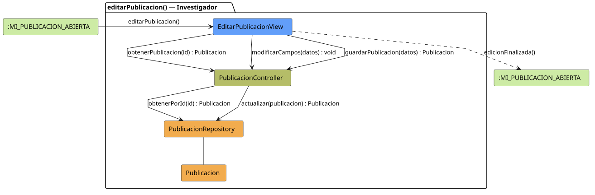

# FUNIBER GIPF > editarPublicacion > Análisis

## información del artefacto

- **Proyecto**: FUNIBER GIPF - Plataforma Interna de Investigación
- **Fase**: Análisis
- **Disciplina**: Análisis y Diseño
- **Versión**: 1.0
- **Fecha**: 2026-06-05
- **Autor**: Diego Martínez

## propósito

Análisis de colaboración del caso de uso `editarPublicacion()` mediante el patrón MVC, identificando las clases de análisis, sus responsabilidades y colaboraciones necesarias para que el investigador modifique el contenido de una publicación propia.

## diagrama de colaboración

||
|-|
|Código fuente: [editarPublicacion.puml](../../../modelosUML/analisis/investigador/editarPublicacion.puml)|

## clases de análisis identificadas

### clases de vista (boundary)

#### EditarPublicacionView
**Estereotipo**: Vista (Boundary)  
**Responsabilidades**:
- Recibir la solicitud `editarPublicacion()` desde `:MI_PUBLICACION_ABIERTA`
- Solicitar los datos actuales de la publicación mediante `obtenerPublicacion(id) : Publicacion`
- Notificar los campos modificados mediante `modificarCampos(datos) : void`
- Solicitar el guardado mediante `guardarPublicacion(datos) : Publicacion`
- Mostrar el formulario de edición prellenado al investigador
- Transitar a `:MI_PUBLICACION_ABIERTA` al finalizar

**Colaboraciones**:
- **Entrada**: Desde `:MI_PUBLICACION_ABIERTA` con `editarPublicacion()`
- **Control**: Se comunica con `PublicacionController` mediante `obtenerPublicacion(id)`, `modificarCampos(datos)` y `guardarPublicacion(datos)`
- **Salida**: Transita a `:MI_PUBLICACION_ABIERTA` con `edicionFinalizada()`

### clases de control

#### PublicacionController
**Estereotipo**: Control  
**Responsabilidades**:
- Recibir `obtenerPublicacion(id)` y delegar en el repositorio la obtención de la publicación
- Recibir `modificarCampos(datos)` y gestionar el estado de los campos modificados
- Recibir `guardarPublicacion(datos)` y delegar la actualización en el repositorio

**Colaboraciones**:
- **Vista**: Responde a solicitudes de `EditarPublicacionView`
- **Repositorio**: Delega en `PublicacionRepository` mediante `obtenerPorId(id) : Publicacion` y `actualizar(publicacion) : Publicacion`

### clases de entidad (entity)

#### PublicacionRepository
**Estereotipo**: Entidad  
**Responsabilidades**:
- Recuperar una publicación por id mediante `obtenerPorId(id) : Publicacion`
- Actualizar la publicación modificada mediante `actualizar(publicacion) : Publicacion`

**Colaboraciones**:
- **Control**: Responde a `PublicacionController`
- **Entidad**: Gestiona instancias de `Publicacion`

#### Publicacion
**Estereotipo**: Entidad  
**Responsabilidades**:
- Representar los datos editables de la publicación propia

**Colaboraciones**:
- **Repositorio**: Es gestionado por `PublicacionRepository`

## flujo de colaboración

### secuencia de operaciones

1. El sistema está en `:MI_PUBLICACION_ABIERTA`
2. El investigador solicita editar: `EditarPublicacionView` recibe `editarPublicacion()`
3. `EditarPublicacionView` invoca `obtenerPublicacion(id) : Publicacion` en `PublicacionController`
4. `PublicacionController` delega en `PublicacionRepository.obtenerPorId(id)` y obtiene la `Publicacion`
5. El investigador modifica los campos del formulario
6. `EditarPublicacionView` invoca `modificarCampos(datos) : void` en `PublicacionController`
7. `EditarPublicacionView` invoca `guardarPublicacion(datos) : Publicacion` en `PublicacionController`
8. `PublicacionController` delega en `PublicacionRepository.actualizar(publicacion)` y obtiene la `Publicacion` actualizada
9. La vista transita a `:MI_PUBLICACION_ABIERTA` con `edicionFinalizada()`

## correspondencia con requisitos

|Requisito del caso de uso|Clase responsable|Método/Colaboración|
|-|-|-|
|Obtener datos actuales de la publicación|`PublicacionController`|`obtenerPublicacion(id) : Publicacion`|
|Acceder a la publicación por id|`PublicacionRepository`|`obtenerPorId(id) : Publicacion`|
|Registrar campos modificados|`PublicacionController`|`modificarCampos(datos) : void`|
|Guardar publicación actualizada|`PublicacionController`|`guardarPublicacion(datos) : Publicacion`|
|Persistir la actualización|`PublicacionRepository`|`actualizar(publicacion) : Publicacion`|
|Confirmar edición|`EditarPublicacionView`|`edicionFinalizada()`|

## características del análisis

### separación de responsabilidades MVC

- **Vista**: Solo presentación del formulario e interacción con el investigador
- **Control**: Solo coordinación de la carga, modificación y persistencia
- **Entidad**: Solo datos y reglas de negocio de la publicación

### agnóstico tecnológicamente

- No especifica tecnología de interfaz de usuario
- No asume implementación específica de base de datos
- Mantiene independencia de frameworks

### trazabilidad completa

- **Origen**: Caso de uso detallado `editarPublicacion()`
- **Destino**: Base para diseño arquitectónico
- **Conexión**: Diagrama de estados → Análisis de colaboración

## patrones aplicados

### repository pattern
`PublicacionRepository` abstrae el acceso a datos, permitiendo diferentes implementaciones sin afectar al controlador.

### mvc pattern
Separación clara entre presentación (`EditarPublicacionView`), lógica de aplicación (`PublicacionController`) y datos (`Publicacion`, `PublicacionRepository`).

## referencias

- [Especificación detallada: editarPublicacion()](../../../context/casosDeUso/detalle/investigador/editarPublicacion/editarPublicacion.md)
- [Modelo del dominio](../../../context/modeloDelDominio/modeloDominio.md)
