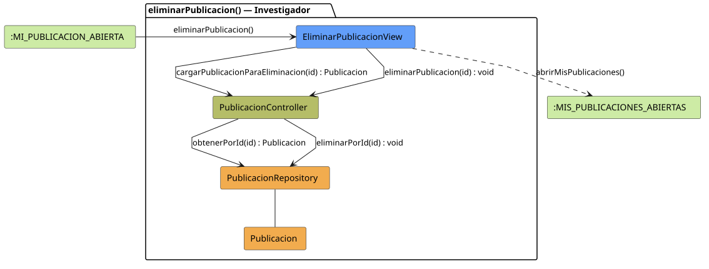

# FUNIBER GIPF > eliminarPublicacion > Análisis

## información del artefacto

- **Proyecto**: FUNIBER GIPF - Plataforma Interna de Investigación
- **Fase**: Análisis
- **Disciplina**: Análisis y Diseño
- **Versión**: 1.0
- **Fecha**: 2026-06-05
- **Autor**: Diego Martínez

## propósito

Análisis de colaboración del caso de uso `eliminarPublicacion()` mediante el patrón MVC, identificando las clases de análisis, sus responsabilidades y colaboraciones necesarias para que el investigador elimine una publicación propia tras confirmar la acción.

## diagrama de colaboración

||
|-|
|Código fuente: [eliminarPublicacion.puml](../../../modelosUML/analisis/investigador/eliminarPublicacion.puml)|

## clases de análisis identificadas

### clases de vista (boundary)

#### EliminarPublicacionView
**Estereotipo**: Vista (Boundary)  
**Responsabilidades**:
- Recibir la solicitud `eliminarPublicacion()` desde `:MI_PUBLICACION_ABIERTA`
- Solicitar los datos de la publicación para la confirmación mediante `cargarPublicacionParaEliminacion(id) : Publicacion`
- Solicitar la eliminación definitiva mediante `eliminarPublicacion(id) : void`
- Mostrar la pantalla de confirmación al investigador
- Transitar a `:MIS_PUBLICACIONES_ABIERTAS` al finalizar

**Colaboraciones**:
- **Entrada**: Desde `:MI_PUBLICACION_ABIERTA` con `eliminarPublicacion()`
- **Control**: Se comunica con `PublicacionController` mediante `cargarPublicacionParaEliminacion(id)` y `eliminarPublicacion(id)`
- **Salida**: Transita a `:MIS_PUBLICACIONES_ABIERTAS` con `abrirMisPublicaciones()`

### clases de control

#### PublicacionController
**Estereotipo**: Control  
**Responsabilidades**:
- Recibir `cargarPublicacionParaEliminacion(id)` y delegar en el repositorio la obtención de la publicación
- Recibir `eliminarPublicacion(id)` y delegar la eliminación en el repositorio

**Colaboraciones**:
- **Vista**: Responde a solicitudes de `EliminarPublicacionView`
- **Repositorio**: Delega en `PublicacionRepository` mediante `obtenerPorId(id) : Publicacion` y `eliminarPorId(id) : void`

### clases de entidad (entity)

#### PublicacionRepository
**Estereotipo**: Entidad  
**Responsabilidades**:
- Recuperar una publicación por id para la confirmación mediante `obtenerPorId(id) : Publicacion`
- Eliminar definitivamente la publicación mediante `eliminarPorId(id) : void`

**Colaboraciones**:
- **Control**: Responde a `PublicacionController`
- **Entidad**: Gestiona instancias de `Publicacion`

#### Publicacion
**Estereotipo**: Entidad  
**Responsabilidades**:
- Representar los datos de la publicación a mostrar en la confirmación de eliminación

**Colaboraciones**:
- **Repositorio**: Es gestionado por `PublicacionRepository`

## flujo de colaboración

### secuencia de operaciones

1. El sistema está en `:MI_PUBLICACION_ABIERTA`
2. El investigador solicita eliminar: `EliminarPublicacionView` recibe `eliminarPublicacion()`
3. `EliminarPublicacionView` invoca `cargarPublicacionParaEliminacion(id) : Publicacion` en `PublicacionController`
4. `PublicacionController` delega en `PublicacionRepository.obtenerPorId(id)` y obtiene la `Publicacion`
5. La vista muestra la pantalla de confirmación con los datos de la publicación
6. El investigador confirma la eliminación
7. `EliminarPublicacionView` invoca `eliminarPublicacion(id) : void` en `PublicacionController`
8. `PublicacionController` delega en `PublicacionRepository.eliminarPorId(id)`
9. La vista transita a `:MIS_PUBLICACIONES_ABIERTAS` con `abrirMisPublicaciones()`

## correspondencia con requisitos

|Requisito del caso de uso|Clase responsable|Método/Colaboración|
|-|-|-|
|Cargar publicación para confirmación|`PublicacionController`|`cargarPublicacionParaEliminacion(id) : Publicacion`|
|Acceder a la publicación por id|`PublicacionRepository`|`obtenerPorId(id) : Publicacion`|
|Eliminar la publicación|`PublicacionController`|`eliminarPublicacion(id) : void`|
|Ejecutar eliminación en base de datos|`PublicacionRepository`|`eliminarPorId(id) : void`|
|Volver a mis publicaciones|`EliminarPublicacionView`|`abrirMisPublicaciones()`|

## características del análisis

### separación de responsabilidades MVC

- **Vista**: Solo presentación de la confirmación e interacción con el investigador
- **Control**: Solo coordinación de la carga para confirmación y la eliminación
- **Entidad**: Solo datos y reglas de negocio de la publicación

### agnóstico tecnológicamente

- No especifica tecnología de interfaz de usuario
- No asume implementación específica de base de datos
- Mantiene independencia de frameworks

### trazabilidad completa

- **Origen**: Caso de uso detallado `eliminarPublicacion()`
- **Destino**: Base para diseño arquitectónico
- **Conexión**: Diagrama de estados → Análisis de colaboración

## patrones aplicados

### repository pattern
`PublicacionRepository` abstrae el acceso a datos, permitiendo diferentes implementaciones sin afectar al controlador.

### mvc pattern
Separación clara entre presentación (`EliminarPublicacionView`), lógica de aplicación (`PublicacionController`) y datos (`Publicacion`, `PublicacionRepository`).

## referencias

- [Especificación detallada: eliminarPublicacion()](../../../context/casosDeUso/detalle/investigador/eliminarPublicacion/eliminarPublicacion.md)
- [Modelo del dominio](../../../context/modeloDelDominio/modeloDominio.md)
