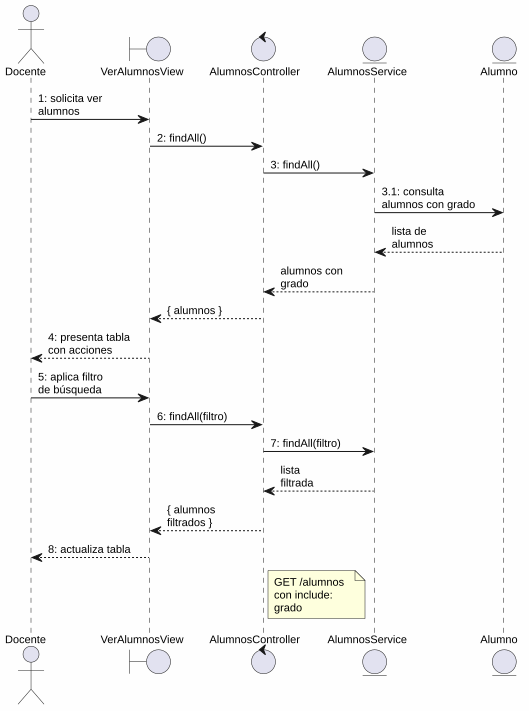
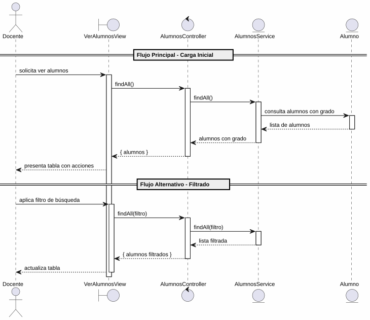

# 25-26-idsw2-sdVC > verAlumnos > Análisis

## propósito

Análisis de colaboración del caso de uso `verAlumnos()` mediante el patrón MVC.

## diagrama de colaboración

||
|-|
|Código fuente: [colaboracion.puml](../../../modelosUML/analisis/verAlumnos/colaboracion.puml)|

## clases de análisis identificadas

### VerAlumnosView (Boundary)
- Recibir solicitud desde 2 orígenes (SISTEMA_DISPONIBLE, ALUMNO_ABIERTO)
- Presentar lista con DNI, nombre, apellidos, email, grado y acciones
- Proporcionar filtro de búsqueda por texto
- Navegar a crear, importar, editar y eliminar

### AlumnosController (Control)
- Coordinar consulta de alumnos
- `findAll()` → `AlumnosService`

### AlumnosService (Entity)
- Abstraer acceso a datos de alumnos
- `findAll()` con `include: { grado: true }`

### Alumno (Entity)
- Atributos: id, nombre, apellidos, dni, email, gradoId

## diagrama de secuencia

||
|-|
|Código fuente: [secuencia.puml](../../../modelosUML/analisis/verAlumnos/secuencia.puml)|

## estados de análisis

| Estado | Descripción |
|--------|-------------|
| `MostrandoAlumnos` | Carga y presenta lista inicial |
| `FiltrandoAlumnos` | Aplica filtros con auto-loop |

**Entradas:** SISTEMA_DISPONIBLE, ALUMNO_ABIERTO
**Salida:** ALUMNOS_ABIERTO

## trazabilidad con la implementación

| Capa | Artefacto |
|------|-----------|
| Controlador | `src/apps/backend/src/alumnos/alumnos.controller.ts` (`GET /alumnos`) |
| Servicio | `src/apps/backend/src/alumnos/alumnos.service.ts` (`findAll()`) |
| Vista | `src/apps/frontend/src/views/AlumnosView.vue` |
| Modelo (BD) | `src/apps/backend/prisma/schema.prisma` (modelo `Alumno`) |
