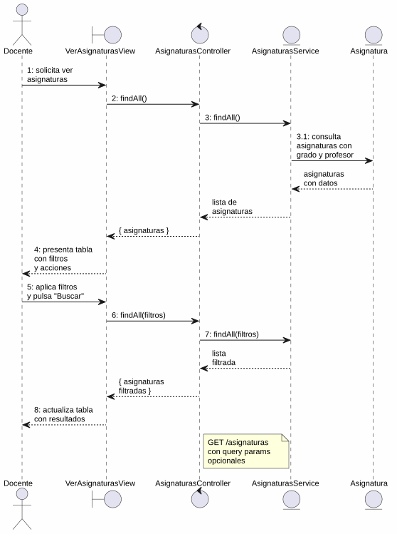
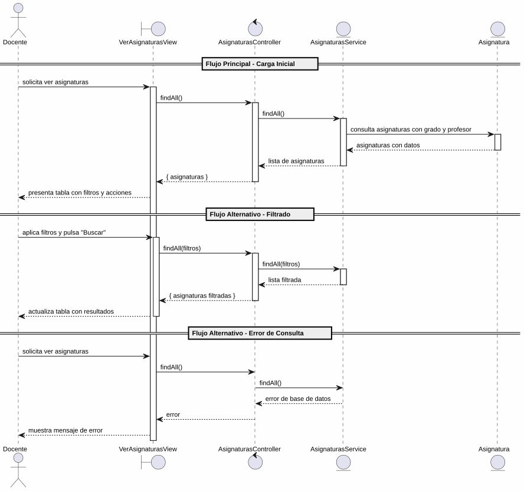

# 25-26-idsw2-sdVC > verAsignaturas > Análisis

## información del artefacto

- **Proyecto**: Sistema de Gestión de Exámenes Universitarios
- **Fase RUP**: Elaboration (Elaboración)
- **Disciplina**: Análisis y Diseño
- **Versión**: 1.0
- **Fecha**: 2026-06-01
- **Autor**: Marcos Gutierrez

## propósito

Análisis de colaboración del caso de uso `verAsignaturas()` mediante el patrón MVC, identificando las clases de análisis, sus responsabilidades y colaboraciones necesarias para cumplir con los requisitos especificados.

## diagrama de colaboración

||
|-|
|Código fuente: [colaboracion.puml](../../../modelosUML/analisis/verAsignaturas/colaboracion.puml)|

## clases de análisis identificadas

### clases de vista (boundary)

#### VerAsignaturasView
**Estereotipo**: Vista (Boundary)
**Responsabilidades**:
- Recibir la solicitud de visualización desde 2 orígenes (SISTEMA_DISPONIBLE, ASIGNATURA_ABIERTO)
- Presentar lista de asignaturas con columnas: Código, Nombre, Curso, Grado, Profesor, Acciones
- Proporcionar filtros de búsqueda por curso académico, grado y texto libre
- Permitir navegación a crear asignatura, importar asignaturas, editar y eliminar
- Visualizar el resultado de las consultas con filtros aplicados

**Colaboraciones**:
- **Entrada**: Recibe `verAsignaturas()` desde 2 orígenes
- **Control**: Se comunica con `AsignaturasController`
- **Salida**: Navega a `ASIGNATURAS_ABIERTO`

### clases de control

#### AsignaturasController
**Estereotipo**: Control
**Responsabilidades**:
- Coordinar la consulta de asignaturas
- Gestionar la respuesta con los datos de asignaturas, grado y profesor

**Colaboraciones**:
- **Vista**: Responde a solicitudes de `VerAsignaturasView`
- **Repositorio**: Delega operaciones de consulta a `AsignaturasService`

### clases de entidad (entity)

#### AsignaturasService
**Estereotipo**: Entidad
**Responsabilidades**:
- Abstraer el acceso a datos de asignaturas
- Proporcionar método para obtener todas las asignaturas con grado y profesor asociados

**Colaboraciones**:
- **Control**: Responde a `AsignaturasController`
- **Entidad**: Gestiona instancias de `Asignatura`, `Grado`, `Profesor`

#### Asignatura
**Estereotipo**: Entidad
**Responsabilidades**:
- Representar una asignatura del sistema
- Encapsular atributos: id, titulo, codigo, cursoAcademico, gradoId, profesorId
- Relacionarse con grado y profesor

**Atributos relevantes**:
| Campo | Tipo | Descripción |
|-------|------|-------------|
| `id` | Int (PK) | Identificador único de la asignatura |
| `titulo` | String | Nombre de la asignatura |
| `codigo` | String | Código identificador (unique por curso) |
| `cursoAcademico` | String | Curso académico |
| `gradoId` | Int (FK) | Referencia al grado |
| `profesorId` | Int? (FK) | Referencia al profesor responsable |

**Colaboraciones**:
- **AsignaturasService**: Es gestionada por el servicio
- **Grado**: Relación de pertenencia al grado
- **Profesor**: Relación con el profesor responsable

## diagrama de secuencia

||
|-|
|Código fuente: [secuencia.puml](../../../modelosUML/analisis/verAsignaturas/secuencia.puml)|

## flujo de colaboración

### secuencia de operaciones (flujo principal — carga inicial)

1. **Inicio**: Desde cualquiera de los 2 orígenes → `VerAsignaturasView.verAsignaturas()`
2. **Consulta**: `VerAsignaturasView` → `AsignaturasController.findAll()`
3. **Acceso a datos**: `AsignaturasController` → `AsignaturasService.findAll()`
4. **Lectura**: `AsignaturasService` → `Asignatura` → obtiene todas las asignaturas con grado y profesor
5. **Devolución**: `AsignaturasService` → `AsignaturasController` → `VerAsignaturasView`: lista de asignaturas
6. **Presentación**: `VerAsignaturasView` muestra tabla con columnas y acciones por fila

### flujo alternativo — filtrado

- Docente aplica filtros (curso, grado, texto) y pulsa "Buscar"
- `VerAsignaturasView` realiza nueva consulta con parámetros de filtro
- Sistema retorna lista filtrada y actualiza la tabla

### flujo alternativo — error de consulta

- Paso 3 falla por error de base de datos
- `AsignaturasService` retorna error a `AsignaturasController`
- `VerAsignaturasView` muestra mensaje de error al Docente

## estados de análisis

Los estados se corresponden con el diagrama de estados detallado en `contexto/casos-de-uso/detalladoCasosDeUso/verAsignaturas/verAsignaturas.puml`:

| Estado | Descripción |
|--------|-------------|
| `MostrandoAsignaturas` | El docente solicita ver asignaturas; el sistema carga y presenta la lista inicial |
| `FiltrandoAsignaturas` | El docente aplica filtros sobre la lista; el sistema actualiza los resultados |

**Transiciones clave:**
- `MostrandoAsignaturas` → `FiltrandoAsignaturas`: Sistema presenta lista con acciones de filtrado
- `FiltrandoAsignaturas` → `FiltrandoAsignaturas`: Docente aplica filtros (auto-loop)

## correspondencia con requisitos

| Requisito del caso de uso | Clase responsable | Método/Colaboración |
|--------------------------|-------------------|---------------------|
| Recibir solicitud desde 2 orígenes | `VerAsignaturasView` | Entrada desde sistema y vista de asignatura |
| Consultar lista completa de asignaturas | `AsignaturasController` | `findAll()` |
| Mostrar grado asociado | `AsignaturasService` | `include: { grado: true }` |
| Mostrar profesor responsable | `AsignaturasService` | `include: { profesor: true }` |

## trazabilidad con la implementación

| Capa | Artefacto real |
|------|----------------|
| Controlador | `src/apps/backend/src/asignaturas/asignaturas.controller.ts` (`GET /asignaturas`) |
| Servicio | `src/apps/backend/src/asignaturas/asignaturas.service.ts` (`findAll()` con includes) |
| Vista | `src/apps/frontend/src/views/AsignaturasView.vue` (tabla con filtros y acciones) |
| Modelo (BD) | `src/apps/backend/prisma/schema.prisma` (Asignatura, Grado, Profesor) |

> **Nota:** Este caso de uso está priorizado como #21 y ya tiene implementación completa en el backend (`AsignaturasService.findAll()`). El análisis se ha realizado a partir del diagrama de estados detallado y validado contra la implementación real.

## patrones aplicados

### repository pattern
`AsignaturasService` abstrae el acceso a datos de asignaturas con relaciones incluidas.

### mvc pattern
Separación entre presentación (`VerAsignaturasView`), lógica de consulta (`AsignaturasController`) y datos (`Asignatura`, `AsignaturasService`).
