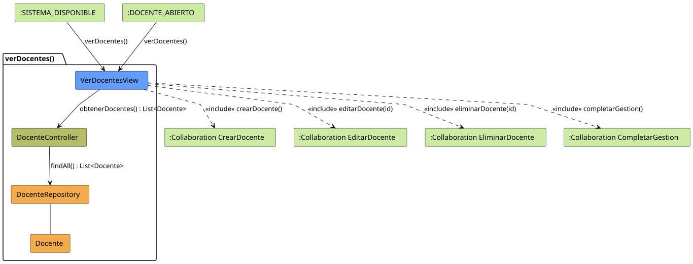

# Jorgestor > verDocentes > Análisis

> |[🏠️](/README.md)|[ 📊](../../../archivosEsenciales/casos-de-uso/diagramasDeContexto/diagramaDeContextoAdministradorInstitucional/diagramaContexto.svg)|[Detalle](../../../archivosEsenciales/casos-de-uso/detalladoCasosDeUso/README.md#ver-docentes-administrador-institucional)|**Análisis**|Diseño|Desarrollo|Pruebas|
> |-|-|-|-|-|-|-|

## información del artefacto

- **Proyecto**: Jorgestor - Sistema de Gestión de Exámenes
- **Fase RUP**: Elaboración
- **Disciplina**: Análisis y Diseño
- **Versión**: 1.0
- **Fecha**: 2026-05-25
- **Autor**: Gemini CLI

## propósito

Análisis de colaboración del caso de uso `verDocentes()` mediante el patrón MVC, identificando las clases de análisis y sus responsabilidades para que el Administrador Institucional visualice el listado de docentes y permita la navegación a acciones relacionadas.

## diagramas de análisis

### diagrama de colaboración

||
|-|
|Código fuente: [colaboracion.puml](colaboracion.puml)|

## clases de análisis identificadas

### clases de vista (boundary)

#### VerDocentesView
**Estereotipo**: Vista (Boundary)  
**Responsabilidades**:
- Presentar el listado de docentes registrados en el sistema.
- Proporcionar herramientas de búsqueda por nombre, DNI o email.
- Ofrecer accesos directos a la creación, edición y eliminación de docentes.
- Facilitar la salida del módulo mediante la finalización de gestión.

**Colaboraciones**:
- **Entrada**: Recibe `verDocentes()` desde `:ADMIN_MAIN_VIEW`.
- **Control**: Se comunica con `DocenteController`.
- **Salida**: **<<include>>** `:Collaboration CrearDocente`, `:Collaboration EditarDocente`, `:Collaboration EliminarDocente`, `:Collaboration CompletarGestion`.

### clases de control

#### DocenteController
**Estereotipo**: Control  
**Responsabilidades**:
- Coordinar la recuperación de todos los docentes.
- Gestionar los criterios de búsqueda aplicados por el administrador.
- Servir de puente entre la vista y el repositorio.

**Colaboraciones**:
- **Vista**: Responde a `VerDocentesView`.
- **Repositorio**: Delega en `DocenteRepository`.

### clases de entidad (entity)

#### DocenteRepository
**Estereotipo**: Entidad  
**Responsabilidades**:
- Proveer acceso a la persistencia de los docentes.
- Recuperar la lista completa o filtrada de registros.

**Colaboraciones**:
- **Control**: Responde a `DocenteController`.
- **Entidad**: Gestiona instancias de `Docente`.

#### Docente
**Estereotipo**: Entidad  
**Responsabilidades**:
- Almacenar los datos básicos de un docente (DNI, nombre, apellidos, email, departamento, etc.).

## flujo de colaboración principal

1. **Inicio**: El Administrador accede a la sección de docentes desde la vista principal de administración.
2. **Consulta**: `VerDocentesView` solicita el listado al `DocenteController`.
3. **Recuperación**: `DocenteController` solicita los datos al `DocenteRepository`.
4. **Respuesta**: Los datos fluyen de vuelta hasta la vista.
5. **Visualización**: La vista renderiza la tabla con buscador y botones de acción.
6. **Navegación**: El Administrador selecciona una acción (Crear, Editar, Eliminar o Finalizar).
