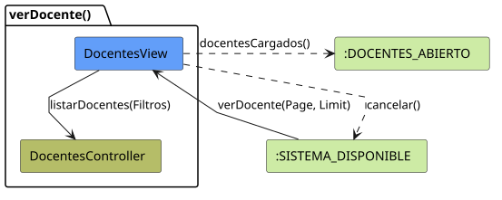
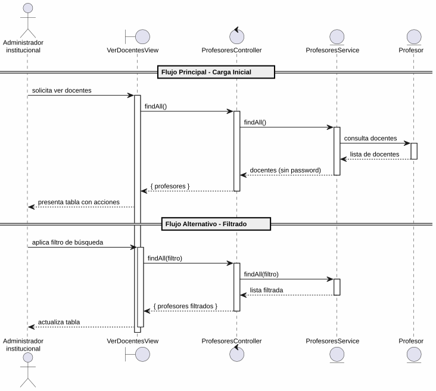

# 25-26-idsw2-sdVC > verDocentes > Análisis

## propósito

Análisis de colaboración del caso de uso `verDocentes()` mediante el patrón MVC.

## diagrama de colaboración

||
|-|
|Código fuente: [colaboracion.puml](../../../modelosUML/analisis/verDocentes/colaboracion.puml)|

## clases de análisis identificadas

### VerDocentesView (Boundary)
- Recibir solicitud desde 2 orígenes (SISTEMA_DISPONIBLE, DOCENTE_ABIERTO)
- Presentar lista con nombre, apellidos, DNI, usuario, email, password y acciones
- Proporcionar filtro de búsqueda por texto
- Navegar a crear, editar y eliminar

### ProfesoresController (Control)
- Coordinar consulta de docentes
- `findAll()` → `ProfesoresService`

### ProfesoresService (Entity)
- Abstraer acceso a datos de docentes
- `findAll()` con `omit: { password: true }`

### Profesor (Entity)
- Atributos: id, nombre, apellidos, dni, email, usuario, password, rol

## diagrama de secuencia

||
|-|
|Código fuente: [secuencia.puml](../../../modelosUML/analisis/verDocentes/secuencia.puml)|

## estados de análisis

| Estado | Descripción |
|--------|-------------|
| `MostrandoDocentes` | Carga y presenta lista inicial |
| `FiltrandoDocentes` | Aplica filtros con auto-loop |

**Entradas:** SISTEMA_DISPONIBLE, DOCENTE_ABIERTO
**Salida:** DOCENTES_ABIERTO

## trazabilidad con la implementación

| Capa | Artefacto |
|------|-----------|
| Controlador | `src/apps/backend/src/profesores/profesores.controller.ts` (`GET /profesores`) |
| Servicio | `src/apps/backend/src/profesores/profesores.service.ts` (`findAll()`) |
| Vista | `src/apps/frontend/src/views/ProfesoresView.vue` |
| Modelo (BD) | `src/apps/backend/prisma/schema.prisma` (modelo `Profesor`) |
