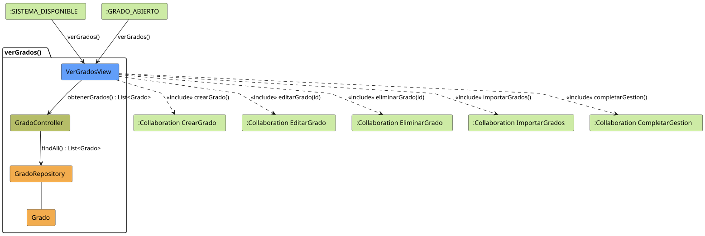

# Jorgestor > verGrados > Análisis

> |[🏠️](/README.md)|[ 📊](../../../archivosEsenciales/casos-de-uso/diagramasDeContexto/diagramaDeContextoDocente/diagramaContexto.svg)|[Detalle](../../../archivosEsenciales/casos-de-uso/detalladoCasosDeUso/README.md#ver-grados-docente)|**Análisis**|Diseño|Desarrollo|Pruebas|
> |-|-|-|-|-|-|-|

## información del artefacto

- **Proyecto**: Jorgestor - Sistema de Gestión de Exámenes
- **Fase RUP**: Elaboración
- **Disciplina**: Análisis y Diseño
- **Versión**: 1.0
- **Fecha**: 2026-05-25
- **Autor**: Gemini CLI

## propósito

Análisis de colaboración del caso de uso `verGrados()` mediante el patrón MVC, identificando las clases de análisis y sus responsabilidades para visualizar el listado de grados y permitir la navegación a acciones relacionadas.

## diagramas de análisis

### diagrama de colaboración

||
|-|
|Código fuente: [colaboracion.puml](colaboracion.puml)|

## clases de análisis identificadas

### clases de vista (boundary)

#### VerGradosView
**Estereotipo**: Vista (Boundary)  
**Responsabilidades**:
- Presentar el listado de grados registrados.
- Proporcionar herramientas de búsqueda y filtrado.
- Ofrecer accesos directos a la creación, edición y eliminación de grados.
- Permitir la importación masiva de grados.
- Facilitar la salida del módulo mediante la finalización de gestión.

**Colaboraciones**:
- **Entrada**: Recibe `verGrados()` desde `:MAIN_VIEW`.
- **Control**: Se comunica con `GradoController`.
- **Salida**: **<<include>>** `:Collaboration CrearGrado`, `:Collaboration EditarGrado`, `:Collaboration EliminarGrado`, `:Collaboration ImportarGrados`, `:Collaboration CompletarGestion`.

### clases de control

#### GradoController
**Estereotipo**: Control  
**Responsabilidades**:
- Coordinar la recuperación de todos los grados.
- Gestionar los criterios de búsqueda aplicados por el usuario.
- Servir de puente entre la vista y el repositorio.

**Colaboraciones**:
- **Vista**: Responde a `VerGradosView`.
- **Repositorio**: Delega en `GradoRepository`.

### clases de entidad (entity)

#### GradoRepository
**Estereotipo**: Entidad  
**Responsabilidades**:
- Proveer acceso a la persistencia de los grados.
- Recuperar la lista completa o filtrada de registros.

**Colaboraciones**:
- **Control**: Responde a `GradoController`.
- **Entidad**: Gestiona instancias de `Grado`.

#### Grado
**Estereotipo**: Entidad  
**Responsabilidades**:
- Almacenar los datos básicos de un grado (ID, nombre, descripción, etc.).

## flujo de colaboración principal

1. **Inicio**: El Docente accede a la sección de grados desde la vista principal.
2. **Consulta**: `VerGradosView` solicita el listado al `GradoController`.
3. **Recuperación**: `GradoController` solicita los datos al `GradoRepository`.
4. **Respuesta**: Los datos fluyen de vuelta hasta la vista.
5. **Visualización**: La vista renderiza la tabla con buscador y botones de acción.
6. **Navegación**: El Docente selecciona una acción (Crear, Editar, Eliminar, Importar o Finalizar).
