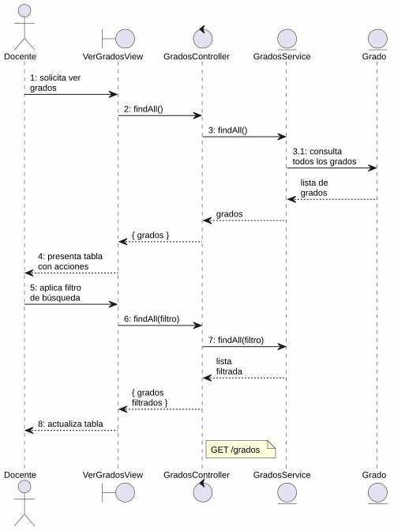
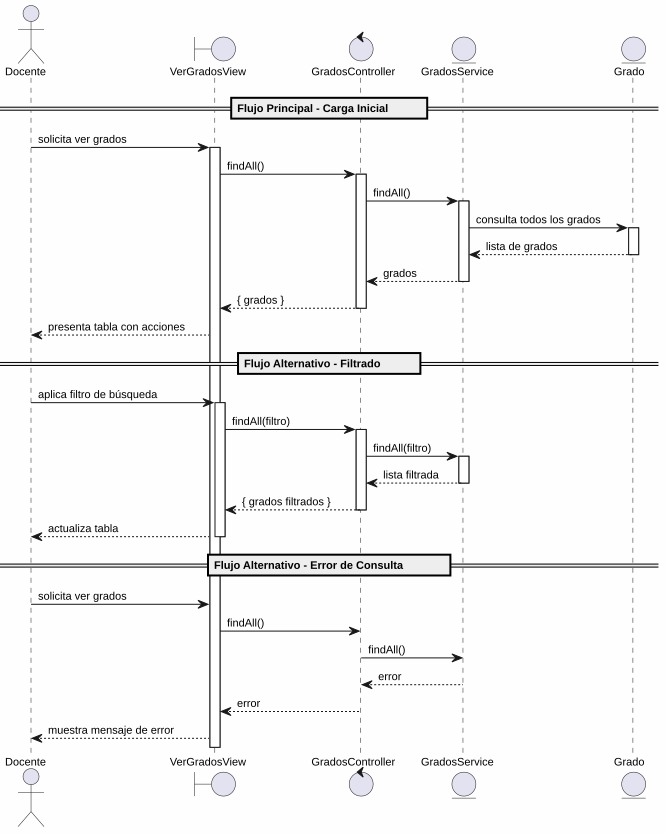

# 25-26-idsw2-sdVC > verGrados > Análisis

## información del artefacto

- **Proyecto**: Sistema de Gestión de Exámenes Universitarios
- **Fase RUP**: Elaboration (Elaboración)
- **Disciplina**: Análisis y Diseño
- **Versión**: 1.0
- **Fecha**: 2026-06-01
- **Autor**: Marcos Gutierrez

## propósito

Análisis de colaboración del caso de uso `verGrados()` mediante el patrón MVC, identificando las clases de análisis, sus responsabilidades y colaboraciones necesarias para cumplir con los requisitos especificados.

## diagrama de colaboración

||
|-|
|Código fuente: [colaboracion.puml](../../../modelosUML/analisis/verGrados/colaboracion.puml)|

## clases de análisis identificadas

### clases de vista (boundary)

#### VerGradosView
**Estereotipo**: Vista (Boundary)
**Responsabilidades**:
- Recibir la solicitud de visualización desde 2 orígenes (SISTEMA_DISPONIBLE, GRADO_ABIERTO)
- Presentar lista de grados con columnas: Código, Título, Alumnos, Acciones
- Proporcionar filtro de búsqueda por código o nombre
- Permitir navegación a crear grado, importar, editar y eliminar

**Colaboraciones**:
- **Entrada**: Recibe `verGrados()` desde 2 orígenes
- **Control**: Se comunica con `GradosController`
- **Salida**: Navega a `GRADOS_ABIERTO`

### clases de control

#### GradosController
**Estereotipo**: Control
**Responsabilidades**:
- Coordinar la consulta de grados
- Gestionar la respuesta con los datos de grados

**Colaboraciones**:
- **Vista**: Responde a solicitudes de `VerGradosView`
- **Repositorio**: Delega operaciones de consulta a `GradosService`

### clases de entidad (entity)

#### GradosService
**Estereotipo**: Entidad
**Responsabilidades**:
- Abstraer el acceso a datos de grados
- Proporcionar método para obtener todos los grados

**Colaboraciones**:
- **Control**: Responde a `GradosController`
- **Entidad**: Gestiona instancias de `Grado`

#### Grado
**Estereotipo**: Entidad
**Responsabilidades**:
- Representar un grado universitario
- Encapsular atributos: id, titulo, codigo

**Atributos relevantes**:
| Campo | Tipo | Descripción |
|-------|------|-------------|
| `id` | Int (PK) | Identificador único del grado |
| `titulo` | String | Nombre del grado |
| `codigo` | String (unique) | Código identificador |

## diagrama de secuencia

||
|-|
|Código fuente: [secuencia.puml](../../../modelosUML/analisis/verGrados/secuencia.puml)|

## flujo de colaboración

1. **Inicio**: Desde cualquiera de los 2 orígenes → `VerGradosView.verGrados()`
2. **Consulta**: `VerGradosView` → `GradosController.findAll()`
3. **Acceso a datos**: `GradosController` → `GradosService.findAll()`
4. **Lectura**: `GradosService` → `Grado` → obtiene todos los grados
5. **Devolución y presentación**: Lista mostrada en tabla con acciones

### flujo alternativo — filtrado
- Docente aplica filtro por texto
- Sistema retorna lista filtrada y actualiza la tabla

## estados de análisis

| Estado | Descripción |
|--------|-------------|
| `MostrandoGrados` | El docente solicita ver grados; el sistema carga y presenta la lista inicial |
| `FiltrandoGrados` | El docente aplica filtros; el sistema actualiza los resultados |

**Transiciones clave:**
- `MostrandoGrados` → `FiltrandoGrados`: Sistema presenta lista con acciones de filtrado
- `FiltrandoGrados` → `FiltrandoGrados`: Docente aplica filtros (auto-loop)

## trazabilidad con la implementación

| Capa | Artefacto real |
|------|----------------|
| Controlador | `src/apps/backend/src/grados/grados.controller.ts` (`GET /grados`) |
| Servicio | `src/apps/backend/src/grados/grados.service.ts` (`findAll()`) |
| Vista | `src/apps/frontend/src/views/GradosView.vue` (tabla con acciones) |
| Modelo (BD) | `src/apps/backend/prisma/schema.prisma` (modelo `Grado`) |

> **Nota:** Caso de uso #22 con implementación completa en backend (`GradosService.findAll()`).

## patrones aplicados

### repository pattern
`GradosService` abstrae el acceso a datos de grados.

### mvc pattern
Separación entre presentación, lógica de consulta y datos.
