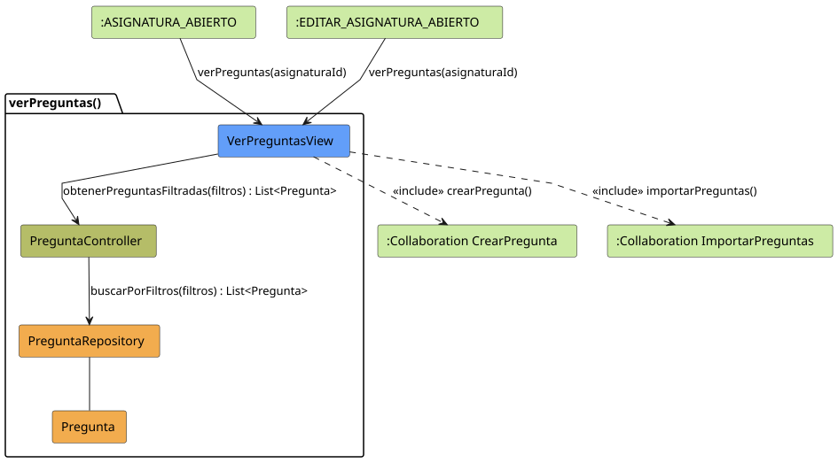
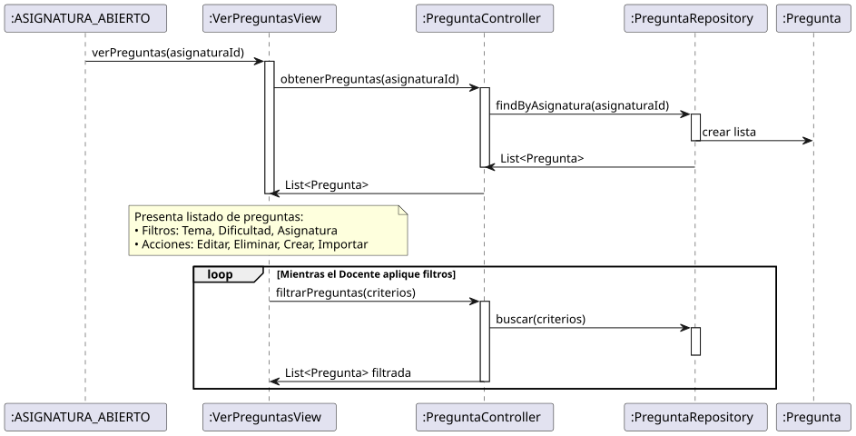

# Jorgestor > verPreguntas > Análisis

> |[🏠️](/README.md)|[ 📊](../../../archivosEsenciales/casos-de-uso/diagramasDeContexto/diagramaDeContextoDocente/diagramaContexto.svg)|[Detalle](../../../archivosEsenciales/casos-de-uso/detalladoCasosDeUso/README.md#ver-preguntas-docente)|**Análisis**|Diseño|Desarrollo|Pruebas|
> |-|-|-|-|-|-|-|

## información del artefacto

- **Proyecto**: Jorgestor - Sistema de Gestión de Exámenes
- **Fase RUP**: Elaboración
- **Disciplina**: Análisis y Diseño
- **Versión**: 1.0
- **Fecha**: 2026-05-23
- **Autor**: Gemini CLI

## propósito

Análisis de colaboración del caso de uso `verPreguntas()` mediante el patrón MVC, enfocado en la visualización, filtrado y gestión de la batería de preguntas de una asignatura, permitiendo el acceso a la creación e importación de nuevas preguntas.

## diagramas de análisis

### diagrama de colaboración

||
|-|
|Código fuente: [colaboracion.puml](colaboracion.puml)|

### diagrama de secuencia

||
|-|
|Código fuente: [secuencia.puml](secuencia.puml)|

## clases de análisis identificadas

### clases de vista (boundary)

#### VerPreguntasView
**Estereotipo**: Vista (Boundary)  
**Responsabilidades**:
- Presentar el listado de preguntas asociadas a una asignatura.
- Proporcionar herramientas de filtrado por Tema, Dificultad y Asignatura.
- Mostrar la información resumida de cada pregunta.
- Permitir el acceso a la creación, edición, eliminación e importación de preguntas.

**Colaboraciones**:
- **Entrada**: Recibe `verPreguntas(id)` desde `:ASIGNATURA_ABIERTO` o `:EDITAR_ASIGNATURA_ABIERTO`.
- **Control**: Se comunica con `PreguntaController`.
- **Salida**: **<<include>>** `:Collaboration CrearPregunta` o `:Collaboration ImportarPreguntas`.

### clases de control

#### PreguntaController
**Estereotipo**: Control  
**Responsabilidades**:
- Gestionar la obtención de preguntas según los criterios de búsqueda y filtrado.
- Coordinar la presentación de resultados en la vista.

**Colaboraciones**:
- **Vista**: Responde a `VerPreguntasView`.
- **Repositorio**: Delega en `PreguntaRepository`.

### clases de entidad (entity)

#### PreguntaRepository
**Estereotipo**: Entidad  
**Responsabilidades**:
- Abstraer el acceso a datos de preguntas.
- Implementar la lógica de búsqueda por múltiples criterios (Tema, Dificultad, etc.).

**Colaboraciones**:
- **Control**: Responde a `PreguntaController`.
- **Entidad**: Gestiona instancias de `Pregunta`.

#### Pregunta
**Estereotipo**: Entidad  
**Responsabilidades**:
- Representar la información de una pregunta de examen.
- Contener atributos: enunciado, opciones, tema, dificultad.

## flujo de colaboración principal

### secuencia: ver preguntas

1. **Inicio**: El docente accede a la gestión de preguntas desde una asignatura.
2. **Carga Inicial**: `VerPreguntasView` solicita todas las preguntas de la asignatura al `PreguntaController`.
3. **Presentación**: La vista muestra el listado y los controles de filtrado.
4. **Filtrado**: El docente selecciona criterios (ej. Dificultad: "Alta") y la vista solicita la actualización de la lista.
5. **Búsqueda**: `PreguntaController` consulta al `PreguntaRepository` con los nuevos criterios.
6. **Actualización**: La vista refresca el listado con los resultados obtenidos.
7. **Gestión**: El docente puede optar por crear una nueva pregunta o importar desde archivo.

## patrón de visualización y filtrado

Utiliza un patrón de vista reactiva al filtrado, permitiendo al usuario refinar la búsqueda de preguntas de forma dinámica sin perder el contexto de la asignatura.
