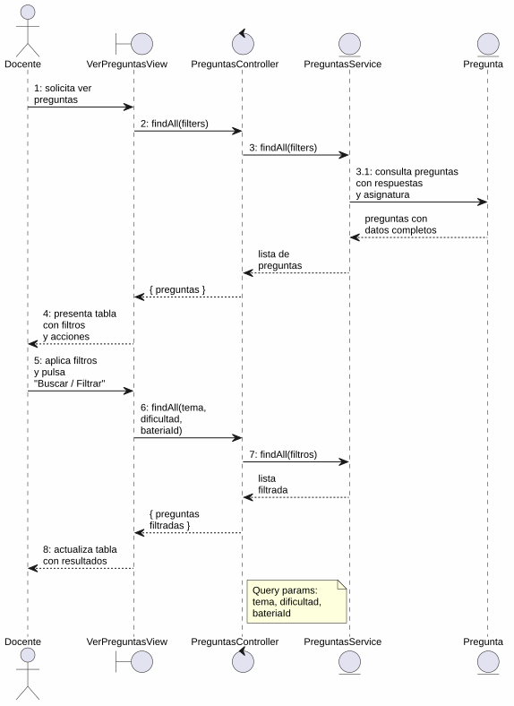
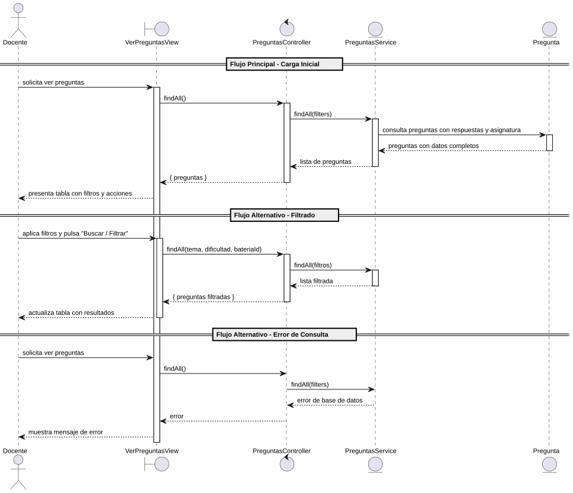

# 25-26-idsw2-sdVC > verPreguntas > Análisis

## información del artefacto

- **Proyecto**: Sistema de Gestión de Exámenes Universitarios
- **Fase RUP**: Elaboration (Elaboración)
- **Disciplina**: Análisis y Diseño
- **Versión**: 1.0
- **Fecha**: 2026-06-01
- **Autor**: Marcos Gutierrez

## propósito

Análisis de colaboración del caso de uso `verPreguntas()` mediante el patrón MVC, identificando las clases de análisis, sus responsabilidades y colaboraciones necesarias para cumplir con los requisitos especificados.

## diagrama de colaboración

||
|-|
|Código fuente: [colaboracion.puml](../../../modelosUML/analisis/verPreguntas/colaboracion.puml)|

## clases de análisis identificadas

### clases de vista (boundary)

#### VerPreguntasView
**Estereotipo**: Vista (Boundary)
**Responsabilidades**:
- Recibir la solicitud de visualización desde 4 orígenes (ASIGNATURA_ABIERTO, SISTEMA_DISPONIBLE, PREGUNTA_CONTEXTUAL_ABIERTO, PREGUNTA_ABIERTO)
- Presentar lista de preguntas con columnas: ID, Asignatura, Enunciado, Tema, Dificultad, Acciones
- Proporcionar filtros de búsqueda por asignatura (contexto), tema, dificultad y texto libre
- Permitir navegación a crear pregunta, editar pregunta, eliminar pregunta e importar preguntas
- Visualizar el resultado de las consultas con filtros aplicados

**Colaboraciones**:
- **Entrada**: Recibe `verPreguntas()` desde 4 orígenes
- **Control**: Se comunica con `PreguntasController`
- **Salida**: Navega a `PREGUNTAS_ABIERTO` (vista global) o `PREGUNTAS_CONTEXTUALES_ABIERTO` (vista contextual)

### clases de control

#### PreguntasController
**Estereotipo**: Control
**Responsabilidades**:
- Coordinar la consulta de preguntas con filtros opcionales
- Recibir y validar los parámetros de filtro (tema, dificultad, bateriaId)
- Gestionar la respuesta con los datos de preguntas, respuestas y asignatura

**Colaboraciones**:
- **Vista**: Responde a solicitudes de `VerPreguntasView`
- **Repositorio**: Delega operaciones de consulta a `PreguntasService`

### clases de entidad (entity)

#### PreguntasService
**Estereotipo**: Entidad
**Responsabilidades**:
- Abstraer el acceso a datos de preguntas
- Proporcionar método para obtener todas las preguntas con filtros opcionales (tema, dificultad, bateriaId)
- Incluir relaciones: respuestas, batería y asignatura en cada consulta

**Colaboraciones**:
- **Control**: Responde a `PreguntasController`
- **Entidad**: Gestiona instancias de `Pregunta`, `Respuesta`, `BateriaDePreguntas`, `Asignatura`

#### Pregunta
**Estereotipo**: Entidad
**Responsabilidades**:
- Representar una pregunta del banco de preguntas
- Encapsular atributos: id, enunciado, tema, dificultad, estado, bateriaId
- Relacionarse con sus respuestas y la batería de preguntas

**Atributos relevantes**:
| Campo | Tipo | Descripción |
|-------|------|-------------|
| `id` | Int (PK) | Identificador único de la pregunta |
| `enunciado` | String | Texto de la pregunta |
| `tema` | String | Tema al que pertenece |
| `dificultad` | Dificultad (enum) | BAJA \| MEDIA \| ALTA |
| `estado` | EstadoPregunta (enum) | EN_CONSTRUCCION \| HABILITADA \| INHABILITADA |
| `bateriaId` | Int (FK) | Referencia a la batería de preguntas |

**Colaboraciones**:
- **PreguntasService**: Es gestionada por el servicio
- **Respuesta**: Relación de composición con las opciones de respuesta

#### BateriaDePreguntas
**Estereotipo**: Entidad
**Responsabilidades**:
- Representar el contenedor de preguntas asociado a una asignatura
- Proporcionar el nombre de la asignatura para la visualización en la tabla

**Colaboraciones**:
- **PreguntasService**: Es consultada para obtener la asignatura asociada

## diagrama de secuencia

||
|-|
|Código fuente: [secuencia.puml](../../../modelosUML/analisis/verPreguntas/secuencia.puml)|

## flujo de colaboración

### secuencia de operaciones (flujo principal — carga inicial)

1. **Inicio**: Desde cualquiera de los 4 orígenes → `VerPreguntasView.verPreguntas()`
2. **Consulta**: `VerPreguntasView` → `PreguntasController.findAll()`
3. **Acceso a datos**: `PreguntasController` → `PreguntasService.findAll(filters)`
4. **Lectura**: `PreguntasService` → `Pregunta` → obtiene todas las preguntas con respuestas y asignatura
5. **Devolución**: `PreguntasService` → `PreguntasController` → `VerPreguntasView`: lista de preguntas
6. **Presentación**: `VerPreguntasView` muestra tabla con columnas y acciones por fila

### flujo alternativo — filtrado

- Docente aplica filtros (asignatura, tema, dificultad, texto) y pulsa "Buscar / Filtrar"
- `VerPreguntasView` → `PreguntasController.findAll(filters)` con parámetros de consulta
- Sistema retorna lista filtrada y actualiza la tabla

### flujo alternativo — error de consulta

- Paso 3 falla por error de base de datos
- `PreguntasService` retorna error a `PreguntasController`
- `PreguntasController` propaga el error a `VerPreguntasView`
- `VerPreguntasView` muestra mensaje de error al Docente

### opciones de navegación desde la vista

| Acción | Destino | Descripción |
|--------|---------|-------------|
| `Volver` | Origen anterior | Retorna al estado desde el que se invocó |
| `Crear Nueva Pregunta` | `crearPregunta()` | Transiciona al caso de uso de creación |
| `Importar` | `importarPreguntas()` | Transiciona al caso de uso de importación |
| `Editar` (por fila) | `editarPregunta(id)` | Transiciona a edición de la pregunta |
| `Eliminar` (por fila) | `eliminarPregunta(id)` | Transiciona a eliminación de la pregunta |

## estados de análisis

Los estados se corresponden con el diagrama de estados detallado en `contexto/casos-de-uso/detalladoCasosDeUso/verPreguntas/verPreguntas.puml`:

| Estado | Descripción |
|--------|-------------|
| `MostrandoPreguntas` | El docente solicita ver preguntas; el sistema carga y presenta la lista inicial |
| `FiltrandoPreguntas` | El docente aplica filtros sobre la lista; el sistema actualiza los resultados |

**Transiciones clave:**
- `MostrandoPreguntas` → `FiltrandoPreguntas`: Sistema presenta lista con acciones de filtrado
- `FiltrandoPreguntas` → `FiltrandoPreguntas`: Docente aplica filtros (auto-loop)

## correspondencia con requisitos

### mapeado con especificación detallada

| Requisito del caso de uso | Clase responsable | Método/Colaboración |
|--------------------------|-------------------|---------------------|
| Recibir solicitud desde 4 orígenes | `VerPreguntasView` | Entrada desde asignatura, sistema, pregunta contextual y pregunta |
| Consultar lista completa de preguntas | `PreguntasController` | `findAll()` |
| Filtrar por asignatura (contexto) | `PreguntasController` | Parámetro `bateriaId` en `findAll()` |
| Filtrar por tema | `PreguntasController` | Parámetro `tema` en `findAll()` |
| Filtrar por dificultad | `PreguntasController` | Parámetro `dificultad` en `findAll()` |
| Mostrar respuestas asociadas | `PreguntasService` | `include: { respuestas: true }` |
| Mostrar asignatura asociada | `PreguntasService` | `include: { bateria: { include: { asignatura: true } } }` |

### patrón de colaboración establecido

- **Entrada cuádruple**: Desde 4 orígenes con convergencia en un único flujo de visualización
- **Análisis MVC sin capa de persistencia**: Solo consulta de datos, sin creación o modificación
- **Salida contextual**: Dos salidas posibles según el contexto (global vs. contextual)
- **Operación de solo lectura**: Sin transacciones de escritura

## trazabilidad con la implementación

| Capa | Artefacto real |
|------|----------------|
| Controlador | `src/apps/backend/src/preguntas/preguntas.controller.ts` (`GET /preguntas` con query params) |
| Servicio | `src/apps/backend/src/preguntas/preguntas.service.ts` (`findAll()` con filtros e includes) |
| Vista | `src/apps/frontend/src/views/PreguntasView.vue` (tabla con filtros y acciones) |
| Modelo (BD) | `src/apps/backend/prisma/schema.prisma` (Pregunta, Respuesta, BateriaDePreguntas) |

> **Nota:** Este caso de uso está priorizado como #20 y ya tiene implementación completa en el backend (`PreguntasService.findAll()` con filtros opcionales). El análisis se ha realizado a partir del diagrama de estados detallado y validado contra la implementación real.

## patrones aplicados

### repository pattern
`PreguntasService` abstrae el acceso a datos de preguntas con filtros dinámicos y relaciones incluidas.

### mvc pattern
Separación entre presentación (`VerPreguntasView`), lógica de consulta (`PreguntasController`) y datos (`Pregunta`, `PreguntasService`).

### filter pattern
Los parámetros de consulta opcionales (tema, dificultad, bateriaId) permiten refinar dinámicamente los resultados sin modificar la estructura de la consulta base.
