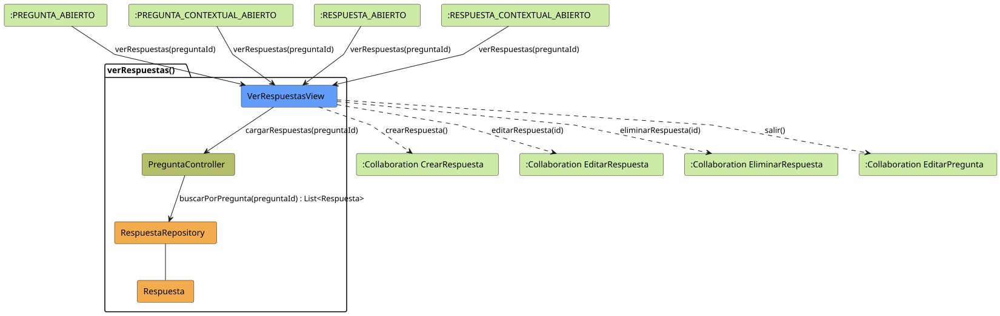
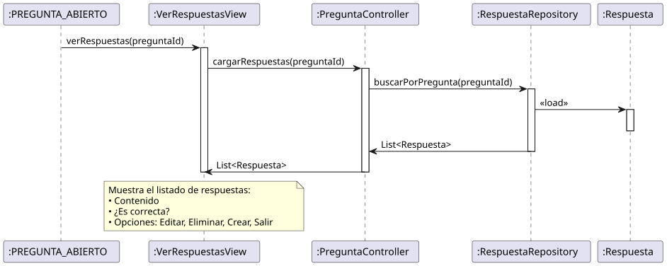

# Jorgestor > verRespuestas > Análisis

> |[🏠️](/README.md)|[ 📊](../../../archivosEsenciales/casos-de-uso/diagramasDeContexto/diagramaDeContextoDocente/diagramaContexto.svg)|[Detalle](../../../archivosEsenciales/casos-de-uso/detalladoCasosDeUso/README.md#ver-respuestas-docente)|**Análisis**|Diseño|Desarrollo|Pruebas|
> |-|-|-|-|-|-|-|

## información del artefacto

- **Proyecto**: Jorgestor - Sistema de Gestión de Exámenes
- **Fase RUP**: Elaboración
- **Disciplina**: Análisis y Diseño
- **Versión**: 1.1
- **Fecha**: 2026-05-27
- **Autor**: Gemini CLI

## propósito

Análisis de colaboración del caso de uso `verRespuestas()` mediante el patrón MVC. Este caso de uso actúa como el listado central de opciones para una pregunta, permitiendo el acceso a su gestión integral y sirviendo como punto de retorno tras editar o crear una respuesta individual.

## diagramas de análisis

### diagrama de colaboración

||
|-|
|Código fuente: [colaboracion.puml](colaboracion.puml)|

### diagrama de secuencia

||
|-|
|Código fuente: [secuencia.puml](secuencia.puml)|

## clases de análisis identificadas

### clases de vista (boundary)

#### VerRespuestasView
**Estereotipo**: Vista (Boundary)  
**Responsabilidades**:
- Presentar el listado de respuestas asociadas a una pregunta.
- Mostrar el contenido y si la respuesta es correcta.
- Facilitar la navegación a la creación, edición y eliminación de respuestas.
- Permitir el retorno a la edición de la pregunta (contextual o general).

**Colaboraciones**:
- **Entrada**: `verRespuestas(preguntaId)` desde `:PREGUNTA_ABIERTO`, `:PREGUNTA_CONTEXTUAL_ABIERTO`, `:RESPUESTA_ABIERTO` o `:RESPUESTA_CONTEXTUAL_ABIERTO`.
- **Control**: `PreguntaController`.
- **Salida**: Redirige a las colaboraciones de CRUD de respuestas o vuelve a la edición de la pregunta.

### clases de control

#### PreguntaController
**Estereotipo**: Control  
**Responsabilidades**:
- Coordinar la obtención de las respuestas filtradas por pregunta.

**Colaboraciones**:
- **Repositorio**: `RespuestaRepository`.

### clases de entidad (entity)

#### RespuestaRepository
**Estereotipo**: Entidad (Repositorio)  
**Responsabilidades**: Abstraer el acceso a la persistencia de las respuestas.

#### Respuesta
**Estereotipo**: Entidad  
**Responsabilidades**: Representar una opción de respuesta con su contenido y estado de veracidad.

## flujo de colaboración principal

### secuencia: listar respuestas

1. **Entrada**: El docente solicita ver las respuestas, ya sea desde la edición de la pregunta o tras finalizar la edición de una respuesta.
2. **Carga**: La vista solicita al controlador las respuestas correspondientes al ID de la pregunta.
3. **Búsqueda**: El controlador delega en el repositorio la búsqueda de las entidades `Respuesta`.
4. **Presentación**: La vista renderiza la tabla con los datos obtenidos.
