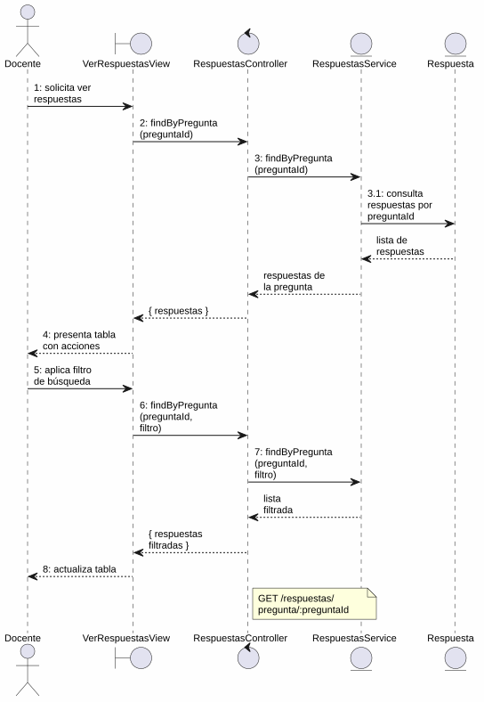
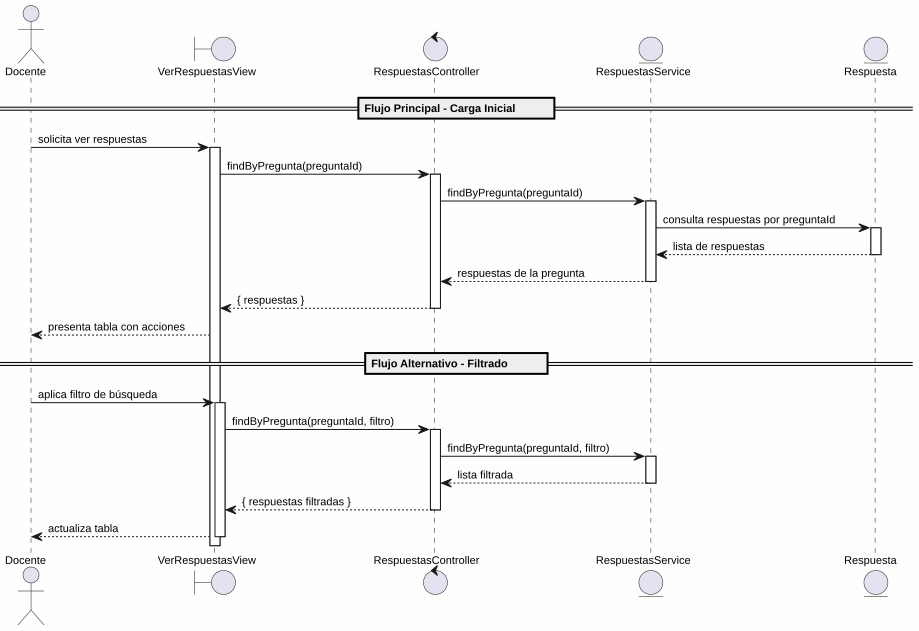

# 25-26-idsw2-sdVC > verRespuestas > Análisis

## propósito

Análisis de colaboración del caso de uso `verRespuestas()` mediante el patrón MVC.

## diagrama de colaboración

||
|-|
|Código fuente: [colaboracion.puml](../../../modelosUML/analisis/verRespuestas/colaboracion.puml)|

## clases de análisis identificadas

### VerRespuestasView (Boundary)
- Recibir solicitud desde 4 orígenes (PREGUNTA_ABIERTO, RESPUESTA_ABIERTO, PREGUNTA_CONTEXTUAL_ABIERTO, RESPUESTA_CONTEXTUAL_ABIERTO)
- Presentar lista con contenido y si es correcta
- Proporcionar filtro de búsqueda por texto
- Navegar a crear, editar y eliminar respuestas

### RespuestasController (Control)
- Coordinar consulta de respuestas por pregunta
- `findByPregunta(preguntaId)` → `RespuestasService`

### RespuestasService (Entity)
- Abstraer acceso a datos de respuestas
- `findByPregunta(preguntaId)` con filtro por pregunta

### Respuesta (Entity)
- Atributos: id, contenido, correcta, preguntaId

## diagrama de secuencia

||
|-|
|Código fuente: [secuencia.puml](../../../modelosUML/analisis/verRespuestas/secuencia.puml)|

## estados de análisis

| Estado | Descripción |
|--------|-------------|
| `MostrandoRespuestas` | Carga y presenta lista inicial de respuestas de una pregunta |
| `FiltrandoRespuestas` | Aplica filtros con auto-loop |

**Entradas:** PREGUNTA_ABIERTO, RESPUESTA_ABIERTO, PREGUNTA_CONTEXTUAL_ABIERTO, RESPUESTA_CONTEXTUAL_ABIERTO
**Salidas:** RESPUESTAS_ABIERTO, RESPUESTAS_CONTEXTUALES_ABIERTO

## trazabilidad con la implementación

| Capa | Artefacto |
|------|-----------|
| Controlador | `src/apps/backend/src/respuestas/respuestas.controller.ts` (`GET /respuestas/pregunta/:preguntaId`) |
| Servicio | `src/apps/backend/src/respuestas/respuestas.service.ts` (`findByPregunta()`) |
| Vista | `src/apps/frontend/src/views/RespuestasView.vue` |
| Modelo (BD) | `src/apps/backend/prisma/schema.prisma` (modelo `Respuesta`) |
