# Documento de Arquitectura y Decisiones Tecnológicas - Jorgestor

---
### 📂 Navegación del Repositorio
[**🏠 Inicio**](../../README.md) | [**🔍 Análisis**](../analisis/README.md) | [**🎨 Diseño**](README.md) | [**💻 Desarrollo**](../../src) | [**📜 Log**](../../conversation-log.md) | [**🗺️ Diagrama de Contexto**](../../archivosEsenciales/casos-de-uso/diagramasDeContexto/diagramaDeContextoDocente/diagramaContexto.puml)
---

Este documento define los cimientos técnicos del sistema **Jorgestor**, asegurando la coherencia entre el análisis, el diseño e implementación final.

## 1. Stack Tecnológico Seleccionado

Se ha optado por una arquitectura de **Single Page Application (SPA)** con una **API REST**, priorizando la separación de responsabilidades, la mantenibilidad y el rigor académico de IDSW2.

### Backend: Java + Spring Boot
- **Framework:** Spring Boot 3.x.
- **Gestor de proyectos:** Maven.
- **Justificación:** Ecosistema robusto, inyección de dependencias (IoC), manejo avanzado de persistencia con Spring Data JPA y seguridad integral con Spring Security. Maven es el estándar de facto para la gestión de dependencias y construcción en entornos Java profesionales.
- **Rol:** Proveedor de servicios REST, orquestador de lógica de negocio y guardián de la integridad de los datos.

### Frontend: React + TypeScript
- **Framework:** React 18+ (Vite).
- **Lenguaje:** TypeScript (Tipado estricto).
- **Estilos:** Tailwind CSS.
- **Justificación:** Tailwind permite un diseño moderno, altamente personalizable y eficiente mediante clases de utilidad, eliminando la necesidad de archivos CSS extensos y facilitando la consistencia visual. Vite proporciona un entorno de desarrollo extremadamente rápido.
- **Rol:** Interfaz de usuario reactiva, gestión de estado en cliente y consumo de la API REST.

### Base de Datos: PostgreSQL + Docker
- **Motor:** PostgreSQL (Relacional).
- **Infraestructura:** Contenedores Docker (Docker Compose).
- **Justificación:** El uso de Docker asegura que el entorno de base de datos sea idéntico para todos los desarrolladores y en cualquier máquina, facilitando el despliegue y cumpliendo con estándares profesionales de "arranque inmediato".
- **ORM:** Hibernate (vía Spring Data JPA).

---

## 2. Decisiones de Diseño Globales

### Comunicación Cliente-Servidor
- **Protocolo:** HTTPS / JSON.
- **Estilo Arquitectónico:** RESTful.
- **Autenticación:** JWT (JSON Web Tokens) para stateless sessions, permitiendo escalabilidad y desacoplamiento.

### Gestión de Errores
- El backend proporcionará códigos de estado HTTP estandarizados (200, 201, 400, 401, 403, 404, 500) junto con un cuerpo de error descriptivo para que el frontend pueda informar correctamente al usuario.

---

## 3. Diagramas de Secuencia (Diseño)

A continuación se detallan las interacciones técnicas entre los componentes del sistema (Frontend, Controller, Service, Repository) para cada caso de uso.

### 🔐 Autenticación y Seguridad

| [Inicio de Sesión](iniciarSesion) | [Cerrar Sesión](cerrarSesion) |
| :---: | :---: |
|  [📄 Código PUML](../../modelosUML/diseño/iniciarSesion/secuencia.puml) |  [📄 Código PUML](../../modelosUML/diseño/cerrarSesion/secuencia.puml) |

---

### 📊 Dashboard Dinámico

| [Completar Gestión](completarGestion) |
| :---: |
|  [📄 Código PUML](../../modelosUML/diseño/completarGestion/secuencia.puml) |

---

### 🎓 Módulo de Grados

| [Ver Grados](verGrados) | [Crear Grado](crearGrado) |
| :---: | :---: |
|  [📄 Código PUML](../../modelosUML/diseño/verGrados/secuencia.puml) |  [📄 Código PUML](../../modelosUML/diseño/crearGrado/secuencia.puml) |

| [Editar Grado](editarGrado) | [Eliminar Grado](eliminarGrado) |
| :---: | :---: |
| 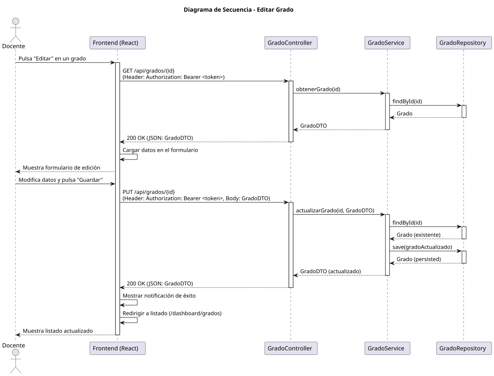 [📄 Código PUML](../../modelosUML/diseño/editarGrado/secuencia.puml) |  [📄 Código PUML](../../modelosUML/diseño/eliminarGrado/secuencia.puml) |

---

### 📚 Módulo de Asignaturas

| [Ver Asignaturas](verAsignaturas) | [Crear Asignatura](crearAsignatura) |
| :---: | :---: |
|  [📄 Código PUML](../../modelosUML/diseño/verAsignaturas/secuencia.puml) |  [📄 Código PUML](../../modelosUML/diseño/crearAsignatura/secuencia.puml) |

| [Editar Asignatura](editarAsignatura) | [Eliminar Asignatura](eliminarAsignatura) |
| :---: | :---: |
|  [📄 Código PUML](../../modelosUML/diseño/editarAsignatura/secuencia.puml) |  [📄 Código PUML](../../modelosUML/diseño/eliminarAsignatura/secuencia.puml) |

---

### 👥 Módulo de Alumnos

| [Ver Alumnos](verAlumnos) | [Crear Alumno](crearAlumno) |
| :---: | :---: |
| 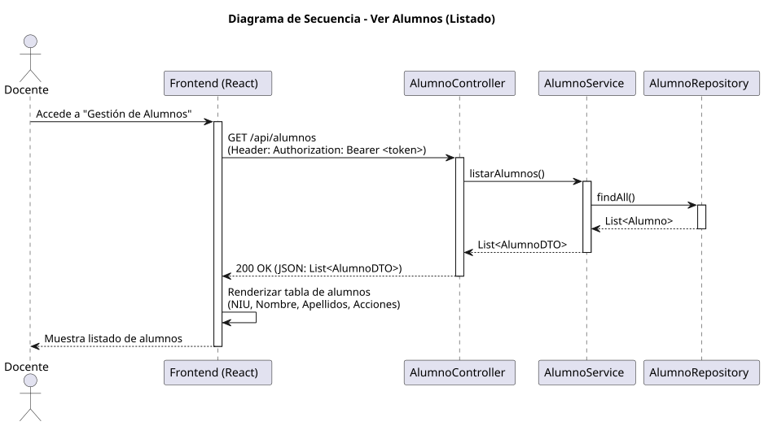 [📄 Código PUML](../../modelosUML/diseño/verAlumnos/secuencia.puml) |  [📄 Código PUML](../../modelosUML/diseño/crearAlumno/secuencia.puml) |

| [Editar Alumno](editarAlumno) | [Eliminar Alumno](eliminarAlumno) |
| :---: | :---: |
|  [📄 Código PUML](../../modelosUML/diseño/editarAlumno/secuencia.puml) | 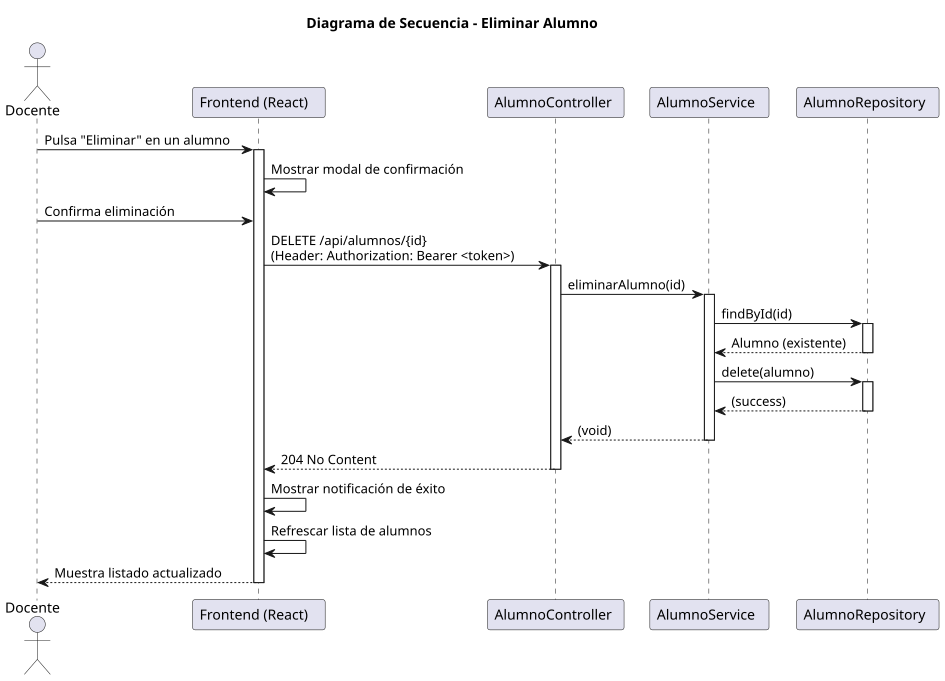 [📄 Código PUML](../../modelosUML/diseño/eliminarAlumno/secuencia.puml) |

---

### ❓ Módulo de Preguntas

| [Ver Preguntas](verPreguntas) | [Crear Pregunta](crearPregunta) |
| :---: | :---: |
|  [📄 Código PUML](../../modelosUML/diseño/verPreguntas/secuencia.puml) | 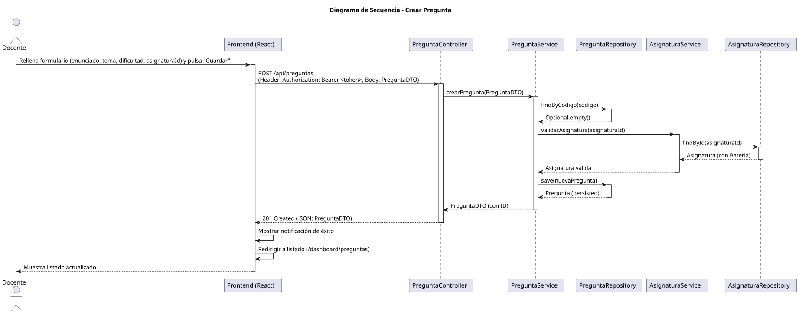 [📄 Código PUML](../../modelosUML/diseño/crearPregunta/secuencia.puml) |

| [Editar Pregunta](editarPregunta) | [Eliminar Pregunta](eliminarPregunta) |
| :---: | :---: |
|  [📄 Código PUML](../../modelosUML/diseño/editarPregunta/secuencia.puml) |  [📄 Código PUML](../../modelosUML/diseño/eliminarPregunta/secuencia.puml) |

---

### 📝 Módulo de Respuestas

| [Ver Respuestas](verRespuestas) | [Crear Respuesta](crearRespuesta) |
| :---: | :---: |
|  [📄 Código PUML](../../modelosUML/diseño/verRespuestas/secuencia.puml) | 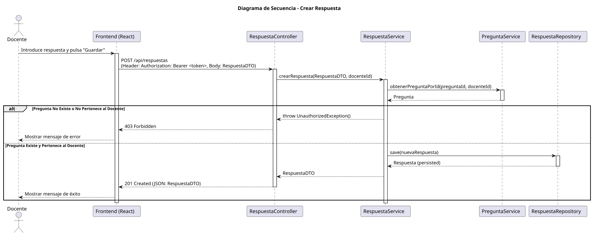 [📄 Código PUML](../../modelosUML/diseño/crearRespuesta/secuencia.puml) |

| [Editar Respuesta](editarRespuesta) | [Eliminar Respuesta](eliminarRespuesta) |
| :---: | :---: |
|  [📄 Código PUML](../../modelosUML/diseño/editarRespuesta/secuencia.puml) |  [📄 Código PUML](../../modelosUML/diseño/eliminarRespuesta/secuencia.puml) |

---

### 📝 Core de Exámenes

| [Generar Exámenes](generarExamenes) | [Cancelar Generación](cancelarGeneracion) |
| :---: | :---: |
|  [📄 Código PUML](../../modelosUML/diseño/generarExamenes/generarExamenes.puml) |  [📄 Código PUML](../../modelosUML/diseño/cancelarGeneracion/cancelarGeneracion.puml) |

| [Asignar Exámenes](asignarExamenes) | [Corregir Exámenes](corregirExamenes) |
| :---: | :---: |
| 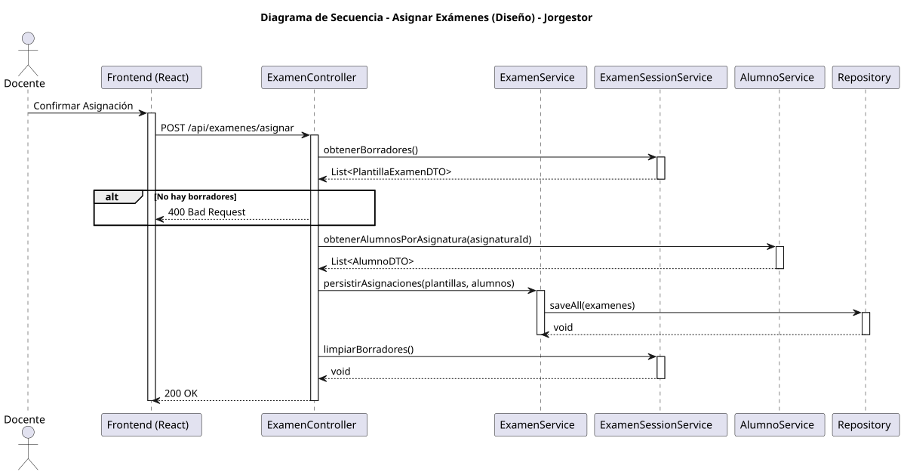 [📄 Código PUML](../../modelosUML/diseño/asignarExamenes/asignarExamenes.puml) | 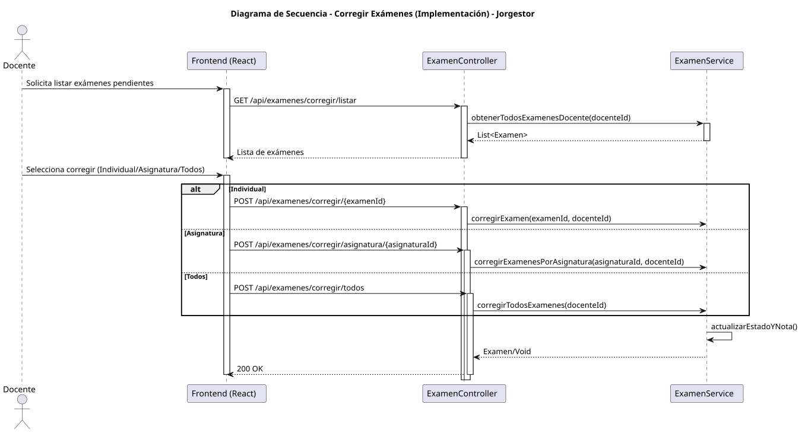 [📄 Código PUML](../../modelosUML/diseño/corregirExamenes/corregirExamenes.puml) |

| [Ver Exámenes](verExamenes) | [Ver Examen](verExamen) |
| :---: | :---: |
| 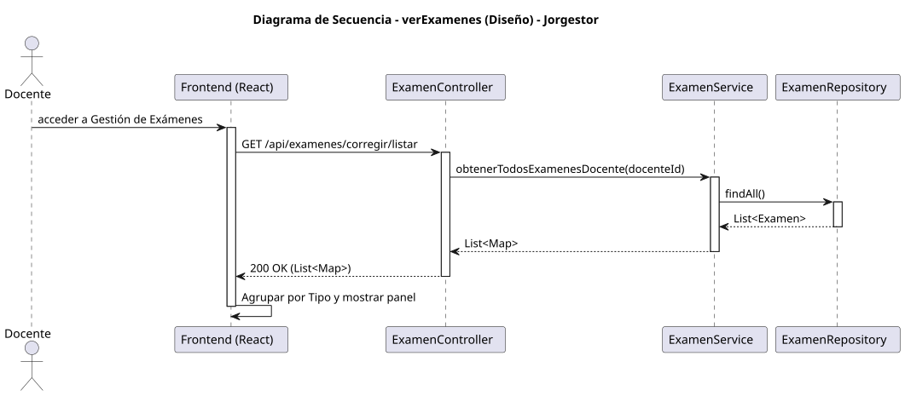 [📄 Código PUML](../../modelosUML/diseño/verExamenes/secuencia.puml) | 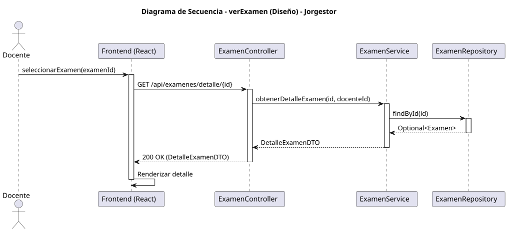 [📄 Código PUML](../../modelosUML/diseño/verExamen/secuencia.puml) |

---

### ⚙️ Mantenimiento de Sistema

| [Ver Docentes](verDocentes) | [Crear Docente](crearDocente) |
| :---: | :---: |
| 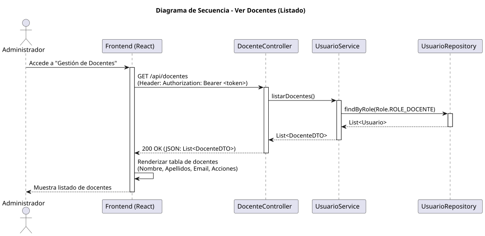 [📄 Código PUML](../../modelosUML/diseño/verDocentes/secuencia.puml) |  [📄 Código PUML](../../modelosUML/diseño/crearDocente/secuencia.puml) |

| [Editar Docente](editarDocente) | [Eliminar Docente](eliminarDocente) |
| :---: | :---: |
| 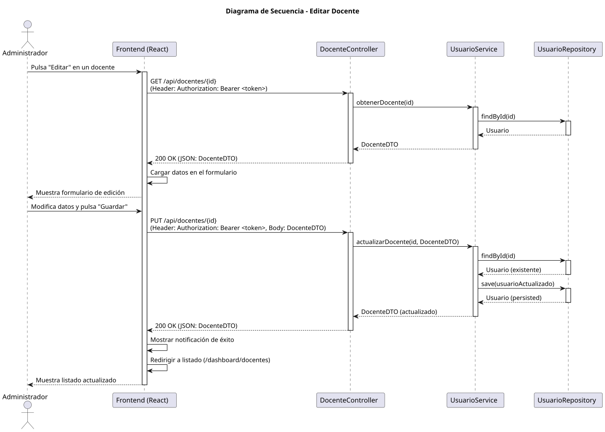 [📄 Código PUML](../../modelosUML/diseño/editarDocente/secuencia.puml) |  [📄 Código PUML](../../modelosUML/diseño/eliminarDocente/secuencia.puml) |

| [Importar Configuración](importarConfiguracionGlobal) | [Exportar Configuración](exportarConfiguracionGlobal) |
| :---: | :---: |
| 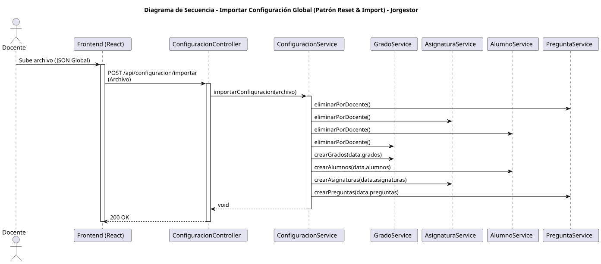 [📄 Código PUML](../../modelosUML/diseño/importarConfiguracionGlobal/importarConfiguracionGlobal.puml) |  [📄 Código PUML](../../modelosUML/diseño/exportarConfiguracionGlobal/exportarConfiguracionGlobal.puml) |
