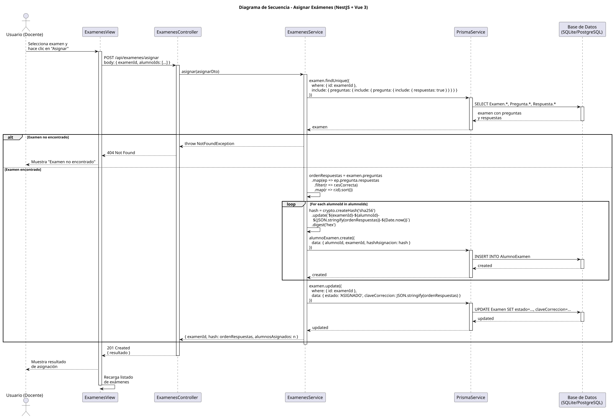

# 25-26-idsw2-sdVC > asignarExamenes > Diseño

## Información del artefacto

| Campo | Valor |
|-------|-------|
| **Proyecto** | Sistema de Gestión de Exámenes Universitarios |
| **Fase RUP** | Elaboración |
| **Disciplina** | Diseño |
| **Versión** | 1.0 (NestJS + Vue 3) |
| **Fecha** | 2026-06-09 |
| **Autor** | Marcos Gutierrez |

## Propósito

Detallar la interacción entre los componentes del sistema para asignar un examen generado a uno o varios alumnos, generando un hash SHA-256 único por cada asignación y almacenando la clave de corrección para su posterior uso en la corrección automática.

## Diagrama de secuencia de diseño

||
|-|
|Código fuente: [secuencia.puml](../../../modelosUML/diseño/asignarExamenes/secuencia.puml)|

## Participantes

| Componente | Responsabilidad |
|---|---|
| **ExamenesView** | Vista que permite al docente seleccionar un examen del listado, elegir los alumnos destinatarios (agrupados por grado), confirmar la asignación y mostrar el resultado. |
| **ExamenesController** | Endpoint REST `POST /api/examenes/asignar` que recibe el DTO con examenId y array de alumnoIds. |
| **ExamenesService** | Método `asignar()` que consulta el examen con preguntas y respuestas, genera el orden de respuestas correctas, itera sobre los alumnos creando un hash SHA-256 por cada uno, persistiendo la asignación y actualizando el estado del examen. |
| **PrismaService** | Capa ORM que ejecuta las consultas de búsqueda de examen, creación de asignaciones batch y actualización de estado. |
| **Base de Datos (SQLite/PostgreSQL)** | Almacena los exámenes, preguntas, respuestas y las asignaciones (AlumnoExamen) con sus hashes. |

## Decisiones de diseño

| Decisión | Justificación |
|---|---|
| **Hash SHA-256 con timestamp** | Se incluye `Date.now()` en el cálculo del hash para garantizar unicidad incluso si se asigna el mismo examen al mismo alumno en momentos diferentes. |
| **Clave de corrección como JSON** | El orden de respuestas correctas se serializa como JSON y se almacena en el campo `claveCorreccion` del examen para su uso durante la corrección. |
| **Creación de asignaciones en loop** | Se itera sobre cada alumno creando su registro `AlumnoExamen` individualmente para poder generar un hash único por asignación. |
| **Actualización de estado al final** | El estado del examen se actualiza a `ASIGNADO` después de crear todas las asignaciones, garantizando consistencia. |
| **Validación de examen existente** | Se consulta el examen con todas sus preguntas y respuestas antes de cualquier operación, lanzando `NotFoundException` si no existe. |
| **DTO con validación de tipos** | `AsignarExamenesDto` usa pipes de NestJS para validar que examenId sea número y alumnoIds sea array de números. |
| **Respuesta con conteo** | El servicio retorna `{ examenId, hash, alumnosAsignados }` permitiendo al frontend mostrar cuántos alumnos recibieron el examen. |
| **Seguridad por capas** | `JwtAuthGuard` + `RolesGuard` protegen el endpoint. Solo usuarios con rol `DOCENTE` o `ADMIN` pueden asignar exámenes. |
