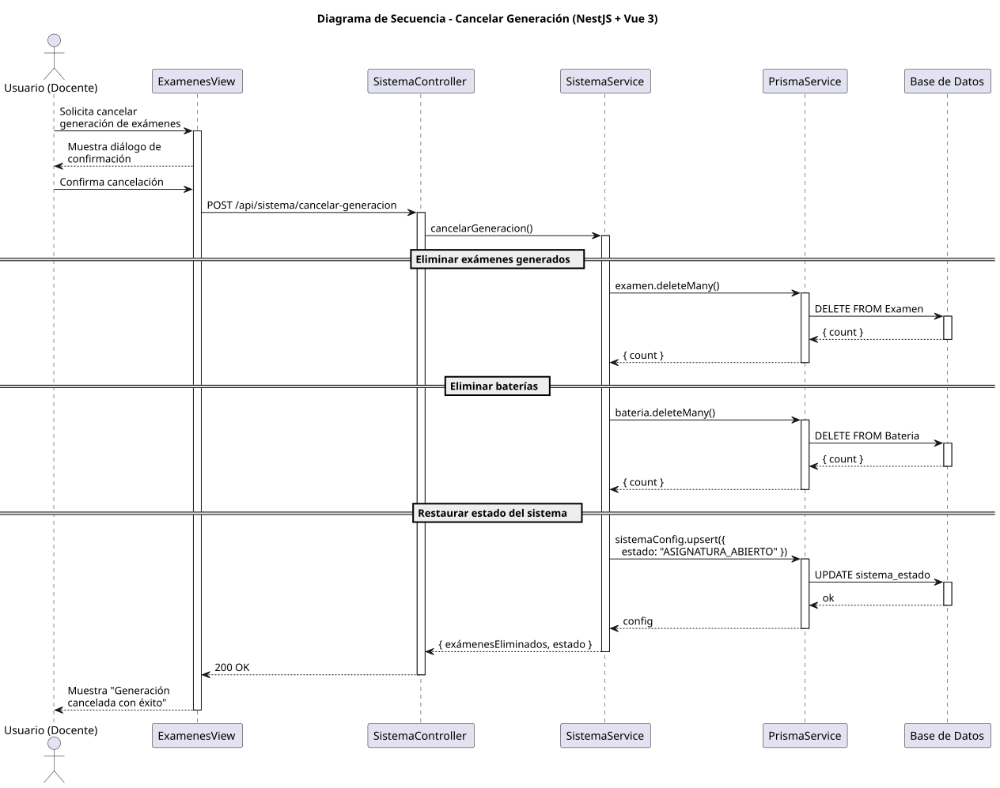

# 25-26-idsw2-sdVC > cancelarGeneracion > Diseño

## Información del artefacto

| Campo | Valor |
|-------|-------|
| **Proyecto** | Sistema de Gestión de Exámenes Universitarios |
| **Fase RUP** | Elaboración |
| **Disciplina** | Diseño |
| **Versión** | 1.0 (NestJS + Vue 3) |
| **Fecha** | 2026-06-09 |
| **Autor** | Marcos Gutierrez |

## Propósito

Cancelar la generación de exámenes, eliminando todos los exámenes y baterías generados y restaurando el estado del sistema.

## Diagrama de secuencia de diseño

||
|-|
|Código fuente: [secuencia.puml](../../../modelosUML/diseño/cancelarGeneracion/secuencia.puml)|

## Participantes

| Componente | Responsabilidad |
|---|---|
| **ExamenesView** | Diálogo de confirmación. |
| **SistemaController** | POST /api/sistema/cancelar-generacion. |
| **SistemaService** | Elimina exámenes, baterías y actualiza estado. |
| **PrismaService** | Capa ORM. |
| **Base de Datos** | Almacena exámenes, baterías y estado del sistema. |

## Decisiones de diseño

| Decisión | Justificación |
|---|---|
| **Eliminación masiva** | deleteMany elimina todos los registros generados. |
| **Actualización de estado** | Sistema vuelve a ASIGNATURA_ABIERTO. |
| **Confirmación en frontend** | Evita cancelaciones accidentales. |
| **Transacción** | Todas las operaciones como una unidad atómica. |
