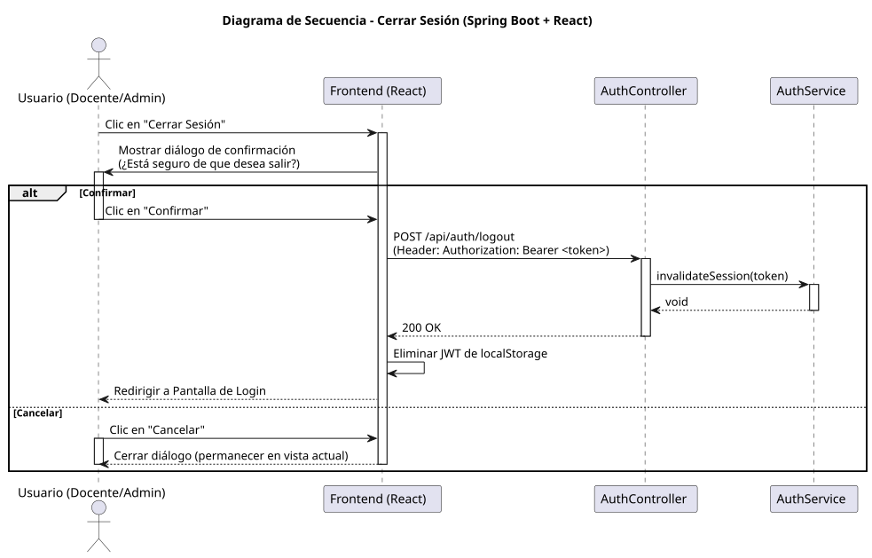

# Jorgestor > cerrarSesion > Diseño

> |[🏠️](/documents/diseño/README.md)|[📊](https://github.com/martinlopez7/25-26-IdSw1-SdR/blob/main/documents/casos-de-uso/detalladoCasosDeUso/cerrarSesion/cerrarSesion.svg)|[Análisis](/documents/analisis/cerrarSesion/README.md)|**Diseño**|
> |-|-|-|-|

## Información del artefacto

- **Proyecto**: Jorgestor - Sistema de Gestión de Exámenes
- **Fase RUP**: Elaboración
- **Disciplina**: Diseño
- **Versión**: 1.0 (Spring Boot + React)
- **Fecha**: 2026-05-30
- **Autor**: Equipo de desarrollo

## Propósito

Detallar el proceso de cierre de sesión, asegurando que el cliente elimine las credenciales locales (JWT) y el sistema transite de forma segura al estado inicial.

## Diagrama de secuencia de diseño

||
|-|
|[Código PlantUML](../../../modelosUML/diseño/cerrarSesion/secuencia.puml)|

## Participantes

- **Frontend (React + TypeScript)**: Gestiona el modal de confirmación y limpia el `localStorage`.
- **AuthController**: Endpoint `POST /api/auth/logout` para notificar al servidor (opcional para logs o blacklisting).
- **AuthService**: Lógica para finalizar la sesión en el lado del servidor.

## Decisiones de diseño

- **Confirmación de Usuario**: Se implementa un modal según el prototipado para evitar cierres accidentales.
- **Limpieza Local**: La acción principal es la eliminación del token en el cliente para invalidar futuras peticiones.
- **Redirección**: Tras el cierre, se redirige automáticamente a la ruta `/login`.
