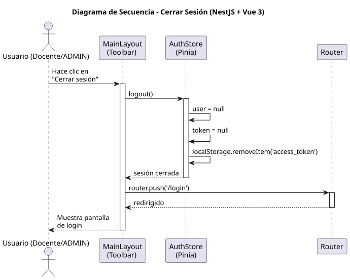

# 25-26-idsw2-sdVC > cerrarSesion > Diseño

## Información del artefacto

| Campo | Valor |
|-------|-------|
| **Proyecto** | Sistema de Gestión de Exámenes Universitarios |
| **Fase RUP** | Elaboración |
| **Disciplina** | Diseño |
| **Versión** | 1.0 (NestJS + Vue 3) |
| **Fecha** | 2026-06-09 |
| **Autor** | Marcos Gutierrez |

## Propósito

Cerrar la sesión del usuario eliminando el token JWT del almacenamiento local y redirigiendo a la pantalla de login.

## Diagrama de secuencia de diseño

||
|-|
|Código fuente: [secuencia.puml](../../../modelosUML/diseño/cerrarSesion/secuencia.puml)|

## Participantes

| Componente | Responsabilidad |
|---|---|
| **MainLayout (Toolbar)** | Botón "Cerrar sesión". |
| **AuthStore (Pinia)** | Limpia estado y localStorage. |
| **Router** | Redirige a /login. |

## Decisiones de diseño

| Decisión | Justificación |
|---|---|
| **Sin llamada al backend** | JWT es stateless; basta eliminar el token local. |
| **localStorage.removeItem** | Elimina token persistido. |
| **Redirección a /login** | Router guard protege rutas internas. |
